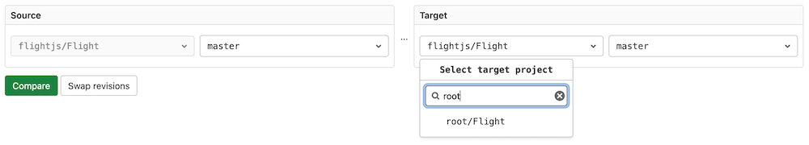
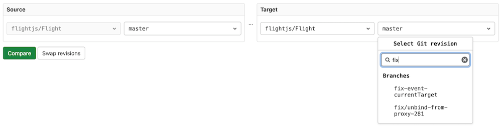
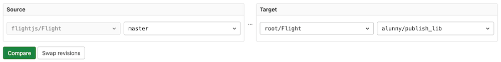
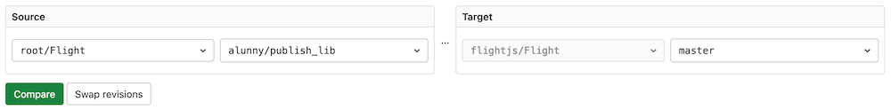

# Branches **(FREE)**

A branch is a version of a project's working tree. You create a branch for each
set of related changes you make. This keeps each set of changes separate from
each other, allowing changes to be made in parallel, without affecting each
other.

After pushing your changes to a new branch, you can:

- Create a [merge request](../../merge_requests/index.md). You can streamline this process
  by following [branch naming patterns](#naming).
- Perform inline code review.
- [Discuss](../../../discussions/index.md) your implementation with your team.
- Preview changes submitted to a new branch with [Review Apps](../../../../ci/review_apps/index.md).

You can also request [approval](../../merge_requests/approvals/index.md)
from your managers.

For more information on managing branches using the GitLab UI, see:

- [Default branches](default.md): When you create a new [project](../../index.md), GitLab creates a
  default branch for the repository. You can change this setting at the project,
  subgroup, group, or instance level.
- [Create a branch](../web_editor.md#create-a-new-branch)
- [Protected branches](../../protected_branches.md#protected-branches)
- [Delete merged branches](#delete-merged-branches)
- [Branch filter search box](#branch-filter-search-box)

You can also manage branches using the
[command line](../../../../gitlab-basics/start-using-git.md#create-a-branch).

<i class="fa fa-youtube-play youtube" aria-hidden="true"></i>Watch the video [GitLab Flow](https://www.youtube.com/watch?v=InKNIvky2KE).

See also:

- [Branches API](../../../../api/branches.md), for information on operating on repository branches using the GitLab API.
- [GitLab Flow](../../../../topics/gitlab_flow.md) documentation.
- [Getting started with Git](../../../../topics/git/index.md) and GitLab.

## Naming

Prefix a branch name with an issue number to streamline merge request creation.
When you create a merge request for a branch with a name beginning with an issue
number, GitLab:

- Marks the issue as related. If your project is configured with a
  [default closing pattern](../../issues/managing_issues.md#default-closing-pattern),
  merging this merge request [also closes](../../issues/managing_issues.md#closing-issues-automatically)
  the related issue.
- Copies label and milestone metadata from the issue.

## Compare

To compare branches in a repository:

1. Navigate to your project's repository.
1. Select **Repository > Compare** in the sidebar.
1. Select the target repository to compare with the [repository filter search box](#repository-filter-search-box).
1. Select branches to compare using the [branch filter search box](#branch-filter-search-box).
1. Select **Compare** to view the changes inline:

   

## Delete merged branches


This feature allows merged branches to be deleted in bulk. Only branches that
have been merged into the project's default branch and
[are not protected](../../protected_branches.md) are deleted as part of
this operation.

It's particularly useful to clean up old branches that were not deleted
automatically when a merge request was merged.

## Repository filter search box

> [Introduced](https://gitlab.com/gitlab-org/gitlab/-/merge_requests/52967) in GitLab 13.10.

This feature allows you to search and select a repository quickly when [comparing branches](#compare).



Search results appear in the following order:

- Repositories with names exactly matching the search terms.
- Other repositories with names that include search terms, sorted alphabetically.

## Branch filter search box



This feature allows you to search and select branches quickly. Search results appear in the following order:

- Branches with names that matched search terms exactly.
- Other branches with names that include search terms, sorted alphabetically.

Sometimes when you have hundreds of branches you may want a more flexible matching pattern. In such cases you can use the following operators:

- `^` matches beginning of branch name, for example `^feat` would match `feat/user-authentication`
- `$` matches end of branch name, for example `widget$` would match `feat/search-box-widget`
- `*` wildcard matcher, for example `branch*cache*` would match `fix/branch-search-cache-expiration`

These operators can be mixed, for example `^chore/*migration$` would match `chore/user-data-migration`

## Swap revisions

> [Introduced](https://gitlab.com/gitlab-org/gitlab/-/merge_requests/60491) in GitLab 13.12.



The Swap revisions feature allows you to swap the Source and Target revisions. When the Swap revisions button is selected, the selected revisions for Source and Target is swapped.



## View branches with configured rules **(FREE SELF)**

> [Introduced](https://gitlab.com/gitlab-org/gitlab/-/merge_requests/88279) in GitLab 15.1 with a flag named `branch_rules`. Disabled by default.

FLAG:
On self-managed GitLab, by default this feature is not available. To make it available, ask an administrator to [enable the feature flag](../../../feature_flags.md) named `branch_rules`.
On GitLab.com, this feature is not available.
This feature is not ready for production use.

Branches in your repository can be [protected](../../protected_branches.md) by limiting
who can push to a branch, require approval for those pushed changes, or merge those changes.
To help you track the protections for all branches, the **Branch rules overview**
page shows your branches with their configured rules.

To view the **Branch rules overview** list:

1. On the top bar, select **Main menu > Projects** and find your project.
1. On the left sidebar, select **Settings > Repository**.
1. Expand **Branch Rules** to view all branches with protections.
1. Select **Details** next to your desired branch to show information about its:
   - [Branch protections](../../protected_branches.md).
   - [Approval rules](../../merge_requests/approvals/rules.md).
   - [Status checks](../../merge_requests/status_checks.md).

## Troubleshooting

### Error: ambiguous `HEAD` branch exists

In versions of Git earlier than 2.16.0, you could create a branch named `HEAD`.
This branch named `HEAD` collides with the internal reference (also named `HEAD`)
Git uses to describe the active (checked out) branch. This naming collision can
prevent you from updating the default branch of your repository:

```plaintext
Error: Could not set the default branch. Do you have a branch named 'HEAD' in your repository?
```

To fix this problem:

1. On the top bar, select **Main menu > Projects** and find your project.
1. On the left sidebar, select **Repository > Branches**.
1. Search for a branch named `HEAD`.
1. Make sure the branch has no uncommitted changes.
1. Select **Delete branch**, then **Yes, delete branch**.

Git versions [2.16.0 and later](https://github.com/git/git/commit/a625b092cc59940521789fe8a3ff69c8d6b14eb2),
prevent you from creating a branch with this name.
