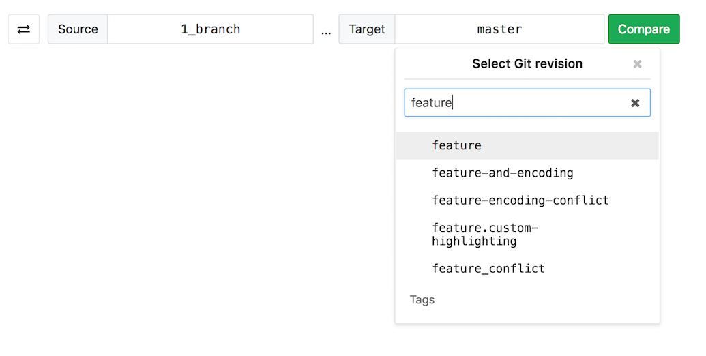

# Branches

Read through GiLab's branching documentation:

- [Create a branch](../web_editor.md#create-a-new-branch).
- [Default branch](#default-branch).
- [Protected branches](../../protected_branches.md#protected-branches).
- [Delete merged branches](#delete-merged-branches).
- [Branch filter search box](#branch-filter-search-box).

See also:

- [Branches API](../../../../api/branches.md), for information on operating on repository branches using the GitLab API.
- [GitLab Flow](../../../../university/training/gitlab_flow.md). Use the best of GitLab for your branching strategies.
- [Getting started with Git](../../../../topics/git/index.md) and GitLab.

## Default branch

When you create a new [project](../../index.md), GitLab sets `master` as the default
branch for your project. You can choose another branch to be your project's
default under your project's **Settings > Repository**.

The default branch is the branch affected by the
[issue closing pattern](../../issues/managing_issues.md#closing-issues-automatically),
which means that _an issue will be closed when a merge request is merged to
the **default branch**_.

The default branch is also protected against accidental deletion. Read through
the documentation on [protected branches](../../protected_branches.md#protected-branches)
to learn more.

## Delete merged branches

> [Introduced](https://gitlab.com/gitlab-org/gitlab-ce/merge_requests/6449) in GitLab 8.14.

This feature allows merged branches to be deleted in bulk. Only branches that
have been merged and [are not protected](../../protected_branches.md) will be deleted as part of
this operation.

It's particularly useful to clean up old branches that were not deleted
automatically when a merge request was merged.

## Branch filter search box

> [Introduced](https://gitlab.com/gitlab-org/gitlab-ce/merge_requests/22166) in GitLab 11.5.

This feature allows you to search and select branches quickly. Search results appear in the following order:

- Branches with names that matched search terms exactly.
- Other branches with names that include search terms, sorted alphabetically.

Sometimes when you have hundreds of branches you may want a more flexible matching pattern. In such cases you can use the following:

- `^feature` will only match branch names that begin with 'feature'.
- `feature$` will only match branch names that end with 'feature'.
