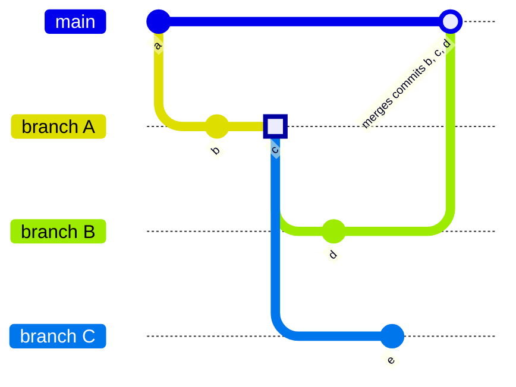

# Branches **(FREE)**

A branch is a version of a project's working tree. You create a branch for each
set of related changes you make. This keeps each set of changes separate from
each other, allowing changes to be made in parallel, without affecting each
other.

After pushing your changes to a new branch, you can:

- Create a [merge request](../../merge_requests/index.md). You can streamline this process
  by following [branch naming patterns](#prefix-branch-names-with-issue-numbers).
- Perform inline code review.
- [Discuss](../../../discussions/index.md) your implementation with your team.
- Preview changes submitted to a new branch with [Review Apps](../../../../ci/review_apps/index.md).

You can also request [approval](../../merge_requests/approvals/index.md)
from your managers.

For more information on managing branches using the GitLab UI, see:

- [Default branches](default.md): When you create a new [project](../../index.md), GitLab creates a
  default branch for the repository. You can change this setting at the project,
  subgroup, group, or instance level.
- [Create a branch](../web_editor.md#create-a-branch)
- [Protected branches](../../protected_branches.md#protected-branches)
- [Delete merged branches](#delete-merged-branches)

You can also manage branches using the
[command line](../../../../gitlab-basics/start-using-git.md#create-a-branch).

<i class="fa fa-youtube-play youtube" aria-hidden="true"></i>Watch the video [GitLab Flow](https://www.youtube.com/watch?v=InKNIvky2KE).

See also:

- [Branches API](../../../../api/branches.md), for information on operating on repository branches using the GitLab API.
- [GitLab Flow](../../../../topics/gitlab_flow.md) documentation.
- [Getting started with Git](../../../../topics/git/index.md) and GitLab.

## Prefix branch names with issue numbers

To streamline the creation of merge requests, start your branch name with an
issue number. GitLab uses the issue number to import data into the merge request:

- The issue is marked as related. The issue and merge request display links to each other.
- If your project is configured with a
  [default closing pattern](../../issues/managing_issues.md#default-closing-pattern),
  merging the merge request [also closes](../../issues/managing_issues.md#closing-issues-automatically)
  the related issue.
- The issue milestone and labels are copied to the merge request.

## Compare branches

> - Repository filter search box [introduced](https://gitlab.com/gitlab-org/gitlab/-/merge_requests/52967) in GitLab 13.10.
> - Revision swapping [introduced](https://gitlab.com/gitlab-org/gitlab/-/merge_requests/60491) in GitLab 13.12.

To compare branches in a repository:

1. On the top bar, select **Main menu > Projects** and find your project.
1. On the left sidebar, select **Repository > Compare revisions**.
1. Select the **Source** branch to search for your desired branch. Exact matches are
   shown first. You can refine your search with operators:
   - `^` matches the beginning of the branch name: `^feat` matches `feat/user-authentication`.
   - `$` matches the end of the branch name: `widget$` matches `feat/search-box-widget`.
   - `*` matches using a wildcard: `branch*cache*` matches `fix/branch-search-cache-expiration`.
   - You can combine operators: `^chore/*migration$` matches `chore/user-data-migration`.
1. Select the **Target** repository and branch. Exact matches are shown first.
1. Select **Compare** to show the list of commits, and changed files. To reverse
   the **Source** and **Target**, select **Swap revisions**.

## Delete merged branches


This feature allows merged branches to be deleted in bulk. Only branches that
have been merged into the project's default branch and
[are not protected](../../protected_branches.md) are deleted as part of
this operation.

It's particularly useful to clean up old branches that were not deleted
automatically when a merge request was merged.

## View branches with configured protections **(FREE SELF)**

> [Introduced](https://gitlab.com/gitlab-org/gitlab/-/merge_requests/88279) in GitLab 15.1 with a flag named `branch_rules`. Disabled by default.

FLAG:
On self-managed GitLab, by default this feature is not available. To make it available, ask an administrator to [enable the feature flag](../../../feature_flags.md) named `branch_rules`.
On GitLab.com, this feature is not available.
This feature is not ready for production use.

Branches in your repository can be [protected](../../protected_branches.md) by limiting
who can push to a branch, require approval for those pushed changes, or merge those changes.
To help you track the protections for all branches, the **Branch rules overview**
page shows your branches with their configured rules.

To view the **Branch rules overview** list:

1. On the top bar, select **Main menu > Projects** and find your project.
1. On the left sidebar, select **Settings > Repository**.
1. Expand **Branch Rules** to view all branches with protections.
1. Select **Details** next to your desired branch to show information about its:
   - [Branch protections](../../protected_branches.md).
   - [Approval rules](../../merge_requests/approvals/rules.md).
   - [Status checks](../../merge_requests/status_checks.md).

## Related topics

- [Protected branches](../../protected_branches.md) user documentation
- [Branches API](../../../../api/branches.md)
- [Protected Branches API](../../../../api/protected_branches.md)

## Troubleshooting

### Multiple branches containing the same commit

At a deeper technical level, Git branches aren't separate entities, but labels
attached to a set of commit SHAs. When GitLab determines whether or not a branch has been
merged, it checks the target branch for the existence of those commit SHAs.
This behavior can cause unexpected results when two merge requests contain the same
commits. In this example, branches `B` and `C` both start from the same commit (`3`)
on branch `A`:



If you merge branch `B`, branch `A` also appears as merged (without any action from you)
because all commits from branch `A` now appear in the target branch `main`. Branch `C`
remains unmerged, because commit `5` wasn't part of branch `A` or `B`.

Merge request `A` remains merged, even if you attempt to push new commits
to its branch. If any changes in merge request `A` remain unmerged (because they
weren't part of merge request `A`), open a new merge request for them.

### Error: ambiguous `HEAD` branch exists

In versions of Git earlier than 2.16.0, you could create a branch named `HEAD`.
This branch named `HEAD` collides with the internal reference (also named `HEAD`)
Git uses to describe the active (checked out) branch. This naming collision can
prevent you from updating the default branch of your repository:

```plaintext
Error: Could not set the default branch. Do you have a branch named 'HEAD' in your repository?
```

To fix this problem:

1. On the top bar, select **Main menu > Projects** and find your project.
1. On the left sidebar, select **Repository > Branches**.
1. Search for a branch named `HEAD`.
1. Make sure the branch has no uncommitted changes.
1. Select **Delete branch**, then **Yes, delete branch**.

Git versions [2.16.0 and later](https://github.com/git/git/commit/a625b092cc59940521789fe8a3ff69c8d6b14eb2),
prevent you from creating a branch with this name.
