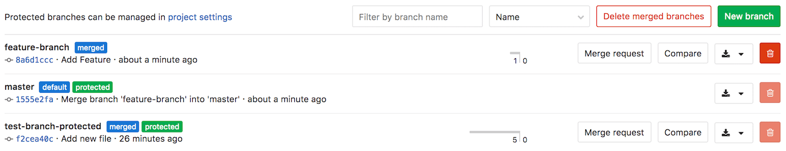

# Branches

Read through GiLab's branching documentation:

- [Create a branch](../web_editor.md#create-a-new-branch)
- [Default branch](#default-branch)
- [Protected branches](../../protected_branches.md#protected-branches)
- [Delete merged branches](#delete-merged-branches)

See also:

- [GitLab Flow](../../../../university/training/gitlab_flow.md#gitlab-flow): use the best of GitLab for your branching strategies
- [Getting started with Git](../../../../topics/git/index.md) and GitLab

## Default branch

When you create a new [project](../../index.md), GitLab sets `master` as the default
branch for your project. You can choose another branch to be your project's
default under your project's **Settings > General**.

The default branch is the branch affected by the
[issue closing pattern](../../issues/automatic_issue_closing.md),
which means that _an issue will be closed when a merge request is merged to
the **default branch**_.

The default branch is also protected against accidental deletion. Read through
the documentation on [protected branches](../../protected_branches.md#protected-branches)
to learn more.

## Delete merged branches

> [Introduced][ce-6449] in GitLab 8.14.

This feature allows merged branches to be deleted in bulk. Only branches that
have been merged and [are not protected][protected] will be deleted as part of
this operation.

It's particularly useful to clean up old branches that were not deleted
automatically when a merge request was merged.

[ce-6449]: https://gitlab.com/gitlab-org/gitlab-ce/merge_requests/6449 "Add button to delete all merged branches"
[protected]: ../../protected_branches.md
