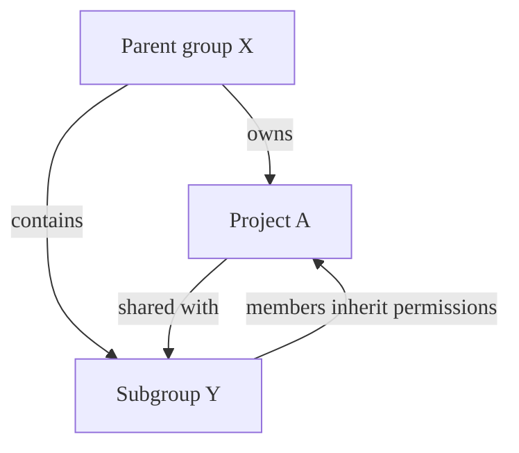
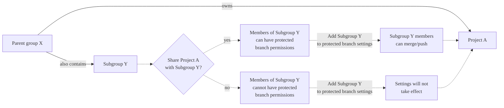

DETAILS:
**Tier:** Free, Premium, Ultimate
**Offering:** GitLab.com, GitLab Self-Managed, GitLab Dedicated

In GitLab, [permissions](../../../permissions.md) are fundamentally defined around the
idea of having read or write permission to the repository and branches. To impose
further restrictions on certain branches, they can be protected.

A protected branch controls:

- Which users can merge into the branch.
- Which users can push to the branch.
- If users can force push to the branch.
- If changes to files listed in the CODEOWNERS file can be pushed directly to the branch.
- Which users, groups, or access levels can unprotect the branch using the
  [Protected branches API](../../../../api/protected_branches.md#update-a-protected-branch).
- Which users can modify the branch with the [Commits API](../../../../api/commits.md).

The [default branch](default.md) for your repository is protected by default.

## Who can modify a protected branch

> - Branch push permission [changed](https://gitlab.com/gitlab-org/gitlab/-/merge_requests/118532) to require GitLab administrators to also have the **allowed** permission in GitLab 16.0.

When a branch is protected, the default behavior enforces these restrictions on the branch.

| Action                   | Who can do it                           |
|:-------------------------|:----------------------------------------|
| Protect a branch         | At least the Maintainer role.           |
| Push to the branch       | Anyone with **Allowed** permission. (1) |
| Force push to the branch | No one.                                 |
| Delete the branch        | No one. (2)                             |

1. Users with the Developer role can create a project in a group, but might not be allowed to
   initially push to the [default branch](default.md).
1. No one can delete a protected branch using Git commands, however, users with at least Maintainer
   role can [delete a protected branch from the UI or API](#delete-a-protected-branch).

You can implement a [merge request approval policy](../../../application_security/policies/merge_request_approval_policies.md#approval_settings)
to prevent protected branches being unprotected or deleted.

### When a branch matches multiple rules

When a branch matches multiple rules, the **most permissive rule** determines the
level of protection for the branch. For example, consider these rules, which include
[wildcards](#protect-multiple-branches-with-wildcard-rules):

| Branch name pattern | Allowed to merge       | Allowed to push and merge |
|---------------------|------------------------|---------------------------|
| `v1.x`              | Maintainer             | Maintainer                |
| `v1.*`              | Maintainer + Developer | Maintainer                |
| `v*`                | No one                 | No one                    |

A branch named `v1.x` is a case-sensitive match for all three branch name patterns: `v1.x`, `v1.*`, and `v*`.
As the most permissive option determines the behavior, the resulting permissions for branch `v1.x` are:

- **Allowed to merge:** Of the three settings, `Maintainer + Developer` is most permissive,
  and controls branch behavior as a result. Even though the branch also matched `v1.x` and `v*`
  (which each have stricter permissions), users with the Developer role can merge into the branch.
- **Allowed to push and merge:** Of the three settings, `Maintainer` is the most permissive, and controls
  branch behavior as a result. Even though branches matching `v*` are set to `No one`, branches
  that _also_ match `v1.x` or `v1.*` receive the more permissive `Maintainer` permission.

To be certain that a rule controls the behavior of a branch,
_all_ other patterns that match must apply less or equally permissive rules.

If you want to ensure that `No one` is allowed to push to branch `v1.x`, every pattern
that matches `v1.x` must set `Allowed to push and merge` to `No one`, like this:

| Branch name pattern | Allowed to merge       | Allowed to push and merge |
|---------------------|------------------------|---------------------------|
| `v1.x`              | Maintainer             | No one                    |
| `v1.*`              | Maintainer + Developer | No one                    |
| `v*`                | No one                 | No one                    |

### Set the default branch protection level

Administrators can set a default branch protection level in the
[**Admin** area](default.md#instance-level-default-branch-protection).

## Add protection to existing branches

Configure protected branches for all projects in a group, or just for a project.

### For one project

Prerequisites:

- You must have at least the Maintainer role.
- When granting a group **Allowed to merge** or **Allowed to push and merge** permissions
  on a protected branch, the project must be accessible and shared with the group.
  For more information, see [Shared projects](../../members/sharing_projects_groups.md).

To protect a branch:

1. On the left sidebar, select **Search or go to** and find your project.
1. Select **Settings > Repository**.
1. Expand **Protected branches**.
1. Select **Add protected branch**.
1. From the **Branch** dropdown list, select the branch you want to protect.
1. From the **Allowed to merge** list, select a role that can merge into this branch.
1. From the **Allowed to push and merge** list, select a role that can push to this branch.

   NOTE:
   In GitLab Premium and Ultimate, you can also add groups or individual users
   to **Allowed to merge** and **Allowed to push and merge**.

1. Select **Protect**.

The protected branch displays in the list of protected branches.

### For all projects in a group

DETAILS:
**Tier:** Premium, Ultimate
**Offering:** GitLab Self-Managed

> - [Introduced](https://gitlab.com/gitlab-org/gitlab/-/merge_requests/106532) in GitLab 15.9 [with a flag](../../../../administration/feature_flags.md) named `group_protected_branches`. Disabled by default.
> - [Generally available](https://gitlab.com/gitlab-org/gitlab/-/issues/500250) in GitLab 17.6. Feature flag `group_protected_branches` removed.

Group owners can create protected branches for a group. These settings are inherited
by all projects in the group and can't be overridden by project settings.

Prerequisites:

- You must have the Owner role for the group.
- The group must be a top-level group. Subgroups are not supported.

To protect a branch for all the projects in a group:

1. On the left sidebar, select **Search or go to** and find your group.
1. Select **Settings > Repository**.
1. Expand **Protected branches**.
1. Select **Add protected branch**.
1. In the **Branch** text box, type the branch name or a wildcard.
   Branch names and wildcards [are case-sensitive](_index.md#name-your-branch).
1. From the **Allowed to merge** list, select a role that can merge into this branch.
1. From the **Allowed to push and merge** list, select a role that can push to this branch.
1. Select **Protect**.

The protected branch is added to the list of protected branches.

### Add a group to protected branches

To set the members of a group or subgroup as **Allowed to merge** or **Allowed to push and merge**
to a protected branch:

1. On the left sidebar, select **Search or go to** and find your project.
1. Select **Settings > Repository**.
1. Expand **Protected branches**.
1. Add groups to the following fields:

   ```plaintext
   # Allow group members to merge into this branch
   Allowed to merge: @group-x

   # Allow group members to push and merge into this branch
   Allowed to push and merge: @group-x/subgroup-y
   ```

NOTE:
When you assign a group to a protected branch, only direct members of that group are included.
Members from parent groups are not automatically granted permissions to the protected branch.

#### Group inheritance and eligibility



In this example:

- **Parent group X** (`group-x`) owns **Project A**.
- **Parent group X** also contains a subgroup, **Subgroup Y**. (`group-x/subgroup-y`)
- **Project A** is shared with **Subgroup Y**.

The eligible groups for protected branch permissions are:

- **Project A**: Both **Group X** and **Subgroup Y**, because **Project A** is shared with **Subgroup Y**.

#### Share projects with groups for protected branch permissions

You can share the project with a group or subgroup so that their members are eligible for
protected branch permissions.



To grant access to **Subgroup Y** members for **Project A**, you must share the project with
the subgroup. Adding the subgroup directly to the protected branch settings is not effective
and isn't applicable to subgroup members.

NOTE:
For a group to have protected branch permissions, the project must be directly shared with the group.
Inherited project membership from parent groups is not sufficient for protected branch permissions.

## Protect multiple branches with wildcard rules

When using wildcards, multiple rules can apply to a single branch.
If more than one rule applies to a branch, the _most permissive_ rule controls
how the branch behaves. For merge controls to work properly, set
**Allowed to push and merge** to a broader set of users than **Allowed to merge**.

Prerequisites:

- You must have at least the Maintainer role.

To protect multiple branches at the same time:

1. On the left sidebar, select **Search or go to** and find your project.
1. Select **Settings > Repository**.
1. Expand **Protected branches**.
1. Select **Add protected branch**.
1. From the **Branch** dropdown list, type the branch name and a wildcard.
   Branch names and wildcards [are case-sensitive](_index.md#name-your-branch). For example:

   | Wildcard protected branch | Matching branches                                      |
   |---------------------------|--------------------------------------------------------|
   | `*-stable`                | `production-stable`, `staging-stable`                  |
   | `production/*`            | `production/app-server`, `production/load-balancer`    |
   | `*gitlab*`                | `gitlab`, `gitlab/staging`, `master/gitlab/production` |

1. From the **Allowed to merge** list, select a role that can merge into
   this branch.
1. From the **Allowed to push and merge** list, select a role that can
   push to this branch. In GitLab Premium or Ultimate, you can also add groups or individual users.
1. Select **Protect**.

The protected branch displays in the list of protected branches.

## Require everyone to submit merge requests for a protected branch

You can force everyone to submit a merge request, rather than allowing them to
check in directly to a protected branch:

1. On the left sidebar, select **Search or go to** and find your project.
1. Select **Settings > Repository**.
1. Expand **Protected branches**.
1. Select **Add protected branch**.
1. From the **Branch** dropdown list, select the branch you want to protect.
1. From the **Allowed to merge** list, select **Developers + Maintainers**.
1. From the **Allowed to push and merge** list, select **No one**.
1. Select **Protect**.

Alternatively, you can [create](branch_rules.md#create-a-branch-rule) or [edit](branch_rules.md#edit-a-branch-rule-target) a branch rule. Then:

1. Select **Edit** in the **Allowed to merge** section.
1. Select **Developers and Maintainers**.
1. Select **Save changes**.

## Allow everyone to push directly to a protected branch

You can allow everyone with write access to push to the protected branch.

1. On the left sidebar, select **Search or go to** and find your project.
1. Select **Settings > Repository**.
1. Expand **Protected branches**.
1. Select **Add protected branch**.
1. From the **Branch** dropdown list, select the branch you want to protect.
1. From the **Allowed to push and merge** list, select **Developers + Maintainers**.
1. Select **Protect**.

Alternatively, you can [create](branch_rules.md#create-a-branch-rule) or [edit](branch_rules.md#edit-a-branch-rule-target) a branch rule. Then:

1. Select **Edit** in the **Allowed to push and merge** section.
1. Select **Developers and Maintainers**.
1. Select **Save changes**.

## Allow deploy keys to push to a protected branch

You can push to a protected branch with a [deploy key](../../deploy_keys/_index.md).

Prerequisites:

- The deploy key must be enabled for your project. A project deploy key is enabled by default when
  it is created. However, a public deploy key must be
  [granted](../../deploy_keys/_index.md#grant-project-access-to-a-public-deploy-key) access to the
  project.
- The deploy key must have [write access](../../deploy_keys/_index.md#permissions) to your project
  repository.
- The owner of the deploy key must have at least read access to the project.
- The owner of the deploy key must also be a member of the project.

To allow a deploy key to push to a protected branch:

1. On the left sidebar, select **Search or go to** and find your project.
1. Select **Settings > Repository**.
1. Expand **Protected branches**.
1. Select **Add protected branch**.
1. From the **Branch** dropdown list, select the branch you want to protect.
1. From the **Allowed to push and merge** list, select the deploy key.
1. Select **Protect**.

Deploy keys are not available in the **Allowed to merge** dropdown list.

## Allow force push on a protected branch

You can allow [force pushes](../../../../topics/git/git_rebase.md#force-push-to-a-remote-branch) to
protected branches.

To protect a new branch and enable force push:

1. On the left sidebar, select **Search or go to** and find your project.
1. Select **Settings > Repository**.
1. Expand **Protected branches**.
1. Select **Add protected branch**.
1. From the **Branch** dropdown list, select the branch you want to protect.
1. From the **Allowed to push and merge** and **Allowed to merge** lists, select the settings you want.
1. To allow all users with push access to force push, turn on the **Allowed to force push** toggle.
1. Select **Protect**.

To enable force pushes on branches that are already protected:

1. On the left sidebar, select **Search or go to** and find your project.
1. Select **Settings > Repository**.
1. Expand **Protected branches**.
1. Select **Add protected branch**.
1. In the list of protected branches, next to the branch, turn on the **Allowed to force push** toggle.

Alternatively, you can [create](branch_rules.md#create-a-branch-rule) or [edit](branch_rules.md#edit-a-branch-rule-target) a branch rule. Then:

1. In the list of protected branches, next to the branch, turn on the **Allowed to force push** toggle.

Members who can push to this branch can now also force push.

### When a branch matches multiple rules

When a branch matches multiple rules, the **most permissive rule** determines the
level of protection for the branch. For example, consider these rules, which include
[wildcards](#protect-multiple-branches-with-wildcard-rules):

| Branch name pattern | Allow force push |
|---------------------|------------------|
| `v1.x`              | Yes              |
| `v1.*`              | No               |
| `v*`                | No               |

A branch named `v1.x` matches all three branch name patterns: `v1.x`, `v1.*`, and `v*`.
As the most permissive option determines the behavior, the resulting permissions for branch `v1.x` are:

- **Allow force push:** Of the three settings, `Yes` is most permissive,
  and controls branch behavior as a result. Even though the branch also matched `v1.x` and `v*`
  (which each have stricter permissions), any user that can push to this branch can also force push.

## Require Code Owner approval on a protected branch

DETAILS:
**Tier:** Premium, Ultimate
**Offering:** GitLab.com, GitLab Self-Managed, GitLab Dedicated

For a protected branch, you can require at least one approval by a [Code Owner](../../codeowners/_index.md).
If a branch is protected by multiple rules, code owner approval is required if _any_ of
the applicable rules have **Required approval from code owners** enabled.

To protect a new branch and enable Code Owner's approval:

1. On the left sidebar, select **Search or go to** and find your project.
1. Select **Settings > Repository**.
1. Expand **Protected branches**.
1. Select **Add protected branch**.
1. From the **Branch** dropdown list, select the branch you want to protect.
1. From the **Allowed to push and merge** and **Allowed to merge** lists, select the settings you want.
1. Turn on the **Require approval from code owners** toggle.
1. Select **Protect**.

To enable Code Owner's approval on branches that are already protected:

1. On the left sidebar, select **Search or go to** and find your project.
1. Select **Settings > Repository**.
1. Expand **Protected branches**.
1. Select **Add protected branch**.
1. In the list of protected branches, next to the branch, turn on the **Code owner approval** toggle.

Alternatively, you can [create](branch_rules.md#create-a-branch-rule) or [edit](branch_rules.md#edit-a-branch-rule-target) a branch rule.
Then, in the list of protected branches, next to the branch,
turn on the **Code owner approval** toggle.

When enabled, all merge requests for these branches require approval
by a Code Owner per matched rule before they can be merged.
Additionally, direct pushes to the protected branch are denied if a rule is matched.

Any user who is not specified in the `CODEOWNERS` file cannot push
changes for the specified files or paths, unless they are specifically allowed to.
You don't have to restrict developers from pushing directly to the
protected branch. Instead, you can restrict pushing to certain files where a review by
Code Owners is required.

In [GitLab Premium 13.5 and later](https://gitlab.com/gitlab-org/gitlab/-/issues/35097), users and groups
who are allowed to push to protected branches do not need a merge request to merge their feature branches.
Thus, they can skip merge request approval rules, Code Owners included.

## Run pipelines on protected branches

The permission to merge or push to protected branches defines
whether or not a user can run CI/CD pipelines and execute actions on jobs.

Because [merge request pipelines](../../../../ci/pipelines/merge_request_pipelines.md) run on the source
branch, a pipeline isn't created if the user opening a merge request does not have permission to merge
or push to the source branch.

See [Security on protected branches](../../../../ci/pipelines/_index.md#pipeline-security-on-protected-branches)
for details about the pipelines security model.

## Create a new branch with protections

Prerequisites:

- You must have at least the Developer role.
- To create a protected branch, branch protection must be configured to
  [require everyone to submit merge requests for a protected branch](#require-everyone-to-submit-merge-requests-for-a-protected-branch).

To create a new branch with protections:

1. On the left sidebar, select **Search or go to** and find your project.
1. Select **Code > Branches**.
1. Select **New branch**.
1. Fill in the branch name and select an existing branch, tag, or commit to
   base the new branch on. If you [require everyone to submit merge requests for a protected branch](#require-everyone-to-submit-merge-requests-for-a-protected-branch), only existing protected branches and commits
   that are already in protected branches are accepted.

You can also use [the Branches API](../../../../api/branches.md) to create a branch with protections.

If branch protection is configured to [allow everyone to push directly to a protected branch](#allow-everyone-to-push-directly-to-a-protected-branch), a branch with protections can also be created from the command line or a Git client application.

## Delete a protected branch

Users with at least the Maintainer role can manually delete protected
branches by using the GitLab web interface:

1. On the left sidebar, select **Search or go to** and find your project.
1. Select **Code > Branches**.
1. Next to the branch you want to delete, select **Delete** (**{remove}**).
1. On the confirmation dialog, enter the branch name and select **Yes, delete protected branch**.
   Branch names [are case-sensitive](_index.md#name-your-branch).

Protected branches can only be deleted by using GitLab either from the UI or API.
This prevents accidentally deleting a branch through local Git commands or
third-party Git clients.

## Related topics

- [Protected branches API](../../../../api/protected_branches.md)
- [Branches](_index.md)
- [Branches API](../../../../api/branches.md)

## Troubleshooting

### Branch names are case-sensitive

Branch names in `git` are case-sensitive. When configuring your protected branch,
or your [target branch workflow](_index.md#configure-workflows-for-target-branches),
`dev` is not the same `DEV` or `Dev`.
