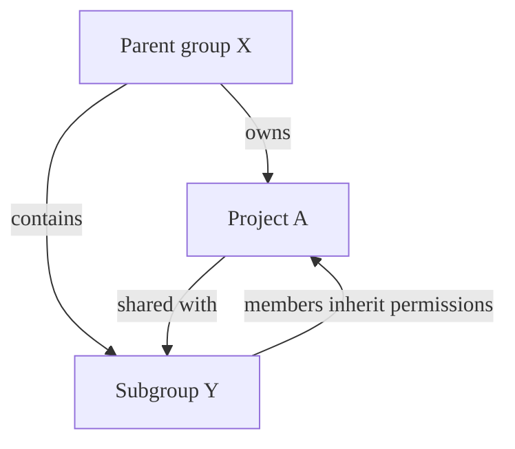
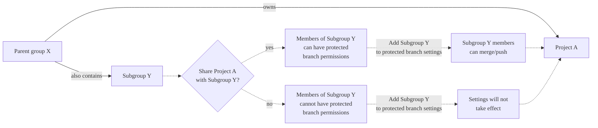



- Tier: Free, Premium, Ultimate
- Offering: GitLab.com, GitLab Self-Managed, GitLab Dedicated





The **Protected branches** settings for projects will be removed. Configure protected branches from **Settings** > **Repository** > **Branch rules** instead.



Protected branches enforce specific permissions on branches in GitLab to ensure code stability
and quality. Protected branches:

- Control which users can merge and push code changes.
- Prevent accidental deletion of critical branches.
- Enforce code review and approval processes.
- Manage Code Owner approval requirements.
- Regulate force push permissions to maintain commit history.
- Control access through both the UI and the Protected branches API.



The default branch for your repository is protected by default.
For more information about default branch settings, see [default branch](default.md).



For information about how protection rules behave when a branch matches multiple rules or has
complex permission requirements, see [Protection rules](protection_rules.md).

## Protect a branch

Configure protected branches for individual projects or for all projects in a group.

### In a project

Prerequisites:

- You must have at least the Maintainer role.
- When granting a group **Allowed to merge** or **Allowed to push and merge** permissions
  on a protected branch, the project must be accessible and shared with the group.
  For more information, see [Shared projects](../../members/sharing_projects_groups.md).

To protect a branch:

1. On the left sidebar, select **Search or go to** and find your project. If you've [turned on the new navigation](../../../interface_redesign.md#turn-new-navigation-on-or-off), this field is on the top bar.
1. Select **Settings** > **Repository**.
1. Expand **Branch rules**.
1. Select **Add branch rule** > **Branch name or pattern**.
1. From the dropdown list, search for and select the branch you want to protect.
1. Select **Create branch rule**. You are directed to the **Branch rule details** page.
1. From the **Protect branch** section, choose one of the following options:
   - From **Allowed to merge**, select **Edit**.
     1. Select the roles that can merge into this branch.
     1. Select **Save changes**.
   - From **Allowed to push and merge**, select **Edit**.
     1. Select the roles that can merge into this branch.
     1. If desired, search to add **Deploy keys**.
     1. Select **Save changes**.



In GitLab Premium and Ultimate, you can also add groups or individual users
to **Allowed to merge** and **Allowed to push and merge**.



### In a group



- Tier: Premium, Ultimate
- Offering: GitLab Self-Managed





- [Generally available](https://gitlab.com/gitlab-org/gitlab/-/issues/500250) in GitLab 17.6. Feature flag `group_protected_branches` removed.



Group owners can create protected branches for a group. These settings are inherited
by all projects in the group and can't be overridden by project settings.

Prerequisites:

- You must have the Owner role for the group.
- The group must be a top-level group. Subgroups are not supported.

To protect a branch for all the projects in a group:

1. On the left sidebar, select **Search or go to** and find your group. If you've [turned on the new navigation](../../../interface_redesign.md#turn-new-navigation-on-or-off), this field is on the top bar.
1. Select **Settings** > **Repository**.
1. Expand **Protected branches**.
1. Select **Add protected branch**.
1. In the **Branch** text box, type the branch name or a [wildcard](#use-wildcard-rules) (`*`).
   Branch names and wildcards are case-sensitive.
1. From the **Allowed to merge** list, select a role that can merge into this branch.
1. From the **Allowed to push and merge** list, select a role that can push to this branch.
1. Choose your preferences for the **Allowed to force push** and **Require approval from code owners**
   settings.
1. Select **Protect**.

## Push and merge permissions

The **Allowed to merge** and **Allowed to push and merge** settings control different
aspects of branch protection:

| Setting                       | Purpose                                                                                                        | Default behavior (not configured) |
|-------------------------------|----------------------------------------------------------------------------------------------------------------|-----------------------------------|
| **Allowed to merge**          | Controls who can merge changes through merge requests and create new protected branches through the UI and API | No one can merge (unless they have **Allowed to push and merge**). |
| **Allowed to push and merge** | Controls who can push directly to existing protected branches and merge through merge requests                 | No one can push.                  |



**Allowed to push and merge** grants both push and merge capabilities.
Users with this permission can merge through merge requests even without
**Allowed to merge** permission.



When you select **No one** for either **Allowed to merge** or **Allowed to push and merge**, the UI
clears other role selections.
This behavior differs from the API, where you can set multiple access levels simultaneously.
For more information about API behavior, see the
[Protected branches API](../../../../api/protected_branches.md).

### Protection strategies by branch types

Different branch types require different protection levels based on their purpose and
security requirements.

For branches deployed to production environments:

- Set **Allowed to merge** to **Maintainers** only.
- Set **Allowed to push and merge** to **No one** (not empty).
- Enable **Require approval from code owners**.
- Consider requiring multiple approvals.

With this configuration, all changes require merge requests with maintainer approval.

For active development branches:

- Set **Allowed to merge** to **Developers + Maintainers**.
- Set **Allowed to push and merge** to **No one** (not empty).

With this configuration, developers can merge approved merge requests while requiring
all changes to go through code review.



When **Allowed to push and merge** is not configured, it does not restrict
push access. To prevent direct pushes, you must explicitly set **Allowed to push and merge**
to **No one**.



### Permission combinations for Developer role

The following examples show what users with the Developer role can do with
different protection configurations:

| Allowed to merge         | Allowed to push and merge | Direct push                                 | Merge through MR |
|--------------------------|---------------------------|---------------------------------------------|------------------|
| No one                   | Developers + Maintainers  |  Yes |  Yes |
| Not configured           | Developers + Maintainers  |  Yes |  Yes |
| Developers + Maintainers | Not configured            |  No          |  Yes |
| Not configured           | Not configured            |  No          |  No |
| Maintainers              | Not configured            |  No          |  No |
| Maintainers              | Maintainers               |  No          |  No |
| Developers + Maintainers | Maintainers               |  No          |  Yes |

## Default branch protection settings

Administrators can [set a default branch protection level](default.md#for-all-projects-in-an-instance)
in the **Admin** area.

## Use wildcard rules

When using wildcards, multiple rules can apply to a single branch.
If more than one rule applies to a branch, the most permissive rule controls
how the branch behaves. For merge controls to work properly, set
**Allowed to push and merge** to a broader set of users than **Allowed to merge**.

Prerequisites:

- You must have at least the Maintainer role.

To protect multiple branches at the same time:

1. On the left sidebar, select **Search or go to** and find your project. If you've [turned on the new navigation](../../../interface_redesign.md#turn-new-navigation-on-or-off), this field is on the top bar.
1. Select **Settings** > **Repository**.
1. Expand **Branch rules**.
1. Select **Add branch rule** > **Branch name or pattern**.
1. From the dropdown list, type the branch name and a wildcard (`*`).
   Branch names and wildcards are case-sensitive. For example:

   | Wildcard protected branch | Matching branches                                      |
   |---------------------------|--------------------------------------------------------|
   | `*-stable`                | `production-stable`, `staging-stable`                  |
   | `production/*`            | `production/app-server`, `production/load-balancer`    |
   | `*gitlab*`                | `gitlab`, `gitlab/staging`, `master/gitlab/production` |

1. Select **Create wildcard**.
1. Select **Create branch rule**. You are directed to the **Branch rule details** page.
1. From the **Protect branch** section, choose one of the following options:
   - From **Allowed to merge**, select **Edit**.
     1. Select the roles that can merge into this branch.
     1. Select **Save changes**.
   - From **Allowed to push and merge**, select **Edit**.
     1. Select the roles that can merge into this branch.
     1. If desired, search to add **Deploy keys**.
     1. Select **Save changes**.

## Configure protection options

You can set various protection options to secure your branches.

### Require merge requests

You can force everyone to submit a merge request, rather than allowing them to
check in directly to a protected branch:

1. On the left sidebar, select **Search or go to** and find your project. If you've [turned on the new navigation](../../../interface_redesign.md#turn-new-navigation-on-or-off), this field is on the top bar.
1. Select **Settings** > **Repository**.
1. Expand **Branch rules**.
1. Next to your branch, select **View details**.
1. From the **Allowed to merge** section, select **Edit**
1. Select **Developers + Maintainers**.
1. Select **Save changes**.
1. From the **Allowed to push and merge** section, select **No one**.
1. Select **Save changes**.

### Allow direct push

You can allow everyone with write access to push directly to the protected branch.

1. On the left sidebar, select **Search or go to** and find your project. If you've [turned on the new navigation](../../../interface_redesign.md#turn-new-navigation-on-or-off), this field is on the top bar.
1. Select **Settings** > **Repository**.
1. Expand **Branch rules**.
1. Next to your branch, select **View details**.
1. From the **Allowed to push and merge** section, select **Developers + Maintainers**.
1. Select **Save changes**.

### With group permissions

To set the members of a group or subgroup as **Allowed to merge** or **Allowed to push and merge**
to a protected branch:

1. On the left sidebar, select **Search or go to** and find your project. If you've [turned on the new navigation](../../../interface_redesign.md#turn-new-navigation-on-or-off), this field is on the top bar.
1. Select **Settings** > **Repository**.
1. Expand **Branch rules**.
1. Next to your branch, select **View details**.
1. In the **Allowed to merge** or **Allowed to push and merge** sections, select **Edit**.
1. Under **Groups**, search to add groups. For example:

   ```plaintext
   # Allow group members to merge into this branch
   Allowed to merge: @group-x

   # Allow group members to push and merge into this branch
   Allowed to push and merge: @group-x/subgroup-y
   ```

1. Select **Save changes**.



When you assign a group to a protected branch, only direct members of that group are included.
Members from parent groups are not automatically granted permissions to the protected branch.



#### Group inheritance requirements



In this example:

- Parent group X (`group-x`) owns Project A.
- Parent group X also contains a subgroup, Subgroup Y. (`group-x/subgroup-y`)
- Project A is shared with Subgroup Y.

The eligible groups for protected branch permissions are:

- Project A: Both Group X and Subgroup Y, because Project A is shared with Subgroup Y.

#### Share projects with groups

You can share the project with a group or subgroup so that their members are eligible for
protected branch permissions.



To grant access to Subgroup Y members for Project A, you must share the project with
the subgroup. Adding the subgroup directly to the protected branch settings is not effective
and isn't applicable to subgroup members.



For a group to have protected branch permissions, the project must be directly shared with the group.
Inherited project membership from parent groups is not sufficient for protected branch permissions.



### Enable deploy key access

You can push to a protected branch with a [deploy key](../../deploy_keys/_index.md).

Prerequisites:

- The deploy key must be enabled for your project. A project deploy key is enabled by default when
  it is created. However, a public deploy key must be granted access to the project.
- The deploy key must have write access to your project repository.
- The owner of the deploy key must have at least read access to the project.
- The owner of the deploy key must also be a member of the project.

To allow a deploy key to push to a protected branch:

1. On the left sidebar, select **Search or go to** and find your project. If you've [turned on the new navigation](../../../interface_redesign.md#turn-new-navigation-on-or-off), this field is on the top bar.
1. Select **Settings** > **Repository**.
1. Expand **Branch rules**.
1. Next to your branch, select **View details**.
1. From the **Allowed to push and merge** section, select **Edit**.
1. In **Deploy keys**, search to add a deploy key.
1. Select **Save changes**.

Deploy keys are not available in the **Allowed to merge** dropdown list.

### Allow force push

You can allow [force pushes](../../../../topics/git/git_rebase.md#force-push-to-a-remote-branch) to
protected branches.

To protect a branch and enable force push:

1. On the left sidebar, select **Search or go to** and find your project. If you've [turned on the new navigation](../../../interface_redesign.md#turn-new-navigation-on-or-off), this field is on the top bar.
1. Select **Settings** > **Repository**.
1. Expand **Branch rules**.
1. Select **Add branch rule** > **Branch name or pattern**.
1. From the dropdown list, search for and select the branch you want to protect and enable force push.
1. Select **Create branch rule**. You are directed to the **Branch rule details** page.
1. From the **Allowed to push and merge** and **Allowed to merge** sections, select the settings you want.
1. Select **Save changes**.
1. To allow all users with push access to force push, turn on the **Allowed to force push** toggle.

To enable force pushes on branches that are already protected:

1. On the left sidebar, select **Search or go to** and find your project. If you've [turned on the new navigation](../../../interface_redesign.md#turn-new-navigation-on-or-off), this field is on the top bar.
1. Select **Settings** > **Repository**.
1. Expand **Branch rules**.
1. Next to your branch, select **View details**.
1. Turn on the **Allowed to force push** toggle.

### Require Code Owner approval



- Tier: Premium, Ultimate
- Offering: GitLab.com, GitLab Self-Managed, GitLab Dedicated



For a protected branch, you can require at least one approval by a [Code Owner](../../codeowners/_index.md).
If a branch is protected by multiple rules, code owner approval is required if
**Required approval from code owners** enabled.

To protect a new branch and enable Code Owner's approval:

1. On the left sidebar, select **Search or go to** and find your project. If you've [turned on the new navigation](../../../interface_redesign.md#turn-new-navigation-on-or-off), this field is on the top bar.
1. Select **Settings** > **Repository**.
1. Expand **Branch rules**.
1. Select **Add branch rule** > **Branch name or pattern**.
1. From the dropdown list, search for and select the branch you want to protect and enable force push.
1. Select **Create branch rule**. You are directed to the **Branch rule details** page.
1. From the **Allowed to push and merge** and **Allowed to merge** sections, select the settings you want.
1. Select **Save changes**.
1. Turn on the **Require approval from code owners** toggle.

To enable Code Owner's approval on branches that are already protected:

1. On the left sidebar, select **Search or go to** and find your project. If you've [turned on the new navigation](../../../interface_redesign.md#turn-new-navigation-on-or-off), this field is on the top bar.
1. Select **Settings** > **Repository**.
1. Expand **Branch rules**.
1. Next to your branch, select **View details**.
1. Turn on the **Code owner approval** toggle.

When enabled, all merge requests for these branches require approval
by a Code Owner per matched rule before they can be merged.
Additionally, direct pushes to the protected branch are denied if a rule is matched.

Any user who is not specified in the `CODEOWNERS` file cannot push
changes for the specified files or paths, unless they are specifically allowed to.
You don't have to restrict developers from pushing directly to the
protected branch. Instead, you can restrict pushing to certain files where a review by
Code Owners is required.

Users and groups who are allowed to push to protected branches do not need a merge request to merge
their feature branches. Thus, they can skip merge request approval rules, Code Owners included.

### Control who can unprotect branches



- Tier: Premium, Ultimate
- Offering: GitLab.com, GitLab Self-Managed, GitLab Dedicated



When you protect a branch, you can also control who can unprotect it later.
By default, users with at least the Maintainer role can unprotect protected branches.

For organizations with regulatory or compliance requirements, you can restrict these permissions to
specific users, groups, or access levels.



To avoid permanently locking protection settings for a branch, ensure at least one user or group
retains unprotect permissions for the branch at all times.

Users cannot create, modify, or delete protected branch settings unless they can unprotect the
branch themselves. This safety mechanism is in place to prevent configuration errors.



You can configure these permissions through the API only. Use this feature for:

- Regulatory compliance: Ensure only authorized personnel can modify branch protections.
- Large organizations: Prevent accidental removal of protections across multiple repositories.
- Automated governance: Enable scripts to create admin-only protections that development teams
  cannot override.

#### Unprotect permissions

The following table shows who can unprotect a branch based on your configuration:

| Configuration                     | Who can unprotect |
|-----------------------------------|-------------------|
| Default behavior                  | Users with at least the Maintainer role |
| Specific users configured         | Only designated users |
| Specific groups configured        | Only members of designated groups |
| Multiple access levels configured | Any user, group, or role from the configured access levels |

## CI/CD on protected branches

The permission to merge or push to protected branches defines
whether or not a user can run CI/CD pipelines and execute actions on jobs.

Merge request pipelines run on the source branch or a merge request reference based on the source branch. A pipeline isn't created if the user doesn't have permission to merge or push to the source branch.

When a merge request is between protected branches, protected variables and runners are available to
the pipeline if the user has permission to update both the source and target branches.
For more information, see [Control access to protected variables and runners](../../../../ci/pipelines/merge_request_pipelines.md#control-access-to-protected-variables-and-runners).

## Create protected branches

Prerequisites:

- You must have at least the Developer role.
- To create a protected branch, branch protection must be configured to
  [require everyone to submit merge requests for a protected branch](#require-merge-requests).

To create a new branch with protections:

1. On the left sidebar, select **Search or go to** and find your project. If you've [turned on the new navigation](../../../interface_redesign.md#turn-new-navigation-on-or-off), this field is on the top bar.
1. Select **Code** > **Branches**.
1. Select **New branch**.
1. Fill in the branch name and select an existing branch, tag, or commit to
   base the new branch on. If you require everyone to submit merge requests for a protected branch,
   only existing protected branches and commits that are already in protected branches are accepted.

You can also use the Branches API to create a branch with protections.

If branch protection is configured to [allow everyone to push directly to a protected branch](#allow-direct-push), a branch with protections can also be created from the command line or a Git client application.

## Delete protected branches

Users with at least the Maintainer role can manually delete protected
branches by using the GitLab web interface:

1. On the left sidebar, select **Search or go to** and find your project. If you've [turned on the new navigation](../../../interface_redesign.md#turn-new-navigation-on-or-off), this field is on the top bar.
1. Select **Code** > **Branches**.
1. Next to the branch you want to delete, select **More actions** ().
1. Select **Delete protected branch**.
1. On the confirmation dialog, enter the branch name and select **Yes, delete protected branch**.
   Branch names are case-sensitive.

You can only delete protected branches with the GitLab UI or API.
You cannot delete protected branches with local Git commands or third-party Git clients.

## Policy enforcement

For security and compliance, you may implement a [merge request approval policy](../../../application_security/policies/merge_request_approval_policies.md#approval_settings) which affects settings otherwise defined in your instance, group, or projects. Policies may affect users ability to unprotect or delete branches, push or force push.

## Related topics

- [Protection rules and permissions](protection_rules.md)
- [Protected branches API](../../../../api/protected_branches.md)
- [Branches](_index.md)
- [Branches API](../../../../api/branches.md)
- [Commits API](../../../../api/commits.md)
- [Code Owners](../../codeowners/_index.md#code-owners-and-protected-branches)

## Troubleshooting

### Branch names are case-sensitive

Branch names in `git` are case-sensitive. When configuring your protected branch,
or your [target branch workflow](_index.md#configure-workflows-for-target-branches),
`dev` is not the same `DEV` or `Dev`.
