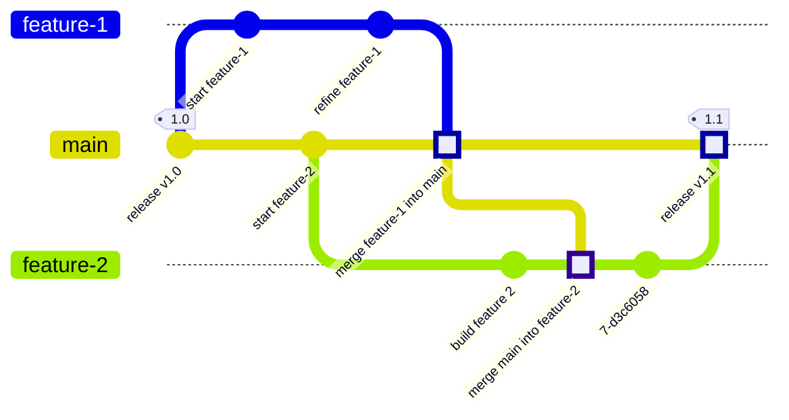
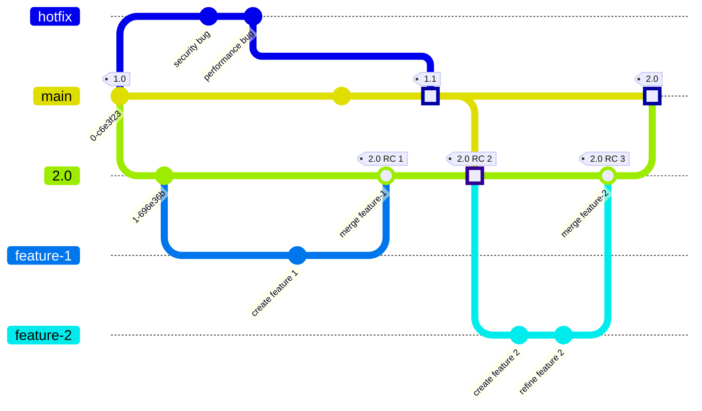
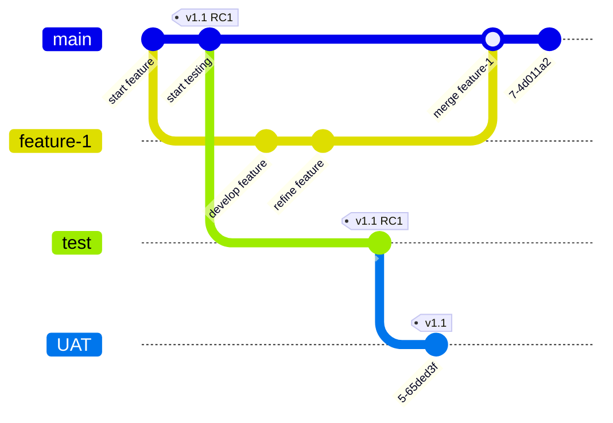

The way you organize and merge Git branches is called a **branching strategy**.
For many teams, the simplest approach is sensible and effective:

1. Make changes in a feature branch.
1. Merge the feature branch directly to `main`.

However, if your team has complex needs (like testing and compliance requirements),
you might want to consider a different branching strategy.

We want to demystify some of the more common strategies available.
Not everyone has a Git (or version control) specialist on staff. If you know
your team is working at the far edges of its Git skillset, this information is for you.

When you use GitLab to replace multiple, disparate tools, the decisions you
make about your Git branching strategy matter. With careful planning, you can establish clear
connections between:

- The initial bug reports you receive.
- The commits your teams make to fix those bugs.
- The processes of backporting those fixes to other versions or customers.
- The deployments that make your fixes available to your users.

Careful choices help you take the best advantage of the single data store in GitLab.

## Do I need a more complex Git branching strategy?

You might have outgrown your current Git branching strategy if:

- You use continuous delivery.
- You have significant automated testing.
- You must fix critical bugs for one customer without affecting other customers.
- You maintain multiple historical versions of your product.
- Your product has no single production branch, because it supports multiple operating systems or platforms.
- Your product has different deployment or certification requirements for each version.

Don't implement a strategy that is more complex than your product needs.

### When to split a project into multiple repositories

Should you maintain one Git repository with a complex branching structure, or split the project
across multiple repositories? There's no single right answer. It depends on what you have the personnel
and expertise to support.

GitLab provides automation that assumes your repository is for a single product, though that product
might contain multiple versions. To determine if you should have multiple repositories, or a single
complex one, ask these questions:

- Is it the same product?
- Do all elements use the same build process?
- Is the underlying code similar, or the same?

No matter what you choose (either a complex single repository, or a set of smaller repositories) you
should expect to spend engineering time on maintenance. Identify which type of engineering work you are
prepared to do:

- If you maintain code for multiple products in a single repository, plan for customization work later
  to use all features of GitLab.
- Merging work across multiple repositories is more involved than merging across branches in the same
  repository. Plan for engineering time to build custom release processes and manage the flow of code
  across repositories.


Does your organization use a large monorepo or a megarepo? The
[Professional Services](https://about.gitlab.com/services/) team at GitLab can help you construct a
custom branching solution that meets your monorepo's needs.


## Major types of branching strategies

Branching and code management strategies depend on your product's needs.
No pre-existing strategy can cover them all, but we've identified some major categories:

- [Webservices](#webservices)
- [Long-lived release branches](#long-lived-release-branches)
- [A branch per environment](#branch-per-environment)

### Webservices

This strategy follows standard Git practices. The `main` branch is your production branch, which
is great for a single webservice: there's one canonical production version, and no support for
previous revisions.

For this configuration, [`git-flow`](https://nvie.com/posts/a-successful-git-branching-model/)
probably works for you. It's standardized, and you don't have to maintain anything.

In this example, `feature-1` branches off directly from `main`. When complete, `feature-1` merges back
directly into `main`. This merge commit is highlighted with a square. Longer-lived branches, like
`feature-2`, might periodically merge in the latest updates from `main` as part of development.
When complete, `feature-2` merges into `main`, and release `1.1` is cut:

### Long-lived release branches

This branching strategy is appropriate if your product has branches that must remain separate from `main`
for a long time. Some examples include:

- Multiple production versions of the same software package. For example: a current version, and
  legacy versions. The current version receives feature updates and hotfixes, while previous versions
  receive hotfixes and security releases only.
- A current production version, and a long-lived beta version. You might need this approach when a major
  software dependency (like a software development kit, or SDK) is introducing breaking changes.
  The current production version receives feature updates and hotfixes. The beta version receives
  those feature updates and hotfixes while your team also builds in support for the upcoming SDK changes.

If you intend to lock a long-lived branch, it is critical to define your hotfix process and enforce it.
If undefined and unenforced, every change becomes a hotfix.

In this example, the `2.0` branch is created from the commit on `main` for the `1.0` release.
Features branch off from the `2.0` branch, and merge back into `2.0`. At the same time, any hotfix
branches are based off of the most recent release (`1.0`) of `main`, and merge back into `main` as
release `1.1`. The `2.0` branch then pulls in the changes from release `1.1`, and incorporates them
as part of the development of `2.0`. After the addition of another feature (`feature-2`), the `2.0`
branch is ready for production. It merges into `main`, and release `2.0` is cut:

#### Migrate from SVN branching strategies

Legacy projects migrating from SVN to Git should review their branching approach.
Some SVN-centric branching approaches in Git can prevent you from getting
the most out of GitLab. Some workflows to revisit:

- You create a long-lived branch (like `1.0`) from `main`, then lock the `1.0` branch to block any
  change that is not a pre-approved hotfix.
  - Git handles merge conflicts better than SVN.
  - Avoid creating long-lived branches, unless you have contractual
    obligations to use them. While Git handles conflicts well, long-lived branches require you to
    spend time merging fixes to multiple branches.
- You use branches because your product does not support feature flags.

### Branch per environment

This branching strategy is common for organizations with multiple interdependent services that are
built by different teams. It's often used with waterfall or V-model development processes.

In this example, the commit marked `v1.1 RC1` is identified as a release candidate for version `1.1`.
Features continue to branch from and back into `main`, while the release candidate commit is tested on
the `test` and `UAT` environments. This process is repeated for each commit that is considered for release:

## Related topics

- [Protected branches](../protected.md)
- [Merge request approvals](../../../merge_requests/approvals/_index.md)
- [Testing merged results](../../../../../ci/pipelines/merged_results_pipelines.md)
