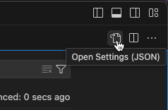

DETAILS:
**Tier:** Premium with GitLab Duo Pro, Ultimate with GitLab Duo Pro or Enterprise - [Start a trial](https://about.gitlab.com/solutions/gitlab-duo-pro/sales/?type=free-trial)
**Offering:** GitLab.com, GitLab Self-Managed, GitLab Dedicated

> - Changed to require GitLab Duo add-on in GitLab 17.6 and later.

When working with GitLab Duo Code Suggestions, you might encounter the following issues.

You can run a [health check](../../../gitlab_duo/turn_on_off.md) to test if your instance meets the requirements to run Code Suggestions.

## Suggestions are not displayed

If suggestions are not displayed, ensure that you:

- Have [configured GitLab Duo correctly](../../../gitlab_duo/turn_on_off.md).
- Are using a [supported language](supported_extensions.md#supported-languages)
  and [editor extension](supported_extensions.md#supported-editor-extensions).
- Have [configured your editor extension correctly](set_up.md#configure-editor-extension).

If suggestions are still not displayed, try the following troubleshooting steps
for the different IDEs:

- [VS Code or GitLab Web IDE](#suggestions-not-displayed-in-vs-code-or-gitlab-web-ide)
- [JetBrains IDEs](#suggestions-not-displayed-in-jetbrains-ides)
- [Microsoft Visual Studio](#suggestions-not-displayed-in-microsoft-visual-studio)

## Code Suggestions returns a 401 error

Code Suggestions [depends on a license token](../../../ai_features.md) that
[synchronizes your subscription](../../../../administration/license.md) with GitLab.

If the token expires, GitLab Duo Code Suggestions returns the following error
with status `401` when the token has expired:

```plaintext
Token validation failed in Language Server:
(Failed to check token: Error: Fetching Information about personal access token
```

If GitLab has access to the [cloud server](../../../ai_features.md), try
[manually synchronizing your license](../../../../subscriptions/self_managed/_index.md#manually-synchronize-subscription-data).

## Authentication troubleshooting

The problem might be driven to the recent changes in authentication,
specifically the token system. To resolve the issue:

1. Remove the existing personal access token from your GitLab account settings.
1. Reauthorize your GitLab account using OAuth.
1. Test the Code Suggestions feature with different file extensions to verify if the issue is resolved.

## VS Code troubleshooting

The following documentation is for Code Suggestions-specific troubleshooting for
VS Code.

For non-Code Suggestions troubleshooting for VS Code, see [Troubleshooting the GitLab Workflow extension for VS Code](../../../../editor_extensions/visual_studio_code/troubleshooting.md).

### Suggestions not displayed in VS Code or GitLab Web IDE

If you are on GitLab Self-Managed, ensure that Code Suggestions for the [GitLab Web IDE](../../web_ide/_index.md) is enabled. The same settings apply to VS Code as local IDE.

1. On the left sidebar, select **Extensions > GitLab Workflow**.
1. Select **Settings** (**{settings}**), and then select **Extension Settings**.
1. In **GitLab > Duo Code Suggestions**, select the **GitLab Duo Code Suggestions**
   checkbox.

#### View Code Suggestions logs

If Code Suggestions are enabled for the IDE, but suggestions are still not displayed:

1. In your IDE, in the GitLab Workflow **Extension Settings**, enable **GitLab: Debug**.
1. On the top menu, select **View > Output** to open the bottom panel, then either:
   - In the command palette, select `GitLab: Show Extension Logs`.
   - In the bottom panel, on the right, select the dropdown list to filter the logs. Select **GitLab Workflow**.
1. In the GitLab Workflow **Extension Settings**, clear and re-select the **GitLab Duo Code Suggestions** checkbox.

### Disable streaming of code generation results

By default, code generation streams AI-generated code. Streaming sends generated code
to your editor incrementally, rather than waiting for the full code snippet to generate.
This allows for a more interactive and responsive experience.

If you prefer to see code generation results only when they are complete, you can turn off streaming.
Disabling streaming means that code generation requests might be perceived
as taking longer to resolve. To disable streaming:

1. In VS Code, on the top bar, go to **Code > Settings > Settings**.
1. On the top right corner, select **Open Settings (JSON)** to edit your `settings.json` file:

   
1. In your `settings.json` file, add this line, or set it to `false` it already exists:

   ```json
   "gitlab.featureFlags.streamCodeGenerations": false,
   ```

1. Save your changes.

### Error: Direct connection fails

> - Direct connection [introduced](https://gitlab.com/groups/gitlab-org/-/epics/13252) in GitLab 17.2.

To reduce latency, the Workflow extension tries to send suggestion completion requests directly to GitLab Cloud Connector,
bypassing the GitLab instance. This network connection does not use the proxy and certificate settings of the VS Code extension.

If your GitLab instance doesn't support direct connections, or your network prevents the extension from connecting to
GitLab Cloud Connector, you might see these warnings in your logs:

```plaintext
Failed to fetch direct connection details from GitLab instance.
Code suggestion requests will be sent to GitLab instance.
```

This error means your instance either doesn't support direct connections, or is misconfigured.

If you see this error, the extension can't connect to GitLab Cloud Connector, and is reverting to use your GitLab instance:

```plaintext
Direct connection for code suggestions failed.
Code suggestion requests will be sent to your GitLab instance.
```

The indirect connection through your GitLab instance is about 100 ms slower, but otherwise works the same.
This issue is often caused by network connection problems, like with your LAN firewall or proxy settings.

## JetBrains IDEs troubleshooting

The following documentation is for Code Suggestions-specific troubleshooting for
JetBrains IDEs.

For non-Code Suggestions troubleshooting for JetBrains IDEs, see [JetBrains troubleshooting](../../../../editor_extensions/jetbrains_ide/jetbrains_troubleshooting.md).

### Suggestions not displayed in JetBrains IDEs

1. From the **Tools > GitLab Duo** menu, select **Verify setup**. Make sure the health check passes.
1. Verify that your JetBrains IDE natively supports the language of the file you are
   working on. Go to **Settings** > **Languages & Frameworks** to see the full list of
   languages and frameworks supported by your JetBrains IDE.

### Error: `unable to find valid certification path to requested target`

The GitLab Duo plugin verifies TLS certificate information before connecting to your GitLab instance.
You can [add a custom SSL certificate](set_up.md#add-a-custom-certificate-for-code-suggestions).

### Error: `Failed to check token`

This error occurs when the provided connection instance URL and authentication token passed through to the
GitLab Language Server process are invalid. To re-enable Code Suggestions:

1. In your IDE, on the top bar, select your IDE name, then select **Settings**.
1. On the left sidebar, select **Tools > GitLab Duo**.
1. Under **Connection**, select **Verify setup**.
1. Update your **Connection** details as needed.
1. Select **Verify setup**, and confirm that authentication succeeds.
1. Select **OK** or **Save**.

## Microsoft Visual Studio troubleshooting

The following documentation is for Code Suggestions-specific troubleshooting for
Microsoft Visual Studio.

For non-Code Suggestions troubleshooting for Microsoft Visual Studio, see
[Visual Studio troubleshooting](../../../../editor_extensions/visual_studio/visual_studio_troubleshooting.md).

### IntelliCode is missing

Code Suggestions requires the **IntelliCode** component of Visual Studio. If the component
is missing, you might see an error like this when you start Visual Studio:

```plaintext
SetSite failed for package [VisualStudioPackage]Source: 'Microsoft.VisualStudio.Composition'
Description: Expected 1 export(s) with contract name "Microsoft.VisualStudio.Language.Suggestions.SuggestionServiceBase"
but found 0 after applying applicable constraints.

Microsoft.VisualStudio.Composition.CompositionFailedException:
Expected 1 export(s) with contract name "Microsoft.VisualStudio.Language.Suggestions.SuggestionServiceBase"
but found 0 after applying applicable constraints.

  at Microsoft.VisualStudio.Composition.ExportProvider.GetExports(ImportDefinition importDefinition)
  at Microsoft.VisualStudio.Composition.ExportProvider.GetExports[T,TMetadataView](String contractName, ImportCardinality cardinality)
  at Microsoft.VisualStudio.Composition.ExportProvider.GetExport[T,TMetadataView](String contractName)
  at Microsoft.VisualStudio.Composition.ExportProvider.GetExportedValue[T]()
  at Microsoft.VisualStudio.ComponentModelHost.ComponentModel.GetService[T]()
[...]
```

To fix this problem, install the **IntelliCode** component:

1. In the Windows start menu, search for the **Visual Studio Installer** and open it.
1. Select your Visual Studio instance, then select **Modify**.
1. In the **Individual components** tab, search for **IntelliCode**.
1. Select the component's checkbox, then on the bottom right, select **Modify**.
1. Wait for the Visual Studio Installer to finish the installation.

### Suggestions not displayed in Microsoft Visual Studio

1. Ensure you have properly [set up the extension](https://gitlab.com/gitlab-org/editor-extensions/gitlab-visual-studio-extension#setup).
1. From the **Tools > Options** menu, find the **GitLab** option. Ensure **Log Level** is set to **Debug**.
1. In **View > Output**, open the extension log. Change the dropdown list to **GitLab Extension** as the log filter.
1. Verify that the debug log contains similar output:

```shell
14:48:21:344 GitlabProposalSource.GetCodeSuggestionAsync
14:48:21:344 LsClient.SendTextDocumentCompletionAsync("GitLab.Extension.Test\TestData.cs", 34, 0)
14:48:21:346 LS(55096): time="2023-07-17T14:48:21-05:00" level=info msg="update context"
```

If another extension provides similar suggestion or completion features, the extension might not return suggestions. To resolve this:

1. Disable all other Visual Studio extensions.
1. Confirm that you now receive Code Suggestions.
1. Re-enable extensions one at a time, testing for Code Suggestions each time, to find the extension that conflicts.

## Neovim troubleshooting

The following documentation is for Code Suggestions-specific troubleshooting for
Neovim.

For non-Code Suggestions troubleshooting for Neovim, see [Neovim troubleshooting](../../../../editor_extensions/neovim/neovim_troubleshooting.md).

### Code completions fails

1. Confirm `omnifunc` is set in Neovim:

   ```lua
   :verbose set omnifunc?
   ```

1. Confirm the Language Server is active by running this command in Neovim:

   ```lua
   :lua =vim.lsp.get_active_clients()
   ```

1. Check the logs for the Language Server in `~/.local/state/nvim/lsp.log`.
1. Inspect the `vim.lsp` log path for errors by running this command in Neovim:

   ```lua
   :lua =vim.cmd('view ' .. vim.lsp.get_log_path())
   ```
