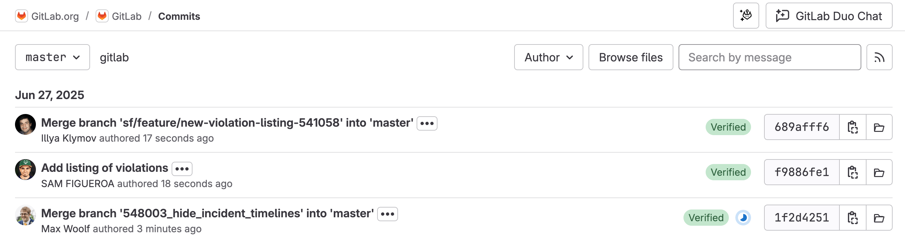



- Tier: Free, Premium, Ultimate
- Offering: GitLab.com, GitLab Self-Managed, GitLab Dedicated



The **Commits** list displays the commit history for your repository. Use it to browse
code changes, view commit details, and verify commit signatures. You can filter the commit list by
Git revision to see the changes for a specific revision.

The list shows:

- Commit hash: Unique identifier (SHA) for each commit.
- Commit message: Title and description of the commit.
- Author: Name and avatar of the user who made the commit.
- Timestamp: When the commit was created.
- Pipeline status: CI/CD pipeline results, if configured.
- Signature verification: GPG, SSH, or X.509 signature status.
- Tags: Any tags pointing to this commit.

## View commits

To view your repository's commit history:

1. On the left sidebar, select **Search or go to** and find your project. If you've [turned on the new navigation](../../../interface_redesign.md#turn-new-navigation-on-or-off), this field is on the top bar.
1. Select **Code** > **Commits**.

To view a commit's summary, select the **Toggle commit description** icon ().
This summary does not display file changes or statistics.

## View commit details

Examine the specific changes made in any commit, including file modifications, additions, and deletions.

To view a commit's details:

1. On the left sidebar, select **Search or go to** and find your project. If you've [turned on the new navigation](../../../interface_redesign.md#turn-new-navigation-on-or-off), this field is on the top bar.
1. Select **Code** > **Commits**.
1. Select the commit to open the commit's details page.

The commit's details page shows:

- Commit information: Commit hash, author, committer, parent commits, and timestamp.
- Commit message: Title and description of the commit.
- File changes: All modified files with diff view.
- Statistics: Number of lines changed, added, and removed.
- Pipeline details: Associated CI/CD pipeline status and details.
- References: Branches and tags containing this commit.
- Related merge requests: Links to merge requests associated with the commit.

## Browse repository files by Git revision

To view all repository files and folders at a specific Git revision, such as a commit SHA,
branch name, or tag:

1. On the left sidebar, select **Search or go to** and find your project. If you've [turned on the new navigation](../../../interface_redesign.md#turn-new-navigation-on-or-off), this field is on the top bar.
1. Select **Code** > **Commits**.
1. Choose one of the following options:
   - Filter by Git revision:
      1. At the top, select to open the **Select Git revision** dropdown list.
      1. Select or search for a Git revision.
   - Select a specific commit from the commits list.
1. In the upper right, select **Browse files**.

You are directed to the [repository](../_index.md) page at that specific revision.

## Filter and search commits

Filter and search the commit history to find specific changes or track work by particular authors.

### Filter by author

To filter commits by a specific author:

1. On the left sidebar, select **Search or go to** and find your project. If you've [turned on the new navigation](../../../interface_redesign.md#turn-new-navigation-on-or-off), this field is on the top bar.
1. Select **Code** > **Commits**.
1. In the **Author** dropdown list, select or search for the author's name or username.

If author filtering doesn't work for names with special characters, use the URL parameter format.
For example, append `?author=Elliot%20Stevens` to the URL.

### Filter by Git revision

To filter commits by Git revision, such as branch, tag, or commit SHA:

1. On the left sidebar, select **Search or go to** and find your project. If you've [turned on the new navigation](../../../interface_redesign.md#turn-new-navigation-on-or-off), this field is on the top bar.
1. Select **Code** > **Commits**.
1. In the dropdown list, select or search for a Git revision.
   For example, branch name, tag, or commit SHA.
1. Select the Git revision to view the list of filtered commits.

### Search by commit message

To search for commits by message content:

1. On the left sidebar, select **Search or go to** and find your project. If you've [turned on the new navigation](../../../interface_redesign.md#turn-new-navigation-on-or-off), this field is on the top bar.
1. Select **Code** > **Commits**.
1. In the **Search by message** field, enter your search terms.

You can also search by commit SHA, full or partial, to find a specific commit directly.

## Cherry-pick a commit

Apply changes from a specific commit to another.

Prerequisites:

- You must have at least the Developer role for the project.
- The target branch must exist.

To cherry-pick a commit:

1. On the left sidebar, select **Search or go to** and find your project. If you've [turned on the new navigation](../../../interface_redesign.md#turn-new-navigation-on-or-off), this field is on the top bar.
1. Select **Code** > **Commits**.
1. Select the commit you want to cherry-pick.
1. In the upper-right corner, select **Options** and then **Cherry-pick**.
1. In the dialog:
   - From the dropdown lists, select the target project and branch.
   - Optional. Select **Start a new merge request** to create a merge request with the changes.
   - Select **Cherry-pick**.

GitLab creates a new commit on the target branch with the cherry-picked changes.
If the branch is [protected](../branches/protected.md) or you don't have the correct permissions,
GitLab prompts you to [create a new merge request](../../merge_requests/_index.md#create-a-merge-request).

## Revert a commit

Create a new commit that undoes changes from a previous commit.

Prerequisites:

- You must have at least the Developer role for the project.

To revert a commit:

1. On the left sidebar, select **Search or go to** and find your project. If you've [turned on the new navigation](../../../interface_redesign.md#turn-new-navigation-on-or-off), this field is on the top bar.
1. Select **Code** > **Commits**.
1. Select the commit you want to revert.
1. In the upper-right corner, select **Options** and then **Revert**.
1. In the dialog:
   - Select the target branch for the revert commit.
   - Optional. Select **Start a new merge request** to create a merge request.
   - Select **Revert**.

GitLab creates a new commit that reverses the changes from the selected commit.
If the branch is [protected](../branches/protected.md) or you don't have the correct permissions,
GitLab prompts you to [create a new merge request](../../merge_requests/_index.md#create-a-merge-request).

## Download commit contents

To download a commit's diff contents:

1. On the left sidebar, select **Search or go to** and find your project. If you've [turned on the new navigation](../../../interface_redesign.md#turn-new-navigation-on-or-off), this field is on the top bar.
1. Select **Code** > **Commits**.
1. Select the commit you want to download.
1. In the upper-right corner, select **Options**.
1. Under **Downloads**, select **Plain Diff**.

## Verify commit signatures

GitLab verifies GPG, SSH, and X.509 signatures to ensure commit authenticity.
Verified commits show a **Verified** badge.

For more information, see [signed commits](../signed_commits/_index.md).

### View signature details

To view signature information:

1. On the left sidebar, select **Search or go to** and find your project. If you've [turned on the new navigation](../../../interface_redesign.md#turn-new-navigation-on-or-off), this field is on the top bar.
1. Select **Code** > **Commits**.
1. Find a commit with a **Verified** or **Unverified** badge.
1. Select the badge to view signature details including:
   - Signature type (GPG, SSH, or X.509)
   - Key fingerprint
   - Verification status
   - Signer identity

## View pipeline status and details

The commit list includes a CI/CD pipeline status icon next to each commit. To view the pipeline details:

1. On the left sidebar, select **Search or go to** and find your project. If you've [turned on the new navigation](../../../interface_redesign.md#turn-new-navigation-on-or-off), this field is on the top bar.
1. Select **Code** > **Commits**.
1. Select the pipeline status icon next to any commit.

## Related topics

- [Signed commits](../signed_commits/_index.md)
- [Compare revisions](../compare_revisions.md)
- [Git file history](../files/git_history.md)
- [Tags](../tags/_index.md)
