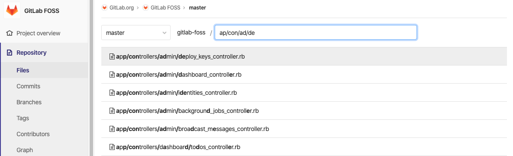

# File finder **(FREE)**

The file finder feature allows you to search for a file in a repository using the
GitLab UI. To use it:

1. Go to your project's **Repository > Files**.
1. In the upper right corner, select **Find File**.

If you prefer to keep your fingers on the keyboard, use the
[shortcut button](../../shortcuts.md), which you can invoke from anywhere
in a project.

Press `t` to launch the File search function when in **Issues**,
**Merge requests**, **Milestones**, even the project's settings.

Start typing what you are searching for and watch the magic happen. With the
up/down arrows, you go up and down the results, with `Esc` you close the search
and go back to **Files**

## How it works

The File finder feature is powered by the [Fuzzy filter](https://github.com/jeancroy/fuzz-aldrin-plus) library.

It implements a fuzzy search with the highlight and tries to provide intuitive
results by recognizing patterns that people use while searching.

For example, consider the [GitLab FOSS repository](https://gitlab.com/gitlab-org/gitlab-foss/tree/master) and that we want to open
the `app/controllers/admin/deploy_keys_controller.rb` file.

Using a fuzzy search, we start by typing letters that get us closer to the file.

NOTE:
To narrow down your search, include `/` in your search terms.

