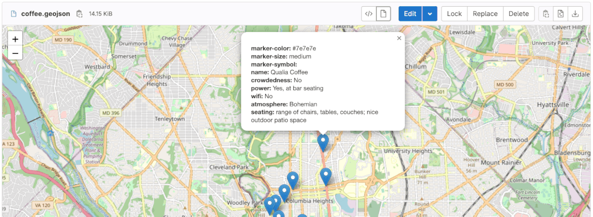

DETAILS:
**Tier:** Free, Premium, Ultimate
**Offering:** GitLab.com, GitLab Self-Managed, GitLab Dedicated

> - [Introduced](https://gitlab.com/gitlab-org/gitlab/-/issues/14134) in GitLab 16.1.

A GeoJSON file is a format for encoding geographical data structures using JavaScript Object Notation (JSON).
It is commonly used for representing geographic features, such as points, lines, and polygons, along with their associated attributes.

When added to a repository, files with a `.geojson` extension are rendered as a map containing the GeoJSON data when viewed in GitLab.

Map data comes from [OpenStreetMap](https://www.openstreetmap.org/) under the [Open Database License](https://www.openstreetmap.org/copyright).

