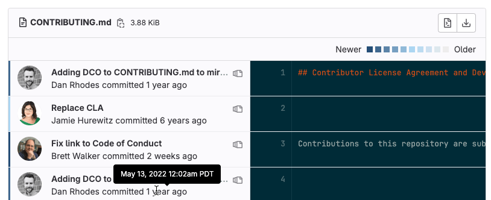

DETAILS:
**Tier:** Free, Premium, Ultimate
**Offering:** GitLab.com, GitLab Self-Managed, GitLab Dedicated

[Git blame](https://git-scm.com/docs/git-blame) provides more information
about every line in a file, including the last modified time, author, and
commit hash.

## View blame for a file

> - Viewing blame directly in the file view [introduced](https://gitlab.com/gitlab-org/gitlab/-/issues/430950) in GitLab 16.7 [with flag](../../../../administration/feature_flags.md) named `inline_blame`. Disabled by default.

Prerequisites:

- The file type must be text-based. The GitLab UI does not display
  `git blame` results for binary files.

To view the blame for a file:

1. On the left sidebar, select **Search or go to** and find your project.
1. Select **Code > Repository**.
1. Select the file you want to review.
1. Either:
   - To change the view of the current file, in the file header, select **Blame**.
   - To open the full blame page, in the upper-right corner, select **Blame**.
1. Go to the line you want to see.

When you select **Blame**, this information is displayed:

To see the precise date and time of the commit, hover over the date. The vertical bar
to the left of the user avatar shows the general age of the commit. The newest
commits have a dark blue bar. As the age of the commit increases, the bar color
changes to light gray.

### Blame previous commit

To see earlier revisions of a specific line:

1. On the left sidebar, select **Search or go to** and find your project.
1. Select **Code > Repository**.
1. Select the file you want to review.
1. In the upper-right corner, select **Blame**, and go to the line you want to see.
1. Select **View blame prior to this change** (**{doc-versions}**)
   until you've found the changes you're interested in viewing.

## Related topics

- [Git file blame REST API](../../../../api/repository_files.md#get-file-blame-from-repository)
- [Common Git commands](../../../../topics/git/commands.md)
- [File management with Git](../../../../topics/git/file_management.md)
