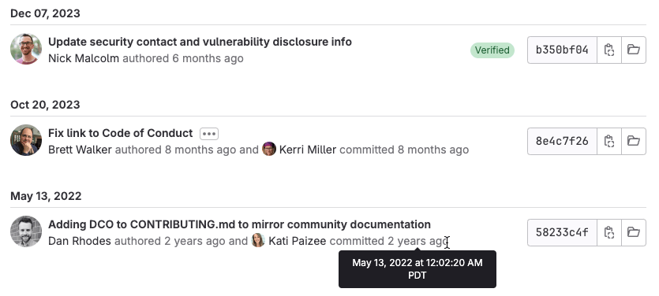

DETAILS:
**Tier:** Free, Premium, Ultimate
**Offering:** GitLab.com, GitLab Self-Managed, GitLab Dedicated

Git file history provides information about the commit history associated
with a file:



Each commit shows:

- The date of the commit. GitLab groups together all commits made on the same day.
- The user's avatar.
- The user's name. Hover over the name to see the user's job title, location, local time, and current status message.
- The date of the commit, in time-ago format. To see the precise date and time of
  the commit, hover over the date.
- If the [commit is signed](../signed_commits/_index.md), a **Verified** badge.
- The commit SHA. GitLab shows the first 8 characters. Select **Copy commit SHA** (**{copy-to-clipboard}**) to copy the entire SHA.
- A link to **browse** (**{folder-open}**) the file as it appeared at the time of this commit.

GitLab retrieves the user name and email information from the
[Git configuration](https://git-scm.com/book/en/v2/Customizing-Git-Git-Configuration)
of the contributor when the user creates a commit.

## View a file's Git history

To see a file's Git history in the UI:

1. On the left sidebar, select **Search or go to** and find your project.
1. Select **Code > Repository**.
1. Go to your desired file in the repository.
1. In the upper-right corner, select **History**.

## Related topics

- [Git blame](git_blame.md) for line-by-line information about a file
- [Common Git commands](../../../../topics/git/commands.md)
- [File management with Git](../../../../topics/git/file_management.md)

## Troubleshooting

## Limit history range of results

> - [Introduced](https://gitlab.com/gitlab-org/gitlab/-/issues/423108) in GitLab 16.9.

When reviewing history for old files, or files with many commits, you can
limit the search results by date. Limiting the dates for commits helps fix
[commit history requests timeouts](https://gitlab.com/gitlab-org/gitaly/-/issues/5426)
in very large repositories.

In the GitLab UI, edit the URL. Include these parameters in `YYYY-MM-DD` format:

- `committed_before`
- `committed_after`

Separate each key-value pair in the query string with an ampersand (`&`), like this:

```plaintext
?ref_type=heads&committed_after=2023-05-15&committed_before=2023-11-22
```

The full URL to the range of commits looks like this:

For example:

```plaintext
https://gitlab.com/gitlab-org/gitlab/-/commits/master/CONTRIBUTING.md?ref_type=heads&committed_after=2023-05-15&committed_before=2023-11-22
```
