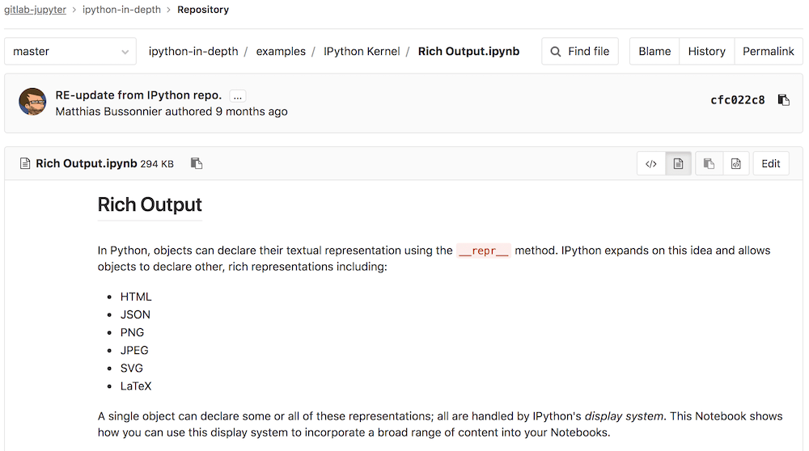

# Jupyter Notebook files

DETAILS:
**Tier:** Free, Premium, Ultimate
**Offering:** GitLab.com, GitLab Self-Managed, GitLab Dedicated

[Jupyter Notebook](https://jupyter.org/) (previously, IPython Notebook) files are used for
interactive computing in many fields. They contain a complete record of the
user's sessions and include:

- Code.
- Narrative text.
- Equations.
- Rich output.

When you add a Jupyter Notebook (with `.ipynb` extension) to your repository,
it's rendered into HTML when you view it:

Interactive features, including JavaScript plots, don't work when viewed in
GitLab.

## Cleaner diffs and raw diffs

> - [Reintroduced toggle](https://gitlab.com/gitlab-org/gitlab/-/merge_requests/85079) in GitLab 15.0 [with a flag](../../../../../administration/feature_flags.md) named `ipynb_semantic_diff`. Enabled by default.
> - [Generally available](https://gitlab.com/gitlab-org/gitlab/-/merge_requests/95373) in GitLab 15.6. Feature flag `ipynb_semantic_diff` removed.

When commits include changes to Jupyter Notebook files, GitLab:

- Transforms the machine-readable `.ipynb` file into a human-readable Markdown file.
- Displays a cleaner version of the diff that includes syntax highlighting.
- Enables switching between raw and rendered diffs on the Commit and Compare pages. (Not available on merge request pages.)
- Renders images on the diffs.

Code Suggestions is not available on diffs and merge requests for `.ipynb` files.

Cleaner notebook diffs are not generated when the notebook is too large.

## Jupyter Git integration

Jupyter can be configured as an OAuth application with repository access, acting
on behalf of the authenticated user. See the
[Runbooks documentation](../../../clusters/runbooks/_index.md) for an
example configuration.
