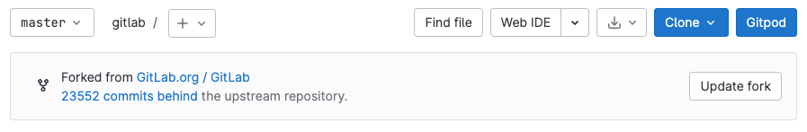

# Project forking workflow **(FREE)**

Whenever possible, it's recommended to work in a common Git repository and use
[branching strategies](../../../topics/gitlab_flow.md) to manage your work. However,
if you do not have write access for the repository you want to contribute to, you
can create a fork.

A fork is a personal copy of the repository and all its branches, which you create
in a namespace of your choice. Make changes in your own fork and
submit them through a merge request to the repository you don't have access to.

## Create a fork

> - [Introduced](https://gitlab.com/gitlab-org/gitlab/-/issues/15013) a new form in GitLab 13.11 [with a flag](../../../user/feature_flags.md) named `fork_project_form`. Disabled by default.
> - [Enabled on GitLab.com and self-managed](https://gitlab.com/gitlab-org/gitlab/-/merge_requests/77181) in GitLab 14.8. Feature flag `fork_project_form` removed.

To fork an existing project in GitLab:

1. On the project's homepage, in the upper-right corner, select **Fork** (**{fork}**):
   
1. Optional. Edit the **Project name**.
1. For **Project URL**, select the [namespace](../../namespace/index.md)
   your fork should belong to.
1. Add a **Project slug**. This value becomes part of the URL to your fork.
   It must be unique in the namespace.
1. Optional. Add a **Project description**.
1. Select the **Visibility level** for your fork. For more information about
   visibility levels, read [Project and group visibility](../../public_access.md).
1. Select **Fork project**.

GitLab creates your fork, and redirects you to the new fork's page.

## Update your fork

A fork can fall out of sync with its upstream repository, and require an update:

- **Ahead**: Your fork contains new commits not present in the upstream repository.
  To sync your fork, create a merge request to push your changes to the upstream repository.
- **Behind**: The upstream repository contains new commits not present in your fork.
  To sync your fork, pull the new commits into your fork.
- **Ahead and behind**: Both the upstream repository and your fork contain new commits
  not present in the other. To fully sync your fork, create a merge request to push
  your changes up, and pull the upstream repository's new changes into your fork.

To sync your fork with its upstream repository, update it from the GitLab UI
or the command line. GitLab Premium and Ultimate tiers can also automate updates by
[configuring forks as pull mirrors](#with-repository-mirroring) of the upstream repository.

### From the UI

> [Introduced](https://gitlab.com/gitlab-org/gitlab/-/issues/330243) in GitLab 15.11 [with a flag](../../../administration/feature_flags.md) named `synchronize_fork`. Disabled by default, but enabled for projects in the `gitlab-org/gitlab` and `gitlab-com/www-gitlab-com` namespaces only.

FLAG:
On self-managed GitLab, by default this feature is not available. To make it available,
ask an administrator to [enable the feature flag](../../../administration/feature_flags.md) named `synchronize_fork`.
On GitLab.com, this feature is available for projects in the `gitlab-org/gitlab` and `gitlab-com/www-gitlab-com` namespaces.

To update your fork from the GitLab UI:

1. On the top bar, select **Main menu > Projects > View all projects**.
1. On the secondary menu, select **Personal**.
1. Select the fork you want to update.
1. Below the dropdown list for branch name, find the **Forked from** (**{fork}**)
   information box to determine if your fork is ahead, behind, or both. In this example,
   the fork is behind the upstream repository:

   

1. If your fork is **ahead** of the upstream repository, select
   **Create merge request** to propose adding your fork's changes to the upstream repository.
1. If your fork is **behind** the upstream repository, select **Update fork**
   to pull changes from the upstream repository.
1. If your fork is **ahead and behind** the upstream repository, you can update from the UI
   available only if no merge conflicts are detected:
   - If your fork contains no merge conflicts, you can select **Create merge request**
     to propose pushing your changes to the upstream repository, **Update fork**
     to pull changes down to your fork, or both. The type of changes in your fork
     determine which actions are appropriate.
   - If your fork contains merge conflicts, update your fork from the command line.

### From the command line

To update your fork from the command line, first ensure that you have configured
an `upstream` remote repository for your fork:

1. Clone your fork locally, if you have not already done so. For more information, see
   [Clone a repository](../../../gitlab-basics/start-using-git.md#clone-a-repository).
1. View the remotes configured for your fork:

   ```shell
   git remote -v
   ```

1. If your fork does not have a remote pointing to the original repository,
   use one of these examples to configure a remote called `upstream`:

   ```shell
   # Use this line to set any repository as your upstream after editing <upstream_url>
   git remote add upstream <upstream_url>

   # Use this line to set the main GitLab repository as your upstream
   git remote add upstream https://gitlab.com/gitlab-org/gitlab.git
   ```

   After ensuring your local copy has the extra remote configured, you are ready to update your fork.

1. In your local copy, ensure you have checked out the [default branch](branches/default.md),
   replacing `main` with the name of your default branch:

   ```shell
   git checkout main
   ```

   If Git identifies unstaged changes, commit or stash them before continuing.

1. Fetch the changes to the upstream repository:

   ```shell
   git fetch upstream
   ```

1. Pull the changes into your fork, replacing `main` with the name of the branch
   you are updating:

   ```shell
   git pull upstream main
   ```

1. Push the changes to your fork repository on the server (GitLab.com or self-managed):

   ```shell
   git push origin main
   ```

### With repository mirroring **(PREMIUM)**

A fork can be configured as a mirror of the upstream if all these conditions are met:

1. Your subscription is **Premium** or **Ultimate**.
1. You create all changes in branches (not `main`).
1. You do not work on [merge requests for confidential issues](../merge_requests/confidential.md),
   which requires changes to `main`.

[Repository mirroring](mirror/index.md) keeps your fork synced with the original repository.
This method updates your fork once per hour, with no manual `git pull` required.
For instructions, read [Configure pull mirroring](mirror/pull.md#configure-pull-mirroring).

WARNING:
With mirroring, before approving a merge request, you are asked to sync. You should automate it.

## Merge changes back upstream

When you are ready to send your code back to the upstream project,
[create a merge request](../merge_requests/creating_merge_requests.md). For **Source branch**,
choose your forked project's branch. For **Target branch**, choose the original project's branch.

NOTE:
When creating a merge request, if the forked project's visibility is more restrictive than the parent project (for example the fork is private, the parent is public), the target branch defaults to the forked project's default branch. This prevents potentially exposing the private code of the forked project.


Then you can add labels, a milestone, and assign the merge request to someone who can review
your changes. Then select **Submit merge request** to conclude the process. When successfully merged, your
changes are added to the repository and branch you're merging into.

## Unlink a fork

Removing a fork relationship unlinks your fork from its upstream project.
Your fork then becomes an independent project.

Prerequisites:

- You must be a project owner to unlink a fork.

WARNING:
If you remove a fork relationship, you can't send merge requests to the source.
If anyone has forked your project, their fork also loses the relationship.
To restore the fork relationship, [use the API](../../../api/projects.md#create-a-forked-fromto-relation-between-existing-projects).

To remove a fork relationship:

1. On the top bar, select **Main menu > Projects** and find your project.
1. On the left sidebar, select **Settings > General**.
1. Expand **Advanced**.
1. In the **Remove fork relationship** section, select **Remove fork relationship**.
1. To confirm, enter the project path and select **Confirm**.

When you unlink a fork that uses a [hashed storage pool](../../../administration/repository_storage_types.md#hashed-object-pools)
to share objects with another repository:

- All objects are copied from the pool into your fork.
- After the copy process completes, no further updates from the storage pool are propagated to your fork.

## Related topics

- GitLab blog post: [Keep your fork up to date with its origin](https://about.gitlab.com/blog/2016/12/01/how-to-keep-your-fork-up-to-date-with-its-origin/)
- GitLab community forum: [Refreshing a fork](https://forum.gitlab.com/t/refreshing-a-fork/32469)

## Troubleshooting

### Error: `An error occurred while forking the project. Please try again`

This error can be due to a mismatch in shared runner settings between the forked project
and the new namespace. See [Forks](../../../ci/runners/configure_runners.md#forks)
in the Runner documentation for more information.

### Removing fork relationship fails

If removing the fork through the UI or API is not working, you can attempt the
fork relationship removal in a
[Rails console session](../../../administration/operations/rails_console.md#starting-a-rails-console-session):

```ruby
p = Project.find_by_full_path('<project_path>')
u = User.find_by_username('<username>')
Projects::UnlinkForkService.new(p, u).execute
```
