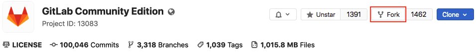
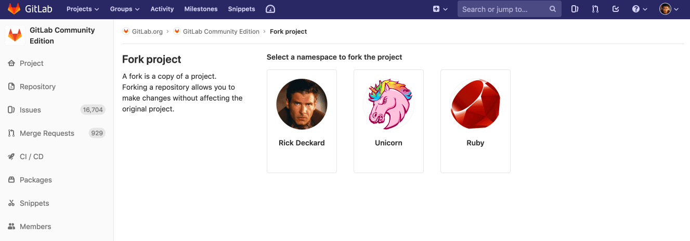

# Project forking workflow

Forking a project to your own namespace is useful if you have no write
access to the project you want to contribute to. Even if you do have write
access or can request it, we recommend working together in the same
repository since it is simpler. See our [GitLab Flow](../../../topics/gitlab_flow.md)
document more information about using branches to work together.

## Creating a fork

Forking a project is, in most cases, a two-step process.

1. On the project's home page, in the top right, click the **Fork** button.

   

1. Click a namespace to fork to. Only namespaces you have Developer and higher [permissions](../../permissions.md) for are shown.

   NOTE: **Note:**
   The project path must be unique within the namespace.

   

The fork is created. The permissions you have in the namespace are the permissions you will have in the fork.

CAUTION: **CAUTION:**
In GitLab 12.6 and later, when project owners [reduce a project's visibility](../../../public_access/public_access.md#reducing-visibility),
it **removes the relationship** between a project and all its forks.

## Repository mirroring

You can use [repository mirroring](repository_mirroring.md) to keep your fork synced with the original repository. You can also use `git remote add upstream` to achieve the same result.

The main difference is that with repository mirroring your remote fork will be automatically kept up-to-date.

Without mirroring, to work locally you'll have to user `git pull` to update your local repo with the fork on GitLab. You'll have to fetch locally and push it back to the remote repo to update it.

CAUTION: **Caution:**
With mirroring, before approving a merge request you'll likely to be asked to sync, hence automating it is recommend.

Read more about [How to keep your fork up to date with its origin](https://about.gitlab.com/blog/2016/12/01/how-to-keep-your-fork-up-to-date-with-its-origin/).

## Merging upstream

When you are ready to send your code back to the upstream project,
[create a merge request](../merge_requests/creating_merge_requests.md). For **Source branch**,
choose your forked project's branch. For **Target branch**, choose the original project's branch.

Then you can add labels, a milestone, and assign the merge request to someone who can review
your changes. Then click **Submit merge request** to conclude the process. When successfully merged, your
changes are added to the repository and branch you're merging into.

## Removing a fork relationship

You can unlink your fork from its upstream project in the [advanced settings](../settings/index.md#removing-a-fork-relationship).

[gitlab flow]: https://about.gitlab.com/blog/2014/09/29/gitlab-flow/ "GitLab Flow blog post"
