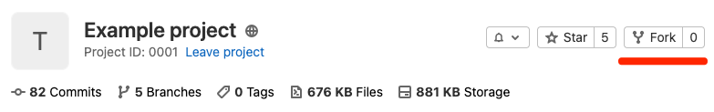
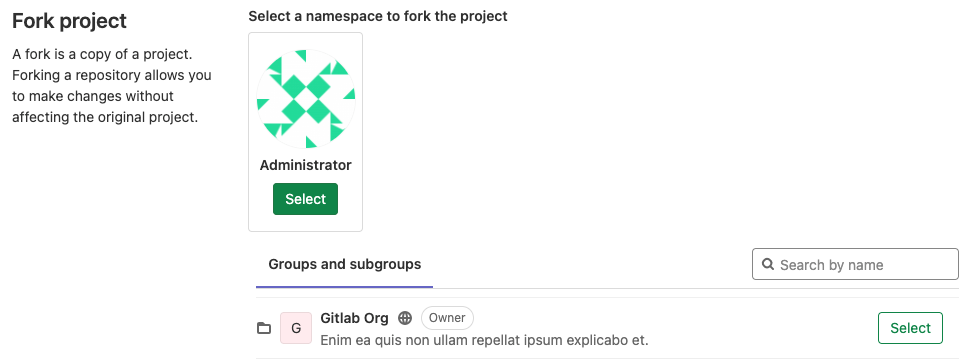
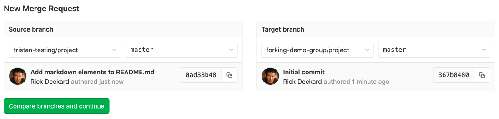
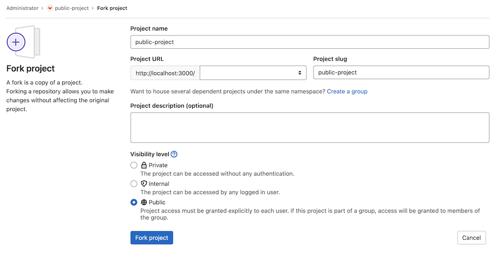

# Project forking workflow **(FREE)**

Whenever possible, it's recommended to work in a common Git repository and use
[branching strategies](../../../topics/gitlab_flow.md) to manage your work. However,
if you do not have write access for the repository you want to contribute to, you
can create a fork.

A fork is a personal copy of the repository and all its branches, which you create
in a namespace of your choice. This way you can make changes in your own fork and
submit them through a merge request to the repository you don't have access to.

## Creating a fork

To fork an existing project in GitLab:

1. On the project's home page, in the top right, click **{fork}** **Fork**.

   

1. Select the project to fork to:

   - *(Recommended method)* Below **Select a namespace to fork the project**, identify
     the project you want to fork to, and click **Select**. Only namespaces you have
     Developer and higher [permissions](../../permissions.md) for are shown.

     

   - *(Experimental method)* If your GitLab administrator has
     [enabled the experimental fork project form](#enable-or-disable-the-fork-project-form), read
     [Create a fork with the fork project form](#create-a-fork-with-the-fork-project-form).
     Only namespaces you have Developer and higher
     [permissions](../../permissions.md) for are shown.

   NOTE:
   The project path must be unique in the namespace.

GitLab creates your fork, and redirects you to the project page for your new fork.
The permissions you have in the namespace are your permissions in the fork.

WARNING:
When a public project with the repository feature set to **Members Only**
is forked, the repository is public in the fork. The owner
of the fork must manually change the visibility. Issue
[#36662](https://gitlab.com/gitlab-org/gitlab/-/issues/36662) exists for this issue.

## Repository mirroring

You can use [repository mirroring](repository_mirroring.md) to keep your fork synced with the original repository. You can also use `git remote add upstream` to achieve the same result.

The main difference is that with repository mirroring, your remote fork is automatically kept up-to-date.

Without mirroring, to work locally you must use `git pull` to update your local repository
with the upstream project, then push the changes back to your fork to update it.

WARNING:
With mirroring, before approving a merge request, you are asked to sync. Because of this, automating it is recommended.

Read more about [How to keep your fork up to date with its origin](https://about.gitlab.com/blog/2016/12/01/how-to-keep-your-fork-up-to-date-with-its-origin/).

## Merging upstream

When you are ready to send your code back to the upstream project,
[create a merge request](../merge_requests/creating_merge_requests.md). For **Source branch**,
choose your forked project's branch. For **Target branch**, choose the original project's branch.

NOTE:
When creating a merge request, if the forked project's visibility is more restrictive than the parent project (for example the fork is private, the parent is public), the target branch defaults to the forked project's default branch. This prevents potentially exposing the private code of the forked project.



Then you can add labels, a milestone, and assign the merge request to someone who can review
your changes. Then click **Submit merge request** to conclude the process. When successfully merged, your
changes are added to the repository and branch you're merging into.

## Removing a fork relationship

You can unlink your fork from its upstream project in the [advanced settings](../settings/index.md#removing-a-fork-relationship).

## Create a fork with the fork project form **(FREE SELF)**

> - [Introduced](https://gitlab.com/gitlab-org/gitlab/-/issues/15013) in GitLab 13.11.
> - It's [deployed behind a feature flag](../../../user/feature_flags.md), disabled by default.
> - It's disabled on GitLab.com.
> - It's not recommended for production use.
> - To use it in GitLab self-managed instances, ask a GitLab administrator to [enable it](#enable-or-disable-the-fork-project-form). **(FREE SELF)**

This experimental version of the fork project form is available only if your GitLab
administrator has [enabled it](#enable-or-disable-the-fork-project-form):



To use it, follow the instructions at [Creating a fork](#creating-a-fork) and provide:

- The project name.
- The project URL.
- The project slug.
- *(Optional)* The project description.
- The visibility level for your fork.

### Enable or disable the fork project form **(FREE SELF)**

The new [fork project form](#create-a-fork-with-the-fork-project-form) is under
development and not ready for production use. It is deployed behind a feature flag
that is **disabled by default**.
[GitLab administrators with access to the GitLab Rails console](../../../administration/feature_flags.md)
can enable it.

To enable it:

```ruby
Feature.enable(:fork_project_form)
```

To disable it:

```ruby
Feature.disable(:fork_project_form)
```
