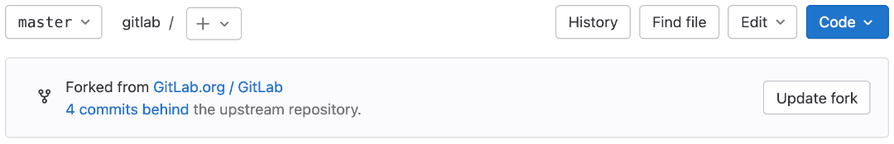

DETAILS:
**Tier:** Free, Premium, Ultimate
**Offering:** GitLab.com, GitLab Self-Managed, GitLab Dedicated

A fork is a personal copy of another Git repository, placed in the namespace of your choice.
Your copy contains the upstream repository's content, including all branches, tags,
and CI/CD job configurations.
You can create merge requests from your fork to target the upstream repository.
Individual commits can also be [cherry-picked](../merge_requests/cherry_pick_changes.md) from
your fork into the upstream repository.

If you have write access to the original repository, you don't need a fork.
Instead, use branches to manage your work.
If you don't have write access to a repository you want to contribute to, fork it.
Make your changes in your fork, then submit them through a merge request to the upstream repository.

To create a [confidential merge request](../merge_requests/confidential.md),
use a personal fork of a public repository.

## Create a fork

> - [Introduced](https://gitlab.com/gitlab-org/gitlab/-/issues/24894) in GitLab 16.6.

To fork an existing project in GitLab:

1. On the project's homepage, in the upper-right corner, select **Fork** (**{fork}**).
1. Optional. Edit the **Project name**.
1. For **Project URL**, select the [namespace](../../namespace/_index.md)
   your fork should belong to.
1. Add a **Project slug**. This value becomes part of the URL to your fork.
   It must be unique in the namespace.
1. Optional. Add a **Project description**.
1. Select one of the **Branches to include** options:
   - **All branches** (default).
   - **Only the default branch**. Uses the `--single-branch` and `--no-tags`
     [Git options](https://git-scm.com/docs/git-clone).
1. Select the **Visibility level** for your fork. For more information about
   visibility levels, read [Project and group visibility](../../public_access.md).
1. Select **Fork project**.

GitLab creates your fork, redirects you to the new fork's page, and logs the fork's
creation in the [audit log](../../compliance/audit_event_types.md).

If you intend to contribute changes upstream frequently, consider setting a
[default target](../merge_requests/creating_merge_requests.md#set-the-default-target-project) for your fork.

## Update your fork

A fork can fall out of sync with its upstream repository, and require an update:

- **Ahead**: Your fork contains new commits not present in the upstream repository.
  To sync your fork, create a merge request to push your changes to the upstream repository.
- **Behind**: The upstream repository contains new commits not present in your fork.
  To sync your fork, pull the new commits into your fork.
- **Ahead and behind**: Both the upstream repository and your fork contain new commits
  not present in the other. To fully sync your fork, create a merge request to push
  your changes up, and pull the upstream repository's new changes into your fork.

To sync your fork with its upstream repository, update it from the GitLab UI
or the command line. GitLab Premium and Ultimate tiers can also automate updates by
[configuring forks as pull mirrors](#with-repository-mirroring) of the upstream repository.

### From the UI

> - [Introduced](https://gitlab.com/gitlab-org/gitlab/-/issues/330243) in GitLab 15.11 [with a flag](../../../administration/feature_flags.md) named `synchronize_fork`. Disabled by default, but enabled for projects in the `gitlab-org/gitlab` and `gitlab-com/www-gitlab-com` namespaces only.
> - [Generally available](https://gitlab.com/gitlab-org/gitlab/-/issues/330243) in GitLab 16.0. Feature flag `synchronize_fork` removed.

Prerequisites:

- You must create your fork from an [unprotected branch](branches/protected.md) in upstream repository.

To update your fork from the GitLab UI:

1. On the left sidebar, select **Search or go to**.
1. Select **View all my projects**.
1. Select the fork you want to update.
1. Below the dropdown list for branch name, find the **Forked from** (**{fork}**)
   information box to determine if your fork is ahead, behind, or both. In this example,
   the fork is behind the upstream repository:

   

1. If your fork is **ahead** of the upstream repository, select
   **Create merge request** to propose adding your fork's changes to the upstream repository.
1. If your fork is **behind** the upstream repository, select **Update fork**
   to pull changes from the upstream repository.
1. If your fork is **ahead and behind** the upstream repository, you can update from the UI
   only if GitLab detects no merge conflicts:
   - If your fork contains no merge conflicts, you can select **Create merge request**
     to propose pushing your changes to the upstream repository, **Update fork**
     to pull changes down to your fork, or both. The type of changes in your fork
     determine which actions are appropriate.
   - If your fork contains merge conflicts, GitLab shows a step-by-step guide to update your fork from the command line.

### From the command line

You can also choose to update your fork from the command line.

Prerequisites:

- You must [download and install the Git client](../../../topics/git/how_to_install_git/_index.md) on your local machine.
- You must [create a fork](#create-a-fork) of the repository you want to update.

To update your fork from the command line, follow the instruction in
[use Git to update a fork](../../../topics/git/forks.md).

### With repository mirroring

DETAILS:
**Tier:** Premium, Ultimate
**Offering:** GitLab.com, GitLab Self-Managed, GitLab Dedicated

A fork can be configured as a mirror of the upstream if all these conditions are met:

1. Your subscription is **Premium** or **Ultimate**.
1. You create all changes in branches (not `main`).
1. You do not work on [merge requests for confidential issues](../merge_requests/confidential.md),
   which requires changes to `main`.

[Repository mirroring](mirror/_index.md) keeps your fork synced with the original repository.
This method updates your fork once per hour, with no manual `git pull` required.
For instructions, read [Configure pull mirroring](mirror/pull.md#configure-pull-mirroring).

WARNING:
With mirroring, before approving a merge request, you are asked to sync. You should automate it.

## Merge changes back upstream

When you are ready to send your code back to the upstream repository, create a new merge request as
described in [When you work in a fork](../merge_requests/creating_merge_requests.md#when-you-work-in-a-fork).
When successfully merged, your changes are added to the repository and branch you're merging into.

## Unlink a fork

Removing a fork relationship unlinks your fork from its upstream repository.
Your fork then becomes an independent repository.

Prerequisites:

- You must be a project owner to unlink a fork.

WARNING:
If you remove a fork relationship, you can't send merge requests to the source.
If anyone has forked your repository, their fork also loses the relationship.
To restore the fork relationship, [use the API](../../../api/project_forks.md#create-a-fork-relationship-between-projects).

To remove a fork relationship:

1. On the left sidebar, select **Search or go to** and find your project.
1. Select **Settings > General**.
1. Expand **Advanced**.
1. In the **Remove fork relationship** section, select **Remove fork relationship**.
1. To confirm, enter the project path and select **Confirm**.

GitLab logs the unlink operation in the [audit log](../../compliance/audit_event_types.md).
When you unlink a fork that uses a [hashed storage pool](../../../administration/repository_storage_paths.md#hashed-object-pools)
to share objects with another repository:

- All objects are copied from the pool into your fork.
- After the copy process completes, no further updates from the storage pool are propagated to your fork.

## Check a fork's storage usage

Your fork uses a [deduplication strategy](../../../development/git_object_deduplication.md)
to reduce the storage space it needs. Your fork can access the object pool connected to the source repository.

For more information and to check the storage use, see [View project fork storage usage](../../storage_usage_quotas.md#view-project-fork-storage-usage).

## Related topics

- GitLab community forum: [Refreshing a fork](https://forum.gitlab.com/t/refreshing-a-fork/32469)
- [Prevent project forking outside group](../../group/access_and_permissions.md#prevent-project-forking-outside-group)
- [Understand how Git LFS works with forks](../../../topics/git/lfs/_index.md#understand-how-git-lfs-works-with-forks)

## Troubleshooting

### Error: `An error occurred while forking the project. Please try again`

This error can be due to a mismatch in instance runner settings between the forked project
and the new namespace. See [Forks](../../../ci/runners/configure_runners.md#using-instance-runners-in-forked-projects)
in the Runner documentation for more information.

### Removing fork relationship fails

If removing the fork through the UI or API is not working, you can attempt the
fork relationship removal in a
[Rails console session](../../../administration/operations/rails_console.md#starting-a-rails-console-session):

```ruby
p = Project.find_by_full_path('<project_path>')
u = User.find_by_username('<username>')
Projects::UnlinkForkService.new(p, u).execute
```
