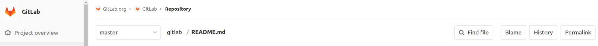
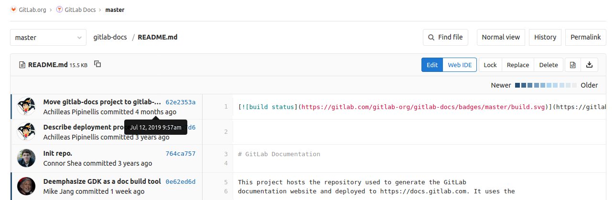
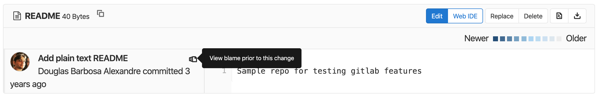

# Git file blame

> [Introduced](https://git.sphere.ly/staff/publicgitlab/commit/39c657930625ddc3ac8a921f01ffc83acadce68f) in GitLab 2.5

[Git blame](https://git-scm.com/docs/git-blame) provides more information
about every line in a file, including the last modified time, author, and
commit hash.

You can find the **Blame** button with each file in a project.



When you select the **Blame** button, you'll see a screen with the
noted information:



If you hover over a commit in the UI, you'll see a precise date and time
for that commit.



To see earlier revisions of a specific line, click **View blame prior to this change**
until you've found the changes you're interested in viewing.

## Associated `git` command

If you're running `git` from the command line, the equivalent command is
`git blame <filename>`. For example, if you want to find `blame` information
about a `README.md` file in the local directory, run the following command:

```bash
git blame README.md
```

You'll see output similar to the following, which includes the commit time
in UTC format:

```bash
62e2353a (Achilleas Pipinellis     2019-07-11 14:52:18 +0300   1) [](https://gitlab.com/gitlab-com/gitlab-docs/commits/master)
fb0fc7d6 (Achilleas Pipinellis     2016-11-07 22:21:22 +0100   2)
^764ca75 (Connor Shea              2016-10-05 23:40:24 -0600   3) # GitLab Documentation
^764ca75 (Connor Shea              2016-10-05 23:40:24 -0600   4)
0e62ed6d (Mike Jang                2019-11-26 21:44:53 +0000   5) This project hosts the repository used to generate the GitLab
0e62ed6d (Mike Jang                2019-11-26 21:44:53 +0000   6) documentation website and deployed to https://docs.gitlab.com. It uses the
```

## File blame through the API

You can also get this information over the [Git file blame REST API](../../../api/repository_files.md#get-file-blame-from-repository).
