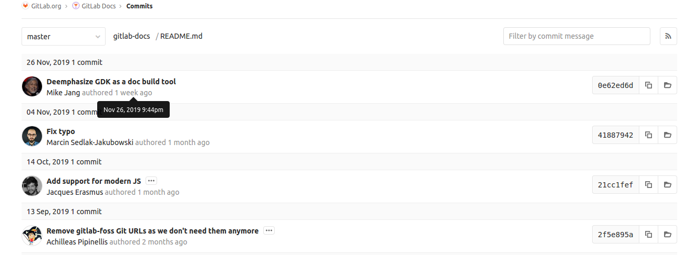

# Git file history

> [Introduced](https://gitlab.com/gitlab-org/gitlab/blob/9ba1224867665844b117fa037e1465bb706b3685/app/controllers/commits_controller.rb) in GitLab 0.8.0

Git file History provides information about the commit history associated
with a file.

You can find the **History** button with each file in a project.


When you select the **History** button, you'll see a screen with the
noted information:



If you hover over a commit in the UI, you'll see a precise date and time
that commit was last modified.

## Associated `git` command

If you're running `git` from the command line, the equivalent command
is `git log <filename>`. For example, if you want to find `history`
information about a `README.md` file in the local directory, run the
following command:

```bash
git log README.md
```

You'll see output similar to the following, which includes the commit
time in UTC format:

```bash
commit 0e62ed6d9f39fa9bedf7efc6edd628b137fa781a
Author: Mike Jang <mjang@gitlab.com>
Date:   Tue Nov 26 21:44:53 2019 +0000

    Deemphasize GDK as a doc build tool

commit 418879420b1e3a4662067bd07b64bb6988654697
Author: Marcin Sedlak-Jakubowski <msedlakjakubowski@gitlab.com>
Date:   Mon Nov 4 19:58:27 2019 +0100

    Fix typo

commit 21cc1fef11349417ed515557748369cfb235fc81
Author: Jacques Erasmus <jerasmus@gitlab.com>
Date:   Mon Oct 14 22:13:40 2019 +0000

    Add support for modern JS

    Added rollup to the project

commit 2f5e895aebfa5678e51db303b97de56c51e3cebe
Author: Achilleas Pipinellis <axil@gitlab.com>
Date:   Fri Sep 13 14:03:01 2019 +0000

    Remove gitlab-foss Git URLs as we don't need them anymore

    [ci skip]
```
