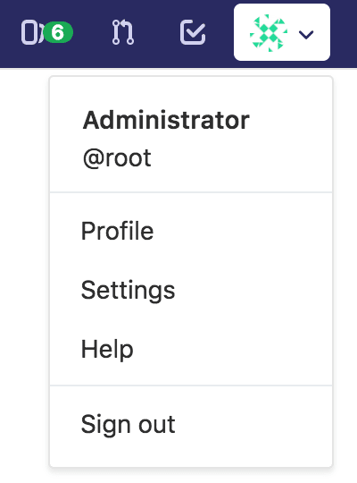
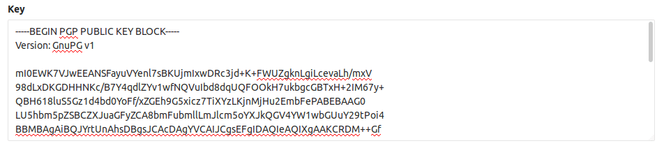
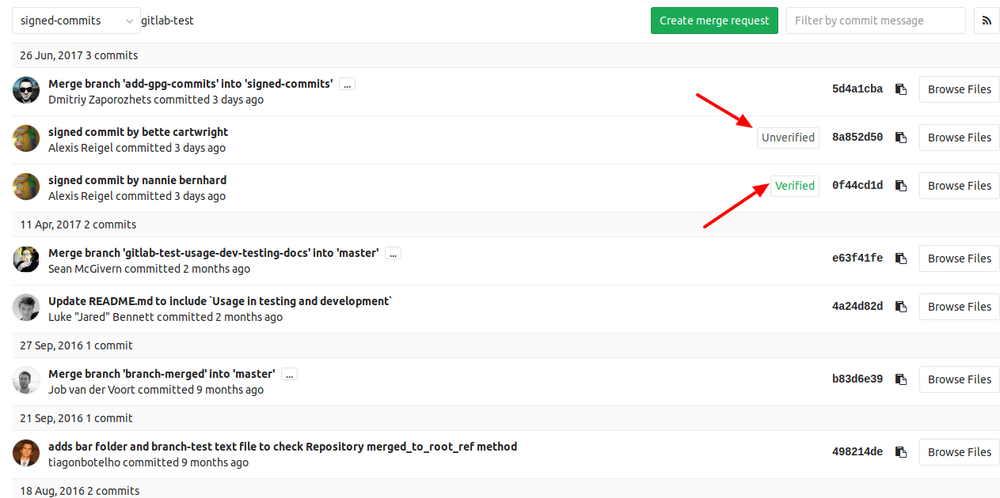
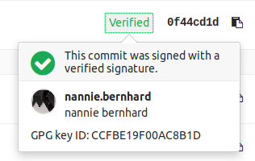
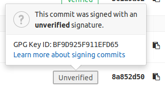

# Signing commits with GPG

NOTE: **Note:**
The term GPG is used for all OpenPGP/PGP/GPG related material and
implementations.

> - [Introduced][ce-9546] in GitLab 9.5.
> - Subkeys support was added in GitLab 10.1.

GitLab can show whether a commit is verified or not when signed with a GPG key.
All you need to do is upload the public GPG key in your profile settings.

GPG verified tags are not supported yet.

## Getting started with GPG

Here are a few guides to get you started with GPG:

- [Git Tools - Signing Your Work](https://git-scm.com/book/en/v2/Git-Tools-Signing-Your-Work)
- [Managing OpenPGP Keys](https://riseup.net/en/security/message-security/openpgp/gpg-keys)
- [OpenPGP Best Practices](https://riseup.net/en/security/message-security/openpgp/best-practices)
- [Creating a new GPG key with subkeys](https://www.void.gr/kargig/blog/2013/12/02/creating-a-new-gpg-key-with-subkeys/) (advanced)

## How GitLab handles GPG

GitLab uses its own keyring to verify the GPG signature. It does not access any
public key server.

In order to have a commit verified on GitLab the corresponding public key needs
to be uploaded to GitLab. For a signature to be verified three conditions need
to be met:

1. The public key needs to be added your GitLab account
1. One of the emails in the GPG key matches a **verified** email address you use in GitLab
1. The committer's email matches the verified email from the gpg key

## Generating a GPG key

>**Notes:**
- If your Operating System has `gpg2` installed, replace `gpg` with `gpg2` in
  the following commands.
- If Git is using `gpg` and you get errors like `secret key not available` or
  `gpg: signing failed: secret key not available`, run the following command to
  change to `gpg2`:
    ```
    git config --global gpg.program gpg2
    ```

If you don't already have a GPG key, the following steps will help you get
started:

1. [Install GPG](https://www.gnupg.org/download/index.html) for your operating system
1. Generate the private/public key pair with the following command:

    ```sh
    gpg --full-gen-key
    ```

    This will spawn a series of questions.

1. The first question is which algorithm can be used.  Select the kind you want
   or press <kbd>Enter</kbd> to choose the default (RSA and RSA):

    ```
    Please select what kind of key you want:
       (1) RSA and RSA (default)
       (2) DSA and Elgamal
       (3) DSA (sign only)
       (4) RSA (sign only)
    Your selection? 1
    ```

1. The next question is key length. We recommend to choose the highest value
   which is `4096`:

    ```
    RSA keys may be between 1024 and 4096 bits long.
    What keysize do you want? (2048) 4096
    Requested keysize is 4096 bits
    ```
1. Next, you need to specify the validity period of your key. This is something
   subjective, and you can use the default value which is to never expire:

    ```
    Please specify how long the key should be valid.
             0 = key does not expire
          <n>  = key expires in n days
          <n>w = key expires in n weeks
          <n>m = key expires in n months
          <n>y = key expires in n years
    Key is valid for? (0) 0
    Key does not expire at all
    ```

1. Confirm that the answers you gave were correct by typing `y`:

    ```
    Is this correct? (y/N) y
    ```

1. Enter you real name, the email address to be associated with this key (should
   match a verified email address you use in GitLab) and an optional comment
   (press <kbd>Enter</kbd> to skip):

    ```
    GnuPG needs to construct a user ID to identify your key.

    Real name: Mr. Robot
    Email address: mr@robot.sh
    Comment:
    You selected this USER-ID:
        "Mr. Robot <mr@robot.sh>"

    Change (N)ame, (C)omment, (E)mail or (O)kay/(Q)uit? O
    ```

1. Pick a strong password when asked and type it twice to confirm.
1. Use the following command to list the private GPG key you just created:

    ```
    gpg --list-secret-keys --keyid-format LONG mr@robot.sh
    ```

    Replace `mr@robot.sh` with the email address you entered above.

1. Copy the GPG key ID that starts with `sec`. In the following example, that's
   `30F2B65B9246B6CA`:

    ```
    sec   rsa4096/30F2B65B9246B6CA 2017-08-18 [SC]
          D5E4F29F3275DC0CDA8FFC8730F2B65B9246B6CA
    uid                   [ultimate] Mr. Robot <mr@robot.sh>
    ssb   rsa4096/B7ABC0813E4028C0 2017-08-18 [E]
    ```

1. Export the public key of that ID (replace your key ID from the previous step):

    ```
    gpg --armor --export 30F2B65B9246B6CA
    ```

1. Finally, copy the public key and [add it in your profile settings](#adding-a-gpg-key-to-your-account)

## Adding a GPG key to your account

>**Note:**
Once you add a key, you cannot edit it, only remove it. In case the paste
didn't work, you'll have to remove the offending key and re-add it.

You can add a GPG key in your profile's settings:

1. On the upper right corner, click on your avatar and go to your **Settings**.

    

1. Navigate to the **GPG keys** tab and paste your _public_ key in the 'Key'
   box.

    

1. Finally, click on **Add key** to add it to GitLab. You will be able to see
   its fingerprint, the corresponding email address and creation date.

    

## Associating your GPG key with Git

After you have [created your GPG key](#generating-a-gpg-key) and [added it to
your account](#adding-a-gpg-key-to-your-account), it's time to tell Git which
key to use.

1. Use the following command to list the private GPG key you just created:

    ```
    gpg --list-secret-keys --keyid-format LONG mr@robot.sh
    ```

    Replace `mr@robot.sh` with the email address you entered above.

1. Copy the GPG key ID that starts with `sec`. In the following example, that's
   `30F2B65B9246B6CA`:

    ```
    sec   rsa4096/30F2B65B9246B6CA 2017-08-18 [SC]
          D5E4F29F3275DC0CDA8FFC8730F2B65B9246B6CA
    uid                   [ultimate] Mr. Robot <mr@robot.sh>
    ssb   rsa4096/B7ABC0813E4028C0 2017-08-18 [E]
    ```

1. Tell Git to use that key to sign the commits:

    ```
    git config --global user.signingkey 30F2B65B9246B6CA
    ```

    Replace `30F2B65B9246B6CA` with your GPG key ID.

## Signing commits

After you have [created your GPG key](#generating-a-gpg-key) and [added it to
your account](#adding-a-gpg-key-to-your-account), you can start signing your
commits:

1. Commit like you used to, the only difference is the addition of the `-S` flag:

    ```
    git commit -S -m "My commit msg"
    ```

1. Enter the passphrase of your GPG key when asked.
1. Push to GitLab and check that your commits [are verified](#verifying-commits).

If you don't want to type the `-S` flag every time you commit, you can tell Git
to sign your commits automatically:

```
git config --global commit.gpgsign true
```

## Verifying commits

1. Within a project or [merge request](../../merge_requests/index.md), navigate to
   the **Commits** tab. Signed commits will show a badge containing either
   "Verified" or "Unverified", depending on the verification status of the GPG
   signature.

    

1. By clicking on the GPG badge, details of the signature are displayed.

    

    

## Revoking a GPG key

Revoking a key **unverifies** already signed commits. Commits that were
verified by using this key will change to an unverified state. Future commits
will also stay unverified once you revoke this key. This action should be used
in case your key has been compromised.

To revoke a GPG key:

1. On the upper right corner, click on your avatar and go to your **Settings**.
1. Navigate to the **GPG keys** tab.
1. Click on **Revoke** besides the GPG key you want to delete.

## Removing a GPG key

Removing a key **does not unverify** already signed commits. Commits that were
verified by using this key will stay verified. Only unpushed commits will stay
unverified once you remove this key. To unverify already signed commits, you need
to [revoke the associated GPG key](#revoking-a-gpg-key) from your account.

To remove a GPG key from your account:

1. On the upper right corner, click on your avatar and go to your **Settings**.
1. Navigate to the **GPG keys** tab.
1. Click on the trash icon besides the GPG key you want to delete.

[ce-9546]: https://gitlab.com/gitlab-org/gitlab-ce/merge_requests/9546
