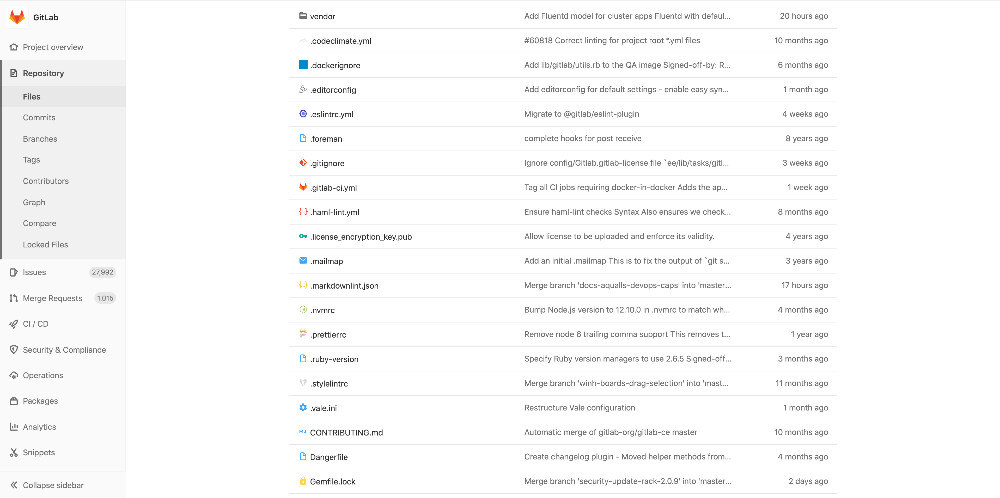

# Repository **(FREE)**

A [repository](https://git-scm.com/book/en/v2/Git-Basics-Getting-a-Git-Repository)
is what you use to store your codebase in GitLab and change it with version control.
A repository is part of a [project](../index.md), which has a lot of other features.

## Create a repository

To create a new repository, all you need to do is
[create a new project](../../../user/project/working_with_projects.md#create-a-project) or
[fork an existing project](forking_workflow.md).

Once you create a new project, you can add new files via UI
(read the section below) or via command line.
To add files from the command line, follow the instructions
presented on the screen when you create a new project, or read
through them in the [command line basics](../../../gitlab-basics/start-using-git.md)
documentation.

> **Important:**
For security reasons, when using the command line, we strongly recommend
that you [connect with GitLab via SSH](../../../ssh/README.md).

## Files

Use a repository to store your files in GitLab. In [GitLab 12.10 and later](https://gitlab.com/gitlab-org/gitlab/-/issues/33806),
an icon identifying the extension is shown next to the filename:



### Create and edit files

Host your codebase in GitLab repositories by pushing your files to GitLab.
You can either use the user interface (UI), or connect your local computer
with GitLab [through the command line](../../../gitlab-basics/command-line-commands.md#start-working-on-your-project).

To configure [GitLab CI/CD](../../../ci/README.md) to build, test, and deploy
your code, add a file called [`.gitlab-ci.yml`](../../../ci/quick_start/index.md)
to your repository's root.

**From the user interface:**

The GitLab UI allows you to perform lots of Git commands without having to
touch the command line. Even if you use the command line regularly, sometimes
it's easier to do so [via GitLab UI](web_editor.md):

- [Create a file](web_editor.md#create-a-file)
- [Upload a file](web_editor.md#upload-a-file)
- [File templates](web_editor.md#template-dropdowns)
- [Create a directory](web_editor.md#create-a-directory)
- [Start a merge request](web_editor.md#tips)
- [Find file history](git_history.md)
- [Identify changes by line (Git blame)](git_blame.md)

**From the command line:**

To get started with the command line, please read through the
[command line basics documentation](../../../gitlab-basics/command-line-commands.md).

### Find files

Use the GitLab [file finder](file_finder.md) to search for files in a repository.

### Supported markup languages and extensions

GitLab supports a number of markup languages (sometimes called [lightweight
markup languages](https://en.wikipedia.org/wiki/Lightweight_markup_language))
that you can use for the content of your files in a repository. They are mostly
used for documentation purposes.

Just pick the right extension for your files and GitLab renders them
according to the markup language.

| Markup language | Extensions |
| --------------- | ---------- |
| Plain text | `txt` |
| [Markdown](../../markdown.md) | `mdown`, `mkd`, `mkdn`, `md`, `markdown` |
| [reStructuredText](https://docutils.sourceforge.io/rst.html) | `rst` |
| [AsciiDoc](../../asciidoc.md) | `adoc`, `ad`, `asciidoc` |
| [Textile](https://textile-lang.com/) | `textile` |
| [Rdoc](http://rdoc.sourceforge.net/doc/index.html)  | `rdoc` |
| [Org mode](https://orgmode.org/) | `org` |
| [creole](http://www.wikicreole.org/) | `creole` |
| [MediaWiki](https://www.mediawiki.org/wiki/MediaWiki) | `wiki`, `mediawiki` |

### Repository README and index files

When a `README` or `index` file is present in a repository, its contents are
automatically pre-rendered by GitLab without opening it.

They can either be plain text or have an extension of a
[supported markup language](#supported-markup-languages-and-extensions):

Some things to note about precedence:

1. When both a `README` and an `index` file are present, the `README` always
   takes precedence.
1. When more than one file is present with different extensions, they are
   ordered alphabetically, with the exception of a file without an extension,
   which is always last in precedence. For example, `README.adoc` takes
   precedence over `README.md`, and `README.rst` takes precedence over
   `README`.

### Jupyter Notebook files

[Jupyter](https://jupyter.org/) Notebook (previously IPython Notebook) files are used for
interactive computing in many fields and contain a complete record of the
user's sessions and include code, narrative text, equations, and rich output.

[Read how to use Jupyter notebooks with GitLab.](jupyter_notebooks/index.md)

### OpenAPI viewer

> [Introduced](https://gitlab.com/gitlab-org/gitlab/-/issues/19515) in GitLab 12.6.

GitLab can render OpenAPI specification files with its file viewer, provided
their filenames include `openapi` or `swagger` and their extension is `yaml`,
`yml`, or `json`. The following examples are all correct:

- `openapi.yml`
- `openapi.yaml`
- `openapi.json`
- `swagger.yml`
- `swagger.yaml`
- `swagger.json`
- `gitlab_swagger.yml`
- `openapi_gitlab.yml`
- `OpenAPI.YML`
- `openapi.Yaml`
- `openapi.JSON`
- `openapi.gitlab.yml`
- `gitlab.openapi.yml`

Then, to render them:

1. Navigate to the OpenAPI file in your repository in the GitLab UI.
1. Click the "Display OpenAPI" button which is located between the "Display source"
   and "Edit" buttons (when an OpenAPI file is found, it replaces the
   "Display rendered file" button).

## Branches

For details, see [Branches](branches/index.md).

## Commits

When you [commit your changes](https://git-scm.com/book/en/v2/Git-Basics-Recording-Changes-to-the-Repository),
you are introducing those changes to your branch.
Via command line, you can commit multiple times before pushing.

- **Commit message:**
  A commit message is important to identity what is being changed and,
  more importantly, why. In GitLab, you can add keywords to the commit
  message that performs one of the actions below:
  - **Trigger a GitLab CI/CD pipeline:**
  If you have your project configured with [GitLab CI/CD](../../../ci/README.md),
  you trigger a pipeline per push, not per commit.
  - **Skip pipelines:**
  You can add to your commit message the keyword
  [`[ci skip]`](../../../ci/yaml/README.md#skip-pipeline),
  and GitLab CI/CD skips that pipeline.
  - **Cross-link issues and merge requests:**
  [Cross-linking](../issues/crosslinking_issues.md#from-commit-messages)
  is great to keep track of what's is somehow related in your workflow.
  If you mention an issue or a merge request in a commit message, they are shown
  on their respective thread.
- **Cherry-pick a commit:**
  In GitLab, you can
  [cherry-pick a commit](../merge_requests/cherry_pick_changes.md#cherry-picking-a-commit)
  right from the UI.
- **Revert a commit:**
  Easily [revert a commit](../merge_requests/revert_changes.md#reverting-a-commit)
  from the UI to a selected branch.
- **Sign a commit:**
  Use GPG to [sign your commits](gpg_signed_commits/index.md).

## Project and repository size

A project's size is reported on the project's **Details** page. The reported size is
updated every 15 minutes at most, so may not reflect recent activity. The displayed files size includes repository files, artifacts, and LFS.

The project size may differ slightly from one instance to another due to compression, housekeeping, and other factors.

[Repository size limit](../../admin_area/settings/account_and_limit_settings.md) may be set by administrators.
GitLab.com's repository size limit [is set by GitLab](../../gitlab_com/index.md#account-and-limit-settings).

## Contributors

All the contributors to your codebase are displayed under your project's **Settings > Contributors**.

They are ordered from the collaborator with the greatest number
of commits to the fewest, and displayed on a nice graph:


## Repository graph

The repository graph displays the history of the repository network visually, including branches and merges. This can help you visualize the Git flow strategy used in the repository:


Find it under your project's **Repository > Graph**.

## Repository languages

For the default branch of each repository, GitLab determines what programming languages
were used and displays this on the project's pages. If this information is missing, it's
added after updating the default branch for the project. This process can take up to five
minutes.


Not all files are detected, among others; documentation,
vendored code, and most markup languages are excluded. This behavior can be
adjusted by overriding the default. For example, to enable `.proto` files to be
detected, add the following to `.gitattributes` in the root of your repository.

```plaintext
*.proto linguist-detectable=true
```

Sometimes this feature can use excessive CPU.
[Read about troubleshooting this](#repository-languages-excessive-cpu-use)
and also more about customizing this feature using `.gitattributes`.

## Locked files **(PREMIUM)**

Use [File Locking](../file_lock.md) to
lock your files to prevent any conflicting changes.

## Repository's API

You can access your repositories via [repository API](../../../api/repositories.md).

## Clone a repository

Learn how to [clone a repository through the command line](../../../gitlab-basics/start-using-git.md#clone-a-repository).

Alternatively, clone directly into a code editor as documented below.

### Clone and open in Apple Xcode

> [Introduced](https://gitlab.com/gitlab-org/gitlab-foss/-/issues/45820) in GitLab 11.0.

Projects that contain a `.xcodeproj` or `.xcworkspace` directory can now be cloned
into Xcode on macOS. To do that:

1. From the GitLab UI, go to the project's overview page.
1. Click **Clone**.
1. Select **Xcode**.

The project is cloned onto your computer in a folder of your choice and you are
prompted to open XCode.

### Clone and open in Visual Studio Code

> [Introduced](https://gitlab.com/gitlab-org/gitlab/-/issues/220957) in GitLab 13.10.

All projects can be cloned into Visual Studio Code. To do that:

1. From the GitLab UI, go to the project's overview page.
1. Click **Clone**.
1. Select **VS Code**.
1. Select a folder to clone the project into.

When VS Code has successfully cloned your project, it opens the folder.

## Download source code

> - Support for directory download was [introduced](https://gitlab.com/gitlab-org/gitlab-foss/-/issues/24704) in GitLab 11.11.
> - Support for [including Git LFS blobs](../../../topics/git/lfs#lfs-objects-in-project-archives) was [introduced](https://gitlab.com/gitlab-org/gitlab/-/issues/15079) in GitLab 13.5.

The source code stored in a repository can be downloaded from the UI.
By clicking the download icon, a dropdown opens with links to download the following:


- **Source code:**
  allows users to download the source code on branch they're currently
  viewing. Available extensions: `zip`, `tar`, `tar.gz`, and `tar.bz2`.
- **Directory:**
  only shows up when viewing a sub-directory. This allows users to download
  the specific directory they're currently viewing. Also available in `zip`,
  `tar`, `tar.gz`, and `tar.bz2`.
- **Artifacts:**
  allows users to download the artifacts of the latest CI build.

## Redirects when changing repository paths

When a repository path changes, it is essential to smoothly transition from the
old location to the new one. GitLab provides two kinds of redirects: the web UI
and Git push/pull redirects.

Depending on the situation, different things apply.

When [renaming a user](../../profile/index.md#change-your-username),
[changing a group path](../../group/index.md#change-a-groups-path) or [renaming a repository](../settings/index.md#renaming-a-repository):

- Existing web URLs for the namespace and anything under it (such as projects) will
  redirect to the new URLs.
- Starting with GitLab 10.3, existing Git remote URLs for projects under the
  namespace redirect to the new remote URL. Every time you push/pull to a
  repository that has changed its location, a warning message to update
  your remote is displayed instead of rejecting your action.
  This means that any automation scripts, or Git clients continue to
  work after a rename, making any transition a lot smoother.
- The redirects are available as long as the original path is not claimed by
  another group, user or project.

## Troubleshooting

### Repository Languages: excessive CPU use

GitLab uses a Ruby gem to scan all the files in the repository to determine what languages are used.
[Sometimes this can use excessive CPU](https://gitlab.com/gitlab-org/gitaly/-/issues/1565) if
a file type needs to be parsed by the gem to determine what sort of file it is.
The gem contains a [heuristics configuration file](https://github.com/github/linguist/blob/master/lib/linguist/heuristics.yml)
that defines what file extensions need to be parsed.

Excessive CPU use has been reported for files with the extension `.txt` and XML files with
a file extension that is not defined by the gem.

The workaround is to specify what language to assign to specific file extensions.
The same approach should also allow misidentified file types to be fixed.

1. Identify which language to specify. The gem contains a [configuration file for known data types](https://github.com/github/linguist/blob/master/lib/linguist/languages.yml).
  The entry for `Text` files, for example:

   ```yaml
   Text:
     type: prose
     wrap: true
     aliases:
     - fundamental
     - plain text
     extensions:
     - ".txt"
   ```

1. Add or modify `.gitattributes` in the root of your repository:

   ```plaintext
   *.txt linguist-language=Text
   ```

  `*.txt` files have an entry in the heuristics file. The example above prevents parsing of these files.
