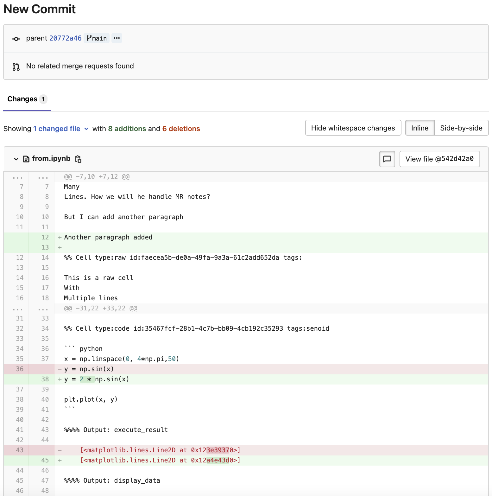

# Jupyter Notebook files **(FREE)**

[Jupyter Notebook](https://jupyter.org/) (previously, IPython Notebook) files are used for
interactive computing in many fields. They contain a complete record of the
user's sessions and include:

- Code.
- Narrative text.
- Equations.
- Rich output.

When you add a Jupyter Notebook (with `.ipynb` extension) to your repository,
it's rendered into HTML when you view it:

Interactive features, including JavaScript plots, don't work when viewed in
GitLab.

## Cleaner diffs

> - [Introduced](https://gitlab.com/groups/gitlab-org/-/epics/6589) in GitLab 14.5 [with a flag](../../../../administration/feature_flags.md) named `jupyter_clean_diffs`. Enabled by default.
> - [Generally available](https://gitlab.com/gitlab-org/gitlab/-/merge_requests/75500) in GitLab 14.9. Feature flag `jupyter_clean_diffs` removed.

When commits include changes to Jupyter Notebook files, GitLab:

- Transforms the machine-readable `.ipynb` file into a human-readable Markdown file.
- Displays a cleaner version of the diff that includes syntax highlighting.

Code suggestions are not available on diffs and merge requests for `.ipynb` files.

## Jupyter Git integration

Jupyter can be configured as an OAuth application with repository access, acting
on behalf of the authenticated user. See the
[Runbooks documentation](../../../project/clusters/runbooks/index.md) for an
example configuration.
