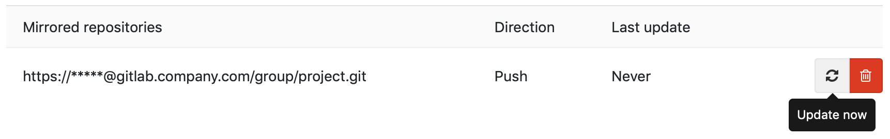

# Repository mirroring **(FREE)**

You can _mirror_ a repository to and from external sources. You can select which repository
serves as the source. Branches, tags, and commits are synced automatically.

NOTE:
SCP-style URLs are **not** supported. However, the work for implementing SCP-style URLs is tracked
in [this issue](https://gitlab.com/gitlab-org/gitlab/-/issues/18993).
Subscribe to the issue to follow its progress.

Several mirroring methods exist:

- [Push](push.md): Mirror a repository from GitLab to another location.
- [Pull](pull.md): Mirror a repository from another location to a GitLab Premium instance.
- [Bidirectional](bidirectional.md) mirroring is also available, but can cause conflicts.

Mirror a repository when:

- The canonical version of your project has migrated to GitLab. To keep providing a
  copy of your project at its previous home, configure your GitLab repository as a
  [push mirror](push.md). Changes you make to your GitLab repository are copied to
  the old location.
- Your GitLab instance is private, but you want to open-source some projects.
- You migrated to GitLab, but the canonical version of your project is somewhere else.
  Configure your GitLab repository as a [pull mirror](pull.md) of the other project.
  Your GitLab repository pulls copies of the commits, tags, and branches of project.
  They become available to use on GitLab.

## Create a repository mirror

Prerequisite:

- You must have at least the Maintainer role for the project.
- If your mirror connects with `ssh://`, the host key must be detectable on the server,
  or you must have a local copy of the key.

1. On the top bar, select **Main menu > Projects** and find your project.
1. On the left sidebar, select **Settings > Repository**.
1. Expand **Mirroring repositories**.
1. Enter a **Git repository URL**. For security reasons, the URL to the original
   repository is only displayed to users with the Maintainer role
   or the Owner role for the mirrored project.
1. Select a **Mirror direction**.
1. If you entered a `ssh://` URL, select either:
   - **Detect host keys**: GitLab fetches the host keys from the server and displays the fingerprints.
   - **Input host keys manually**, and enter the host key into **SSH host key**.

   When mirroring the repository, GitLab confirms at least one of the stored host keys
   matches before connecting. This check can protect your mirror from malicious code injections,
   or your password from being stolen.
1. Select an **Authentication method**. For more information, see
   [Authentication methods for mirrors](#authentication-methods-for-mirrors).
1. If you authenticate with SSH host keys, [verify the host key](#verify-a-host-key)
   to ensure it is correct.
1. To prevent force-pushing over diverged refs, select [**Keep divergent refs**](push.md#keep-divergent-refs).
1. Optional. Select [**Mirror only protected branches**](#mirror-only-protected-branches).
1. Select **Mirror repository**.

If you select `SSH public key` as your authentication method, GitLab generates a
public key for your GitLab repository. You must provide this key to the non-GitLab server.
For more information, see [Get your SSH public key](#get-your-ssh-public-key).

## Update a mirror

When the mirror repository is updated, all new branches, tags, and commits are visible in the
project's activity feed. A repository mirror at GitLab updates automatically.
You can also manually trigger an update:

- At most once every five minutes on GitLab.com.
- According to [the pull mirroring interval limit](../../../../administration/instance_limits.md#pull-mirroring-interval)
  set by the administrator on self-managed instances.

### Force an update

While mirrors are scheduled to update automatically, you can force an immediate update unless:

- The mirror is already being updated.
- The [interval, in seconds](../../../../administration/instance_limits.md#pull-mirroring-interval)
  for pull mirroring limits has not elapsed after its last update.

Prerequisite:

- You must have at least the Maintainer role for the project.

1. On the top bar, select **Main menu > Projects** and find your project.
1. On the left sidebar, select **Settings > Repository**.
1. Expand **Mirroring repositories**.
1. Scroll to **Mirrored repositories** and identify the mirror to update.
1. Select **Update now** (**{retry}**):
   

## Mirror only protected branches

You can choose to mirror only the
[protected branches](../../protected_branches.md) in the mirroring project,
either from or to your remote repository. For [pull mirroring](pull.md),
non-protected branches in the mirroring project are not mirrored and can diverge.

To use this option, select **Only mirror protected branches** when you create a repository mirror.

## Mirror specific branches

> - Mirroring branches matching a regex [introduced](https://gitlab.com/gitlab-org/gitlab/-/merge_requests/102608) in GitLab 15.8 [with a flag](../../../../administration/feature_flags.md) named `mirror_only_branches_match_regex`. Disabled by default.
> - [Enabled by default](https://gitlab.com/gitlab-org/gitlab/-/issues/381667) in GitLab 16.0.

FLAG:
On self-managed GitLab, by default the field `mirror_branch_regex` is available.
To hide the feature, ask an administrator to [disable the feature flag](../../../../administration/feature_flags.md)
named `mirror_only_branches_match_regex`.
On GitLab.com, this feature is available.

To mirror only branches with names matching an [re2 regular expression](https://github.com/google/re2/wiki/Syntax),
enter a regular expression into the **Mirror specific branches** field. Branches with names that
do not match the regular expression are not mirrored.

## Authentication methods for mirrors

When you create a mirror, you must configure the authentication method for it.
GitLab supports these authentication methods:

- [SSH authentication](#ssh-authentication).
- Password.

When using password authentication, ensure you specify the username.
For a [project access token](../../settings/project_access_tokens.md) or
[group access token](../../../group/settings/group_access_tokens.md),
use the username (not token name) and the token as the password.

### SSH authentication

SSH authentication is mutual:

- You must prove to the server that you're allowed to access the repository.
- The server must also *prove to you* that it's who it claims to be.

For SSH authentication, you provide your credentials as a password or _public key_.
The server that the other repository resides on provides its credentials as a _host key_.
You must [verify the fingerprint](#verify-a-host-key) of this host key manually.

If you're mirroring over SSH (using an `ssh://` URL), you can authenticate using:

- Password-based authentication, just as over HTTPS.
- Public key authentication. This method is often more secure than password authentication,
  especially when the other repository supports [deploy keys](../../deploy_keys/index.md).

### Get your SSH public key

When you mirror a repository and select the **SSH public key** as your
authentication method, GitLab generates a public key for you. The non-GitLab server
needs this key to establish trust with your GitLab repository. To copy your SSH public key:

1. On the top bar, select **Main menu > Projects** and find your project.
1. On the left sidebar, select **Settings > Repository**.
1. Expand **Mirroring repositories**.
1. Scroll to **Mirrored repositories**.
1. Identify the correct repository, and select **Copy SSH public key** (**{copy-to-clipboard}**).
1. Add the public SSH key to the other repository's configuration:
   - If the other repository is hosted on GitLab, add the public SSH key
     as a [deploy key](../../../project/deploy_keys/index.md).
   - If the other repository is hosted elsewhere, add the key to
     your user's `authorized_keys` file. Paste the entire public SSH key into the
     file on its own line and save it.

If you must change the key at any time, you can remove and re-add the mirror
to generate a new key. Update the other repository with the new
key to keep the mirror running.

NOTE:
The generated keys are stored in the GitLab database, not in the file system. Therefore,
SSH public key authentication for mirrors cannot be used in a pre-receive hook.

### Verify a host key

When using a host key, always verify the fingerprints match what you expect.
GitLab.com and other code hosting sites publish their fingerprints
for you to check:

- [AWS CodeCommit](https://docs.aws.amazon.com/codecommit/latest/userguide/regions.html#regions-fingerprints)
- [Bitbucket](https://support.atlassian.com/bitbucket-cloud/docs/configure-ssh-and-two-step-verification/)
- [GitHub](https://docs.github.com/en/authentication/keeping-your-account-and-data-secure/githubs-ssh-key-fingerprints)
- [GitLab.com](../../../gitlab_com/index.md#ssh-host-keys-fingerprints)
- [Launchpad](https://help.launchpad.net/SSHFingerprints)
- [Savannah](https://savannah.gnu.org/maintenance/SshAccess/)
- [SourceForge](https://sourceforge.net/p/forge/documentation/SSH%20Key%20Fingerprints/)

Other providers vary. You can securely gather key fingerprints with the following
command if you:

- Run self-managed GitLab.
- Have access to the server for the other repository.

```shell
$ cat /etc/ssh/ssh_host*pub | ssh-keygen -E md5 -l -f -
256 MD5:f4:28:9f:23:99:15:21:1b:bf:ed:1f:8e:a0:76:b2:9d root@example.com (ECDSA)
256 MD5:e6:eb:45:8a:3c:59:35:5f:e9:5b:80:12:be:7e:22:73 root@example.com (ED25519)
2048 MD5:3f:72:be:3d:62:03:5c:62:83:e8:6e:14:34:3a:85:1d root@example.com (RSA)
```

Older versions of SSH may require you to remove `-E md5` from the command.

## Related topics

- Configure a [Pull Mirroring Interval](../../../../administration/instance_limits.md#pull-mirroring-interval)
- [Disable mirrors for a project](../../../admin_area/settings/visibility_and_access_controls.md#enable-project-mirroring)
- [Secrets file and mirroring](../../../../raketasks/backup_restore.md#when-the-secrets-file-is-lost)

## Troubleshooting

Should an error occur during a push, GitLab displays an **Error** highlight for that repository. Details on the error can then be seen by hovering over the highlight text.

### Received RST_STREAM with error code 2 with GitHub

If you receive this message while mirroring to a GitHub repository:

```plaintext
13:Received RST_STREAM with error code 2
```

Your GitHub settings might be set to block pushes that expose your email address
used in commits. To fix this problem, either:

- Set your GitHub email address to public.
- Disable the [Block command line pushes that expose my email](https://github.com/settings/emails) setting.

### Deadline Exceeded

When upgrading GitLab, a change in how usernames are represented means that you
must update your mirroring username and password to ensure that `%40` characters are replaced with `@`.

### Connection blocked because server only allows public key authentication

The connection between GitLab and the remote repository is blocked. Even if a
[TCP Check](../../../../administration/raketasks/maintenance.md#check-tcp-connectivity-to-a-remote-site)
is successful, you must check any networking components in the route from GitLab
to the remote server for blockage.

This error can occur when a firewall performs a `Deep SSH Inspection` on outgoing packets.

### Could not read username: terminal prompts disabled

If you receive this error after creating a new project using
[GitLab CI/CD for external repositories](../../../../ci/ci_cd_for_external_repos/index.md):

- In Bitbucket Cloud:

  ```plaintext
  "2:fetch remote: "fatal: could not read Username for 'https://bitbucket.org':
  terminal prompts disabled\n": exit status 128."
  ```

- In Bitbucket Server (self-managed):

  ```plaintext
  "2:fetch remote: "fatal: could not read Username for 'https://lab.example.com':
  terminal prompts disabled\n": exit status 128.
  ```

Check if the repository owner is specified in the URL of your mirrored repository:

1. On the top bar, select **Main menu > Projects** and find your project.
1. On the left sidebar, select **Settings > Repository**.
1. Expand **Mirroring repositories**.
1. If no repository owner is specified, delete and add the URL again in this format,
   replacing `OWNER`, `ACCOUNTNAME`, `PATH_TO_REPO`, and `REPONAME` with your values:

   - In Bitbucket Cloud:

     ```plaintext
     https://OWNER@bitbucket.org/ACCOUNTNAME/REPONAME.git
     ```

   - In Bitbucket Server (self-managed):

     ```plaintext
     https://OWNER@lab.example.com/PATH_TO_REPO/REPONAME.git
     ```

When connecting to the Cloud or self-managed Bitbucket repository for mirroring, the repository owner is required in the string.

### Pull mirror is missing LFS files

In some cases, pull mirroring does not transfer LFS files. This issue occurs when:

- You use an SSH repository URL. The workaround is to use an HTTPS repository URL instead.
  An issue exists [to fix this problem for SSH URLs](https://gitlab.com/gitlab-org/gitlab/-/issues/11997).
- You're using GitLab 14.0 or older, and the source repository is a public Bitbucket URL.
  [Fixed](https://gitlab.com/gitlab-org/gitlab/-/issues/335123) in GitLab 14.0.6.
- You mirror an external repository using object storage.
  An issue exists [to fix this problem](https://gitlab.com/gitlab-org/gitlab/-/issues/335495).

### `The repository is being updated`, but neither fails nor succeeds visibly

In rare cases, mirroring slots on Redis can become exhausted,
possibly because Sidekiq workers are reaped due to out-of-memory (OoM) events.
When this occurs, mirroring jobs start and complete quickly, but they neither
fail nor succeed. They also do not leave a clear log. To check for this problem:

1. Enter the [Rails console](../../../../administration/operations/rails_console.md)
   and check Redis' mirroring capacity:

   ```ruby
   current = Gitlab::Redis::SharedState.with { |redis| redis.scard('MIRROR_PULL_CAPACITY') }.to_i
   maximum = Gitlab::CurrentSettings.mirror_max_capacity
   available = maximum - current
   ```

1. If the mirroring capacity is `0` or very low, you can drain all stuck jobs with:

   ```ruby
   Gitlab::Redis::SharedState.with { |redis| redis.smembers('MIRROR_PULL_CAPACITY') }.each do |pid|
     Gitlab::Redis::SharedState.with { |redis| redis.srem('MIRROR_PULL_CAPACITY', pid) }
   end
   ```

1. After you run the command, the [background jobs page](../../../admin_area/index.md#background-jobs)
   should show new mirroring jobs being scheduled, especially when
   [triggered manually](#update-a-mirror).

### Invalid URL

If you receive this error while setting up mirroring over [SSH](#ssh-authentication), make sure the URL is in a valid format.

Mirroring does not support the short version of SSH clone URLs (`git@gitlab.com:gitlab-org/gitlab.git`)
and requires the full version including the protocol (`ssh://git@gitlab.com/gitlab-org/gitlab.git`).

Make sure that host and project path are separated using `/` instead of `:`.

### Host key verification failed

This error is returned when the target host public SSH key changes.
Public SSH keys rarely, if ever, change. If host key verification fails,
but you suspect the key is still valid, you can refresh the key's information.

Prerequisites:

- You must have at least the Maintainer role for a project.

To resolve the issue:

1. [Verify the host key](#verify-a-host-key).
1. On the top bar, select **Main menu > Projects** and find your project.
1. On the left sidebar, select **Settings > Repository**.
1. Expand **Mirroring repositories**.
1. To refresh the keys, either:

   - Select **Detect host keys** for GitLab to fetch the host keys from the server, and display the fingerprints.
   - Select **Input host keys manually**, and enter the host key into the **SSH host key** field.

- Select **Mirror repository**.

### Transfer mirror users and tokens to a single service account in Rails console

This requires access to the [GitLab Rails console](../../../../administration/operations/rails_console.md#starting-a-rails-console-session).

Use case: If you have multiple users using their own GitHub credentials to set up
repository mirroring, mirroring breaks when people leave the company. Use this
script to migrate disparate mirroring users and tokens into a single service account:

WARNING:
Commands that change data can cause damage if not run correctly or under the right conditions. Always run commands in a test environment first and have a backup instance ready to restore.

```ruby
svc_user = User.find_by(username: 'ourServiceUser')
token = 'githubAccessToken'

Project.where(mirror: true).each do |project|
  import_url = project.import_url

  # The url we want is https://token@project/path.git
  repo_url = if import_url.include?('@')
               # Case 1: The url is something like https://23423432@project/path.git
               import_url.split('@').last
             elsif import_url.include?('//')
               # Case 2: The url is something like https://project/path.git
               import_url.split('//').last
             end

  next unless repo_url

  final_url = "https://#{token}@#{repo_url}"

  project.mirror_user = svc_user
  project.import_url = final_url
  project.username_only_import_url = final_url
  project.save
end
```
