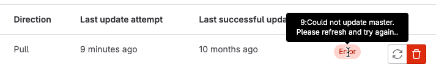

DETAILS:
**Tier:** Free, Premium, Ultimate
**Offering:** GitLab.com, GitLab Self-Managed, GitLab Dedicated

When mirroring fails, project maintainers can see a link similar to **{warning-solid}** **Pull mirroring failed 1 hour ago.**
on the project details page. Select this link to go directly to the mirroring settings,
where GitLab displays an **Error** badge for the mirrored repository. You can hover your mouse cursor
over the badge to display the text of the error:



## Received RST_STREAM with error code 2 with GitHub

If you receive this message while mirroring to a GitHub repository:

```plaintext
13:Received RST_STREAM with error code 2
```

One of these issues might be occurring:

1. Your GitHub settings might be set to block pushes that expose your email address
   used in commits. To fix this problem, either:
   - Set your GitHub email address to public.
   - Disable the [Block command line pushes that expose my email](https://github.com/settings/emails)
     setting.
1. Your repository exceeds the GitHub file size limit of 100 MB. To fix this problem,
   check the file size limit configured for on GitHub, and consider using
   [Git Large File Storage](https://git-lfs.com/) to manage large files.

## Deadline Exceeded

When you upgrade GitLab, a change in how usernames are represented means that you
must update your mirroring username and password to ensure that `%40` characters are replaced with `@`.

## Connection blocked: server only allows public key authentication

The connection between GitLab and the remote repository is blocked. Even if a
[TCP Check](../../../../administration/raketasks/maintenance.md#check-tcp-connectivity-to-a-remote-site)
is successful, you must check any networking components in the route from GitLab
to the remote server for blockage.

This error can occur when a firewall performs a `Deep SSH Inspection` on outgoing packets.

## Could not read username: terminal prompts disabled

If you receive this error after creating a new project using
[GitLab CI/CD for external repositories](../../../../ci/ci_cd_for_external_repos/_index.md):

- In Bitbucket Cloud:

  ```plaintext
  "2:fetch remote: "fatal: could not read Username for 'https://bitbucket.org':
  terminal prompts disabled\n": exit status 128."
  ```

- In Bitbucket Server (self-hosted):

  ```plaintext
  "2:fetch remote: "fatal: could not read Username for 'https://lab.example.com':
  terminal prompts disabled\n": exit status 128.
  ```

Check if the repository owner is specified in the URL of your mirrored repository:

1. On the left sidebar, select **Search or go to** and find your project.
1. Select **Settings > Repository**.
1. Expand **Mirroring repositories**.
1. If no repository owner is specified, delete and add the URL again in this format,
   replacing `OWNER`, `ACCOUNTNAME`, `PATH_TO_REPO`, and `REPONAME` with your values:

   - In Bitbucket Cloud:

     ```plaintext
     https://OWNER@bitbucket.org/ACCOUNTNAME/REPONAME.git
     ```

   - In Bitbucket Server (self-hosted):

     ```plaintext
     https://OWNER@lab.example.com/PATH_TO_REPO/REPONAME.git
     ```

When connecting to the Cloud or self-hosted Bitbucket repository for mirroring, the repository owner is required in the string.

## Pull mirror is missing LFS files

In some cases, pull mirroring does not transfer LFS files. This issue occurs when:

- You use an SSH repository URL. The workaround is to use an HTTPS repository URL instead.
  An issue exists [to fix this problem for SSH URLs](https://gitlab.com/gitlab-org/gitlab/-/issues/11997).
- You mirror an external repository using object storage.
  An issue exists [to fix this problem](https://gitlab.com/gitlab-org/gitlab/-/issues/335495).

## Pull mirroring is not triggering pipelines

Pipelines might not run for multiple reasons:

- [Trigger pipelines for mirror updates](pull.md#trigger-pipelines-for-mirror-updates)
  might not be enabled. This setting can only be enabled when initially
  [configuring pull mirroring](pull.md#configure-pull-mirroring). The status
  [is not displayed](https://gitlab.com/gitlab-org/gitlab/-/issues/346630)
  when checking the project afterwards.

  When mirroring is set up using [CI/CD for external repositories](../../../../ci/ci_cd_for_external_repos/_index.md)
  this setting is enabled by default. If repository mirroring is manually reconfigured, triggering pipelines
  is off by default and this could be why pipelines stop running.
- [`rules`](../../../../ci/yaml/_index.md#rules) configuration prevents any jobs from
  being added to the pipeline.
- Pipelines are triggered using [the account that set up the pull mirror](https://gitlab.com/gitlab-org/gitlab/-/issues/13697).
  If the account is no longer valid, pipelines do not run.
- [Branch protection](../branches/protected.md#run-pipelines-on-protected-branches)
  might prevent the account that set up mirroring from running pipelines.

## `The repository is being updated`, but neither fails nor succeeds visibly

In rare cases, mirroring slots on Redis can become exhausted,
possibly because Sidekiq workers are reaped due to out-of-memory (OoM) events.
When this occurs, mirroring jobs start and complete quickly, but they neither
fail nor succeed. They also do not leave a clear log. To check for this problem:

1. Enter the [Rails console](../../../../administration/operations/rails_console.md)
   and check Redis' mirroring capacity:

   ```ruby
   current = Gitlab::Redis::SharedState.with { |redis| redis.scard('MIRROR_PULL_CAPACITY') }.to_i
   maximum = Gitlab::CurrentSettings.mirror_max_capacity
   available = maximum - current
   ```

1. If the mirroring capacity is `0` or very low, you can drain all stuck jobs with:

   ```ruby
   Gitlab::Redis::SharedState.with { |redis| redis.smembers('MIRROR_PULL_CAPACITY') }.each do |pid|
     Gitlab::Redis::SharedState.with { |redis| redis.srem('MIRROR_PULL_CAPACITY', pid) }
   end
   ```

1. After you run the command, the [background jobs page](../../../../administration/admin_area.md#background-jobs)
   should show new mirroring jobs being scheduled, especially when
   [triggered manually](_index.md#update-a-mirror).

## Invalid URL

If you receive this error while setting up mirroring over [SSH](_index.md#ssh-authentication), make sure the URL is in a valid format.

Mirroring **does not** support SCP-like clone URLs in the form of
`git@gitlab.com:gitlab-org/gitlab.git`, with host and project path separated using `:`.
It requires a [standard URL](https://git-scm.com/docs/git-clone#_git_urls)
that includes the `ssh://` protocol, like `ssh://git@gitlab.com/gitlab-org/gitlab.git`.

## Host key verification failed

This error is returned when the target host public SSH key changes.
Public SSH keys rarely change. If host key verification fails,
but you suspect the key is still valid, you must delete the repository mirror
and create it again. For more information, see [Create a repository mirror](_index.md#create-a-repository-mirror).

## Transfer mirror users and tokens to a single service account

This requires access to the [GitLab Rails console](../../../../administration/operations/rails_console.md#starting-a-rails-console-session).

Use case: If you have multiple users using their own GitHub credentials to set up
repository mirroring, mirroring breaks when people leave the company. Use this
script to migrate disparate mirroring users and tokens into a single service account:

WARNING:
Commands that change data can cause damage if not run correctly or under the right conditions. Always run commands in a test environment first and have a backup instance ready to restore.

```ruby
svc_user = User.find_by(username: 'ourServiceUser')
token = 'githubAccessToken'

Project.where(mirror: true).each do |project|
  import_url = project.import_url

  # The url we want is https://token@project/path.git
  repo_url = if import_url.include?('@')
               # Case 1: The url is something like https://23423432@project/path.git
               import_url.split('@').last
             elsif import_url.include?('//')
               # Case 2: The url is something like https://project/path.git
               import_url.split('//').last
             end

  next unless repo_url

  final_url = "https://#{token}@#{repo_url}"

  project.mirror_user = svc_user
  project.import_url = final_url
  project.username_only_import_url = final_url
  project.save
end
```

## `The requested URL returned error: 301`

When mirroring using the `http://` or `https://` protocols, be sure to specify the exact URL to the repository: `https://gitlab.example.com/group/project.git`

HTTP redirects are not followed and omitting `.git` can result in a 301 error:

```plaintext
13:fetch remote: "fatal: unable to access 'https://gitlab.com/group/project': The requested URL returned error: 301\n": exit status 128.
```

## Push mirror from GitLab instance to Geo secondary fails

Push mirroring of a GitLab repository using the HTTP or HTTPS protocols fails when the destination
is a Geo secondary node due to the proxying of the push request to the Geo primary node,
and the following error is displayed:

```plaintext
13:get remote references: create git ls-remote: exit status 128, stderr: "fatal: unable to access 'https://gitlab.example.com/group/destination.git/': The requested URL returned error: 302".
```

This occurs when a Geo unified URL is configured and the target host name resolves to the secondary node's IP address.

The error can be avoided by:

- Configuring the push mirror to use the SSH protocol. However, the repository must not contain any
  LFS objects, which are always transferred over HTTP or HTTPS and are still redirected.
- Using a reverse proxy to direct all requests from the source instance to the primary Geo node.
- Adding a local `hosts` file entry on the source to force the target host name to resolve to the Geo primary node's IP address.
- Configuring a pull mirror on the target instead.

## Pull or push mirror fails to update: `The project is not mirrored`

Pull and push mirrors fail to update when [GitLab Silent Mode](../../../../administration/silent_mode/_index.md) is enabled.
When this happens, the option to allow mirroring on the UI is disabled.

An administrator can check to confirm that GitLab Silent Mode is disabled.

When mirroring fails due to Silent Mode the following are the debug steps:

- [Triggering the mirror using the API](pull.md#trigger-pipelines-for-mirror-updates) shows: `The project is not mirrored`.

- If pull or push mirror was already set up but there are no further updates on the mirrored repository,
  confirm the [project's pull and push mirror details ans status](../../../../api/project_pull_mirroring.md#get-a-projects-pull-mirror-details)
  are not recent as shown below. This indicates mirroring was paused and disabling GitLab Silent Mode restarts it automatically.

For example, if Silent Mode is what is impeding your imports, the output is similar to the following:

```json
"id": 1,
"update_status": "finished",
"url": "https://test.git"
"last_error": null,
"last_update_at": null,
"last_update_started_at": "2023-12-12T00:01:02.222Z",
"last_successful_update_at": null
```

## Initial mirroring fails: `Unable to pull mirror repo: Unable to get pack index`

You might get an error that states something similar to the following:

```plaintext
13:fetch remote: "error: Unable to open local file /var/opt/gitlab/git-data/repositories/+gitaly/tmp/quarantine-[OMITTED].idx.temp.temp\nerror: Unable to get pack index https://git.example.org/ebtables/objects/pack/pack-[OMITTED].idx\nerror: Unable to find fcde2b2edba56bf408601fb721fe9b5c338d10ee under https://git.example.org/ebtables
Cannot obtain needed object fcde2b2edba56bf408601fb721fe9b5c338d10ee
while processing commit 2c26b46b68ffc68ff99b453c1d30413413422d70.
error: fetch failed.\n": exit status 128.
```

This issue occurs because Gitaly does not support mirroring or importing repositories over the "dumb" HTTP protocol.

To determine if a server is "smart" or "dumb", use cURL to start a reference discovery for the
`git-upload-pack` service and emulate a Git "smart" client:

```shell
$GIT_URL="https://git.example.org/project"
curl --silent --dump-header - "$GIT_URL/info/refs?service=git-upload-pack"\
  -o /dev/null | grep -Ei "$content-type:"
```

- A ["smart" server](https://www.git-scm.com/docs/http-protocol#_smart_server_response)
  reports `application/x-git-upload-pack-advertisement` in the `Content-Type` response header.
- A "dumb" server reports `text/plain` in the `Content-Type` response header.

For more information, see the [Git documentation on discovering references](https://www.git-scm.com/docs/http-protocol#_discovering_references).

To resolve this, you can do either of the following:

- Migrate the source repository to a "smart" server.
- Mirror the repository using the [SSH protocol](_index.md#ssh-authentication) (requires authentication).
