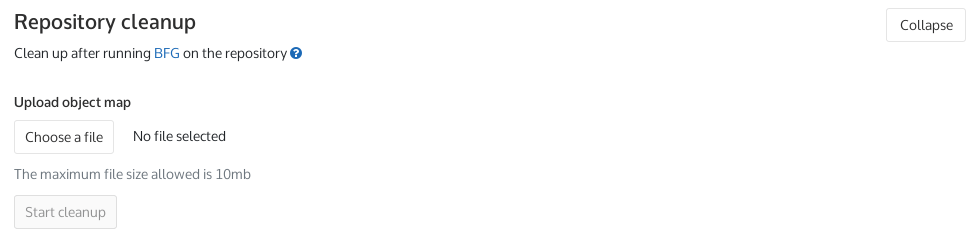

# Reducing the repository size using Git

A GitLab Enterprise Edition administrator can set a [repository size limit](../../admin_area/settings/account_and_limit_settings.md)
which will prevent you from exceeding it.

When a project has reached its size limit, you will not be able to push to it,
create a new merge request, or merge existing ones. You will still be able to
create new issues, and clone the project though. Uploading LFS objects will
also be denied.

If you exceed the repository size limit, your first thought might be to remove
some data, make a new commit and push back to the repository. Perhaps you can
move some blobs to LFS, or remove some old dependency updates from history.
Unfortunately, it's not so easy and that workflow won't work. Deleting files in
a commit doesn't actually reduce the size of the repo since the earlier commits
and blobs are still around. What you need to do is rewrite history with Git's
[`filter-branch` option](https://git-scm.com/book/en/v2/Git-Tools-Rewriting-History#The-Nuclear-Option:-filter-branch),
or a tool like the [BFG Repo-Cleaner](https://rtyley.github.io/bfg-repo-cleaner/).

Note that even with that method, until `git gc` runs on the GitLab side, the
"removed" commits and blobs will still be around. You also need to be able to
push the rewritten history to GitLab, which may be impossible if you've already
exceeded the maximum size limit.

In order to lift these restrictions, the administrator of the GitLab instance
needs to increase the limit on the particular project that exceeded it, so it's
always better to spot that you're approaching the limit and act proactively to
stay underneath it. If you hit the limit, and your admin can't - or won't -
temporarily increase it for you, your only option is to prune all the unneeded
stuff locally, and then create a new project on GitLab and start using that
instead.

If you can continue to use the original project, we recommend [using the
BFG Repo-Cleaner](#using-the-bfg-repo-cleaner). It's faster and simpler than
`git filter-branch`, and GitLab can use its account of what has changed to clean
up its own internal state, maximizing the space saved.

CAUTION: **Caution:**
Make sure to first make a copy of your repository since rewriting history will
purge the files and information you are about to delete. Also make sure to
inform any collaborators to not use `pull` after your changes, but use `rebase`.

CAUTION: **Caution:**
This process is not suitable for removing sensitive data like password or keys
from your repository. Information about commits, including file content, is
cached in the database, and will remain visible even after they have been
removed from the repository.

## Using the BFG Repo-Cleaner

> [Introduced](https://gitlab.com/gitlab-org/gitlab-ce/issues/19376) in GitLab 11.6.

1. [Install BFG](https://rtyley.github.io/bfg-repo-cleaner/).

1. Navigate to your repository:

   ```
   cd my_repository/
   ```

1. Change to the branch you want to remove the big file from:

   ```
   git checkout master
   ```

1. Create a commit removing the large file from the branch, if it still exists:

   ```
   git rm path/to/big_file.mpg
   git commit -m 'Remove unneeded large file'
   ```

1. Rewrite history:

   ```
   bfg --delete-files path/to/big_file.mpg
   ```

   An object map file will be written to `object-id-map.old-new.txt`. Keep it
   around - you'll need it for the final step!

1. Force-push the changes to GitLab:

   ```
   git push --force-with-lease origin master
   ```

   If this step fails, someone has changed the `master` branch while you were
   rewriting history. You could restore the branch and re-run BFG to preserve
   their changes, or use `git push --force` to overwrite their changes.

1. Navigate to **Project > Settings > Repository > Repository Cleanup**:

   

   Upload the `object-id-map.old-new.txt` file and press **Start cleanup**.
   This will remove any internal git references to the old commits, and run
   `git gc` against the repository. You will receive an email once it has
   completed.

NOTE: **Note:**
This process will remove some copies of the rewritten commits from GitLab's
cache and database, but there are still numerous gaps in coverage - at present,
some of the copies may persist indefinitely. [Clearing the instance cache](../../../administration/raketasks/maintenance.md#clear-redis-cache)
may help to remove some of them, but it should not be depended on for security
purposes!

## Using `git filter-branch`

1. Navigate to your repository:

   ```
   cd my_repository/
   ```

1. Change to the branch you want to remove the big file from:

   ```
   git checkout master
   ```

1. Use `filter-branch` to remove the big file:

   ```
   git filter-branch --force --tree-filter 'rm -f path/to/big_file.mpg' HEAD
   ```

1. Instruct Git to purge the unwanted data:

   ```
   git reflog expire --expire=now --all && git gc --prune=now --aggressive
   ```

1. Lastly, force push to the repository:

   ```
   git push --force origin master
   ```

Your repository should now be below the size limit.

<!-- ## Troubleshooting

Include any troubleshooting steps that you can foresee. If you know beforehand what issues
one might have when setting this up, or when something is changed, or on upgrading, it's
important to describe those, too. Think of things that may go wrong and include them here.
This is important to minimize requests for support, and to avoid doc comments with
questions that you know someone might ask.

Each scenario can be a third-level heading, e.g. `### Getting error message X`.
If you have none to add when creating a doc, leave this section in place
but commented out to help encourage others to add to it in the future. -->
