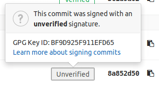

# Signed commits

DETAILS:
**Tier:** Free, Premium, Ultimate
**Offering:** GitLab.com, Self-managed, GitLab Dedicated

When you add a cryptographic signature to your commit, you provide extra assurance that a commit
originated from you, rather than an impersonator. If GitLab can verify a commit
author's identity with a public GPG key, the commit is marked **Verified** in the
GitLab UI. You can then configure [push rules](../push_rules.md)
for your project to reject individual unsigned commits, or reject all
commits from unverified users.

Sign commits with your:

- [SSH key](ssh.md).
- [GPG key](gpg.md).
- [Personal x.509 certificate](x509.md).

## Verify commits

You can review commits for a merge request, or for an entire project, to confirm
they are signed.

1. On the left sidebar, select **Search or go to** and find your project.
1. To review commits:
   - For a project, select **Code > Commits**.
   - For a merge request:
     1. Select **Code > Merge requests**, then select your merge request.
     1. Select **Commits**.
1. Identify the commit you want to review. Signed commits show either a **Verified**
   or **Unverified** badge, depending on the verification status of the signature.
   Unsigned commits do not display a badge:

   

1. To display the signature details for a commit, select **Verified** to see
   the fingerprint or key ID:

   

   

You can also [use the Commits API](../../../../api/commits.md#get-signature-of-a-commit)
to check a commit's signature.

### Verify commits made in the web UI

GitLab signs the commits created using the web UI using SSH.
To verify these commits locally, [follow the steps for SSH](ssh.md#verify-commits-locally)
and add the following public key to the `allowed_signers` file:
`ssh-ed25519 AAAAC3NzaC1lZDI1NTE5AAAAIADOCCUoN3Q1UPQqUvp845fKy7haJH17qsSkVXzWXilW`.

```plaintext
noreply@gitlab.com namespaces="git" ssh-ed25519 AAAAC3NzaC1lZDI1NTE5AAAAIADOCCUoN3Q1UPQqUvp845fKy7haJH17qsSkVXzWXilW
```

## Troubleshooting

### Fix verification problems with signed commits

The verification process for commits signed with GPG keys or X.509 certificates
can fail for multiple reasons:

| Value                       | Description | Possible Fixes |
|-----------------------------|-------------|----------------|
| `UNVERIFIED`                | The commit signature is not valid. | Sign the commit with a valid signature. |
| `SAME_USER_DIFFERENT_EMAIL` | The GPG key used to sign the commit does not contain the committer email, but does contain a different valid email for the committer. | Amend the commit to use an email address that matches the GPG key, or update the GPG key [to include the email address](https://security.stackexchange.com/a/261468). |
| `OTHER_USER`                | The signature and GPG key are valid, but the key belongs to a different user than the committer. | Amend the commit to use the correct email address, or amend the commit to use a GPG key associated with your user. |
| `UNVERIFIED_KEY`            | The key associated with the GPG signature has no verified email address associated with the committer. | Add and verify the email to your GitLab profile, [update the GPG key to include the email address](https://security.stackexchange.com/a/261468), or amend the commit to use a different committer email address. |
| `UNKNOWN_KEY`               | The GPG key associated with the GPG signature for this commit is unknown to GitLab. | [Add the GPG key](gpg.md#add-a-gpg-key-to-your-account) to your GitLab profile. |
| `MULTIPLE_SIGNATURES`       | Multiple GPG or X.509 signatures have been found for the commit. | Amend the commit to use only one GPG or X.509 signature. |
