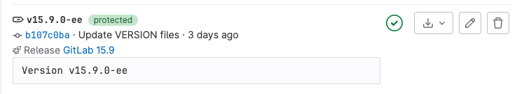

DETAILS:
**Tier:** Free, Premium, Ultimate
**Offering:** GitLab.com, GitLab Self-Managed, GitLab Dedicated

In Git, a tag marks an important point in a repository's history.
Git supports two types of tags:

- **Lightweight tags** point to specific commits, and contain no other information.
  Also known as soft tags. Create or remove them as needed.
- **Annotated tags** contain metadata, can be signed for verification purposes,
  and can't be changed.

The creation or deletion of a tag can be used as a trigger for automation, including:

- Using a [webhook](../../integrations/webhook_events.md#tag-events) to automate actions
  like Slack notifications.
- Signaling a [repository mirror](../mirror/_index.md) to update.
- Running a CI/CD pipeline with [`if: $CI_COMMIT_TAG`](../../../../ci/jobs/job_rules.md#common-if-clauses-with-predefined-variables).

When you [create a release](../../releases/_index.md),
GitLab also creates a tag to mark the release point.
Many projects combine an annotated release tag with a stable branch. Consider
setting deployment or release tags automatically.

In the GitLab UI, each tag displays:



- The tag name. (**{tag}**)
- Optional. If the tag is [protected](../../protected_tags.md), a **protected** badge.
- The commit SHA (**{commit}**), linked to the commit's contents.
- The commit's title and creation date.
- Optional. A link to the release (**{rocket}**).
- Optional. If a pipeline has been run, the current pipeline status.
- Download links to the source code and artifacts linked to the tag.
- A [**Create release**](../../releases/_index.md#create-a-release) (**{pencil}**) link.
- A link to delete the tag.

## View tags for a project

To view all existing tags for a project:

1. On the left sidebar, select **Search or go to** and find your project.
1. Select **Code > Tags**.

## View tagged commits in the commits list

> - [Introduced](https://gitlab.com/gitlab-org/gitlab/-/issues/18795) in GitLab 15.10.

1. On the left sidebar, select **Search or go to** and find your project.
1. Select **Code > Commits**.
1. Commits with a tag are labeled with a tag icon (**{tag}**) and the name of the tag.
   This example shows a commit tagged `v1.26.0`:

   

To view the list of commits in this tag, select the tag name.

## Create a tag

Tags can be created from the command line, or the GitLab UI.

### From the command line

To create either a lightweight or annotated tag from the command line, and push it upstream:

1. To create a lightweight tag, run the command `git tag TAG_NAME`, changing
   `TAG_NAME` to your desired tag name.
1. To create an annotated tag, run one of the versions of `git tag` from the command line:

   ```shell
   # In this short version, the annotated tag's name is "v1.0",
   # and the message is "Version 1.0".
   git tag -a v1.0 -m "Version 1.0"

   # Use this version to write a longer tag message
   # for annotated tag "v1.0" in your text editor.
   git tag -a v1.0
   ```

1. Push your tags upstream with `git push origin --tags`.

### From the UI

To create a tag from the GitLab UI:

1. On the left sidebar, select **Search or go to** and find your project.
1. Select **Code > Tags**.
1. Select **New tag**.
1. Provide a **Tag name**.
1. For **Create from**, select an existing branch name, tag, or commit SHA.
1. Optional. Add a **Message** to create an annotated tag, or leave blank to
   create a lightweight tag.
1. Select **Create tag**.

## Name your tag

Git enforces [tag name rules](https://git-scm.com/docs/git-check-ref-format)
to help ensure tag names remain compatible with other tools. GitLab
adds extra requirements for tag names, and provides benefits for well-structured tag names.

GitLab enforces these additional rules on all tags:

- No spaces are allowed in tag names.
- Tag names starting with 40 or 64 hexadecimal characters are prohibited, because they are similar to Git commit hashes.
- Tag names cannot start with `-`, `refs/heads/`, `refs/tags/`, or `refs/remotes/`
- Tag names are case-sensitive.

## Prevent tag deletion

DETAILS:
**Tier:** Premium, Ultimate
**Offering:** GitLab.com, GitLab Self-Managed, GitLab Dedicated

To prevent users from removing a tag with `git push`, create a [push rule](../push_rules.md).

## Trigger pipelines from a tag

GitLab CI/CD provides a predefined variable, [`CI_COMMIT_TAG`](../../../../ci/variables/predefined_variables.md),
to identify tags in your pipeline configurations.
You can use this variable in job rules and workflow rules to test if a pipeline was triggered by a tag.

By default, if your CI/CD jobs don't have specific rules in place,
they are included in a tag pipeline for any newly created tag.

In your `.gitlab-ci.yml` file for the CI/CD pipeline configuration of your project,
you can use the `CI_COMMIT_TAG` variable to control pipelines for new tags:

- At the job level with [`rules:if`](../../../../ci/yaml/_index.md#rulesif).
- At the pipeline level with the [`workflow`](../../../../ci/yaml/workflow.md) keyword.

## Related topics

- [Tagging (Git reference page)](https://git-scm.com/book/en/v2/Git-Basics-Tagging)
- [Protected tags](../../protected_tags.md)
- [Tags API](../../../../api/tags.md)
