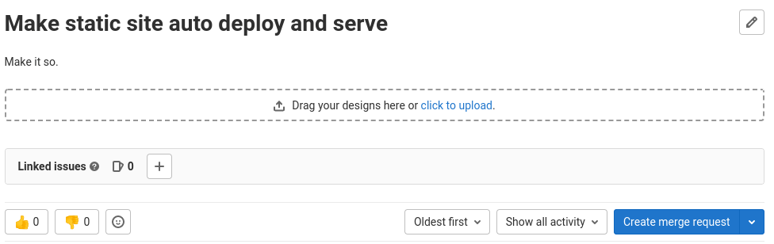
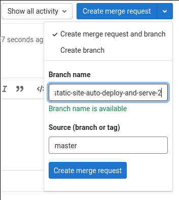
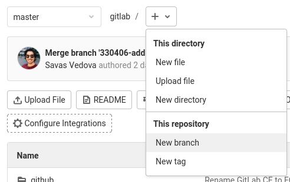
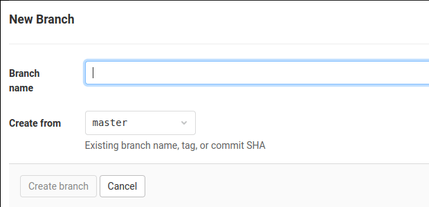

# Web Editor **(FREE)**

You can use the Web Editor to make changes directly from the UI instead of
cloning a project and using the command line.
From any project page, you can create a file, directory, branch, or tag.

## Create a file

To create a text file in the Web Editor:

1. On the top bar, select **Main menu > Projects** and find your project.
1. On the project page, next to the branch name, select the plus icon (**{plus}**).
1. From the dropdown list, select **New file**.
1. Complete the fields.
   - From the **Select a template type** dropdown list, you can apply a template to the new file.
   - To create a merge request with the new file, ensure the **Start a new merge request with these changes** checkbox is selected.
1. Select **Commit changes**.

## Edit a file

To edit a file in the Web Editor:

1. On the top bar, select **Main menu > Projects** and find your project.
1. Go to your file.
1. Next to the display buttons, select **Edit**.

### Keyboard shortcuts

When you [edit a file](#edit-a-file) in the Web Editor, you can use the same keyboard shortcuts for the Web IDE.
See the [available shortcuts](../../shortcuts.md#web-ide).

## Preview Markdown

> [Introduced](https://gitlab.com/gitlab-org/gitlab/-/issues/378966) in GitLab 15.6.

To preview Markdown content in the Web Editor:

1. [Edit a file](#edit-a-file).
1. Do one of the following:
   - Select the **Preview** tab.
   - From the context menu, select **Preview Markdown**.

In the **Preview** tab, you can see a live Markdown preview alongside your content.

To close the preview panel, do one of the following:

- Select the **Write** tab.
- From the context menu, select **Hide Live Preview**.

## Highlight lines

> - [Introduced](https://gitlab.com/gitlab-org/gitlab/-/merge_requests/56159) in GitLab 13.10 for GitLab SaaS instances.
> - [Introduced](https://gitlab.com/gitlab-org/gitlab/-/merge_requests/56159) in GitLab 13.11 for self-managed instances.

To highlight single or multiple lines in the Web Editor, add hash
information to the filename segment of the URL. For example:

- `MY_FILE.js#L3` highlights line 3 in `MY_FILE.js`.
- `MY_FILE.js#L3-10` highlights lines 3 to 10 in `MY_FILE.js`.

To highlight a single line, you can also:

1. [Edit a file](#edit-a-file).
1. Select a line number.

## Upload a file

To upload a binary file in the Web Editor:

1. On the top bar, select **Main menu > Projects** and find your project.
1. On the project page, next to the branch name, select the plus icon (**{plus}**).
1. From the dropdown list, select **Upload file**.
1. Complete the fields. To create a merge request with the uploaded file, ensure the **Start a new merge request with these changes** toggle is turned on.
1. Select **Upload file**.

## Create a directory

To create a directory in the Web Editor:

1. On the top bar, select **Main menu > Projects** and find your project.
1. On the project page, next to the branch name, select the plus icon (**{plus}**).
1. From the dropdown list, select **New directory**.
1. Complete the fields. To create a merge request with the new directory, ensure the **Start a new merge request with these changes** toggle is turned on.
1. Select **Create directory**.

## Create a new branch

There are multiple ways to create a branch from the GitLab web interface.

NOTE:
Use [branch naming patterns](branches/index.md#naming) to streamline merge request creation.

### Create a new branch from an issue

> The **Create merge request** button [changed](https://gitlab.com/gitlab-org/gitlab/-/issues/349566) to open the merge request creation form in GitLab 14.8.

If your development workflow requires an issue for every merge
request, you can create a branch directly from the issue to speed the process up.
The new branch, and later its merge request, are marked as related to this issue.
After merging the merge request, the issue is closed automatically, unless [automatic issue closing is disabled](../issues/managing_issues.md#disable-automatic-issue-closing).
You can see a **Create merge request** dropdown below the issue description.

NOTE:
In GitLab 14.8 and later, selecting **Create merge request**
[redirects to the merge request creation form](https://gitlab.com/gitlab-org/gitlab/-/issues/349566)
instead of immediately creating the merge request.

The **Create merge request** button doesn't display if:

- A branch with the same name already exists.
- A merge request already exists for this branch.
- Your project has an active fork relationship.
- Your project is private and the issue is confidential.

To make this button appear, one possible workaround is to
[remove your project's fork relationship](../settings/index.md#remove-a-fork-relationship).
After removal, the fork relationship cannot be restored. This project can no longer
be able to receive or send merge requests to the source project, or other forks.

This dropdown contains the options **Create merge request and branch** and **Create branch**.

After selecting one of these options, a new branch or branch and merge request
is created based on your project's [default branch](branches/default.md).
The branch name is based on an internal ID, and the issue title. The example
screenshot above creates a branch named
`2-make-static-site-auto-deploy-and-serve`.

When you select the **Create branch** button in an empty
repository project, GitLab performs these actions:

- Creates a default branch.
- Commits a blank `README.md` file to it.
- Creates and redirects you to a new branch based on the issue title.
- _If your project is [configured with a deployment service](../integrations/index.md) like Kubernetes,_
  GitLab prompts you to set up [auto deploy](../../../topics/autodevops/stages.md#auto-deploy)
  by helping you create a `.gitlab-ci.yml` file.

After the branch is created, you can edit files in the repository to fix
the issue. When a merge request is created based on the newly-created branch,
the description field displays the [issue closing pattern](../issues/managing_issues.md#closing-issues-automatically)
`Closes #ID`, where `ID` is the ID of the issue. This closes the issue when the
merge request is merged.

### Create a new branch from a project's dashboard

If you want to make changes to several files before creating a new merge
request, you can create a new branch upfront.

1. From a project's files page, choose **New branch** from the dropdown list.

   

1. Enter a new **Branch name**.
1. Optional. Change the **Create from** field to choose which branch, tag, or
   commit SHA this new branch originates from. This field autocompletes if you
   start typing an existing branch or tag.
1. To return to the file browser on this new branch, select **Create branch**.

   

You can now make changes to any files, as needed. When you're ready to merge
the changes back to your [default branch](branches/default.md), you can use the widget at the top of the screen.
This widget only appears for a period of time after you create the branch or
modify files.

## Create a tag

You can create tags to mark milestones such as production releases and
release candidates. To create a tag in the Web Editor:

1. On the top bar, select **Main menu > Projects** and find your project.
1. On the project page, next to the branch name, select the plus icon (**{plus}**).
1. From the dropdown list, select **New tag**.
1. Complete the fields. From the **Create from** dropdown list, select an existing branch, tag, or commit SHA.
1. Select **Create tag**.

## Tips

When creating or uploading a new file or creating a new directory, you can
trigger a new merge request rather than committing directly to your default branch:

1. Enter a new branch name in the **Target branch** field.
1. GitLab displays the **Start a new merge request with these changes** checkbox.
1. Commit your changes, and GitLab redirects you to a new merge request form.

   

If you'd prefer to not use your primary email address for commits created
through the web editor, you can choose to use another of your linked email
addresses from the **User Settings > Edit Profile** page.

<!-- ## Troubleshooting

Include any troubleshooting steps that you can foresee. If you know beforehand what issues
one might have when setting this up, or when something is changed, or on upgrading, it's
important to describe those, too. Think of things that may go wrong and include them here.
This is important to minimize requests for support, and to avoid doc comments with
questions that you know someone might ask.

Each scenario can be a third-level heading, for example `### Getting error message X`.
If you have none to add when creating a doc, leave this section in place
but commented out to help encourage others to add to it in the future. -->
