# GitLab Web Editor **(FREE)**

Sometimes it's easier to make quick changes directly from the GitLab interface
than to clone the project and use the Git command-line tool. In this feature
highlight, we look at how you can create a new file, directory, branch, or
tag from the file browser. All of these actions are available from a single
dropdown menu.

## Create a file

From a project's files page, click the '+' button to the right of the branch selector.
Choose **New file** from the dropdown.
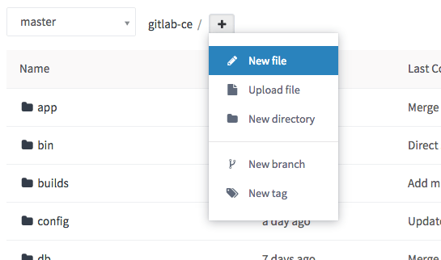

Enter a filename in the **Filename** box. Then, add file content in the editor
area. Add a descriptive commit message and choose a branch. The branch field
defaults to the branch you were viewing in the file browser. If you enter
a new branch name, a checkbox displays, allowing you to start a new merge
request after you commit the changes.

When you are satisfied with your new file, click **Commit Changes** at the bottom.

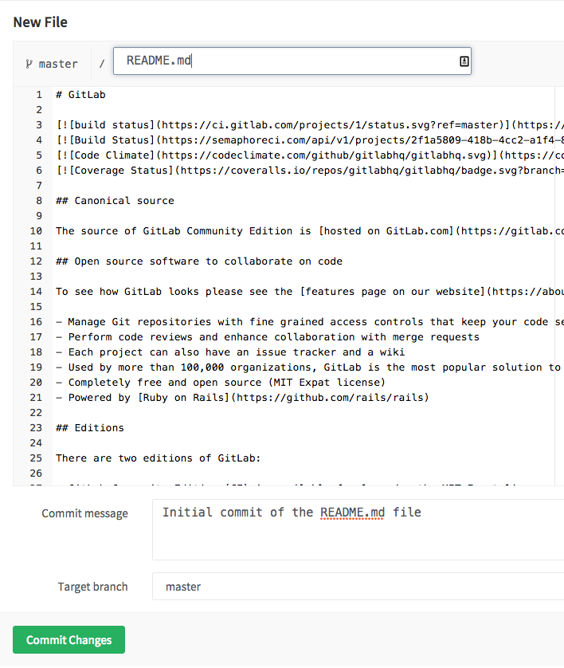

### Shortcuts

You can use shortcuts when editing a file through the Web Editor. It uses the same shortcuts
as the Web IDE. For details, read the documentation for [Command Palette](../web_ide/index.md#command-palette).

### Template dropdowns

When starting a new project, there are some common files that the new project
might need. GitLab displays a message to help you:

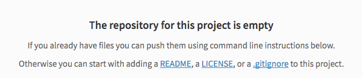

When clicking on either `LICENSE` or `.gitignore` and so on, a dropdown displays
to provide you a template that may be suitable for your project:

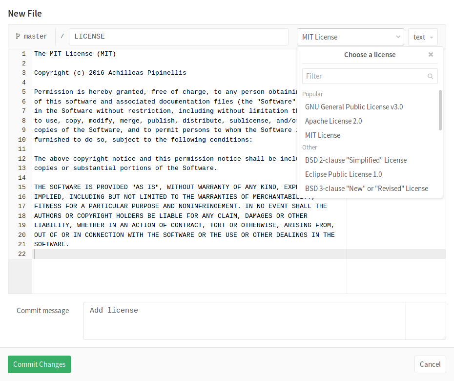

The license, changelog, contribution guide, or `.gitlab-ci.yml` file can also
be added through a button on the project page. In this example, the license
has already been created, which creates a link to the license itself.

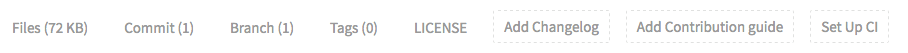

NOTE:
The **Set up CI/CD** button does not appear on an empty repository. For the button
to display, add a file to your repository.

## Highlight lines

> - [Introduced](https://gitlab.com/gitlab-org/gitlab/-/merge_requests/56159) in GitLab 13.10 for GitLab SaaS instances.
> - [Introduced](https://gitlab.com/gitlab-org/gitlab/-/merge_requests/56159) in GitLab 13.11 for self-managed instances.

Web Editor enables you to highlight a single line by adding specially formatted
hash information to the URL's file path segment. For example, the file path segment
`MY_FILE.js#L3` instructs the Web Editor to highlight line 3.

The Web Editor also enables you to highlight multiple lines using a similar pattern. In
this case, the file path segment `MY_FILE.js#L3-10` instructs the Web Editor to
highlight lines 3 to 10 of the file.

You don't need to construct these lines manually. Instead, you can:

1. Hover over the number of a line you want to be highlighted when sharing.
1. Right-click the number with your mouse.
1. Click **Copy Link Address** in the context menu.

   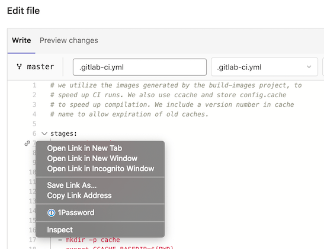

## Upload a file

The ability to create a file is great when the content is text. However, this
doesn't work well for binary data such as images, PDFs, or other binary file types. In
this case, you need to upload a file.

From a project's files page, click the '+' button to the right of the branch
selector. Choose **Upload file** from the dropdown:

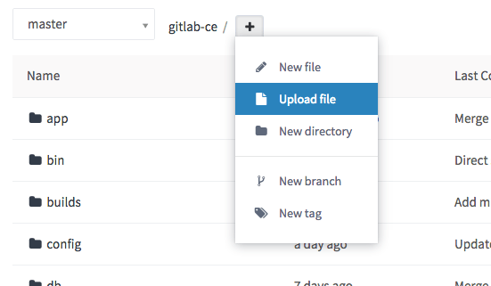

After the upload dialog pops up, there are two ways to upload your file. Either
drag and drop a file on the popup or use the **click to upload** link. After you
select a file to upload, a file preview displays.

Enter a commit message, choose a branch, and click **Upload file** when you are
ready.

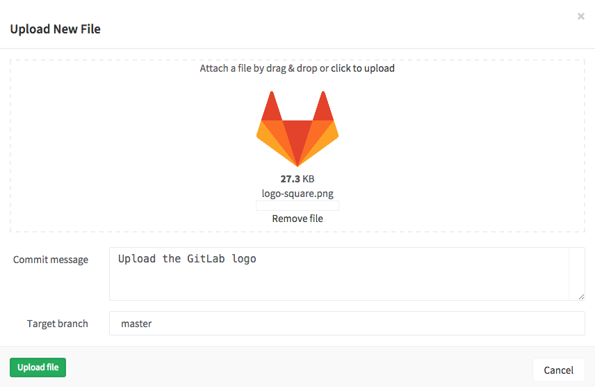

## Create a directory

To keep files in the repository organized it is often helpful to create a new
directory.

From a project's files page, click the plus button (`+`) to the right of the branch selector.
Choose **New directory** from the dropdown.

In the new directory dialog, enter a directory name, a commit message, and choose
the target branch. Click **Create directory** to finish.

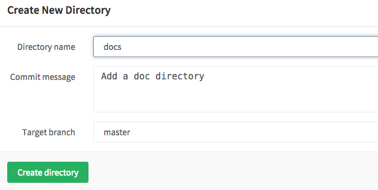

## Create a new branch

There are multiple ways to create a branch from the GitLab web interface.

### Create a new branch from an issue

> [Introduced](https://gitlab.com/gitlab-org/gitlab-foss/-/merge_requests/2808) in GitLab 8.6.

If your development workflow requires an issue for every merge
request, you can create a branch directly from the issue to speed the process up.
The new branch, and later its merge request, are marked as related to this issue.
Once merged, the merge request closes the issue.
You can see a **Create merge request** dropdown below the issue description.

The **Create merge request** button doesn't display if:

- A branch with the same name already exists.
- A merge request already exists for this branch.
- Your project has an active fork relationship.

To make this button appear, one possible workaround is to
[remove your project's fork relationship](../settings/index.md#removing-a-fork-relationship).
After removal, the fork relationship cannot be restored. This project can no longer
be able to receive or send merge requests to the source project, or other forks.

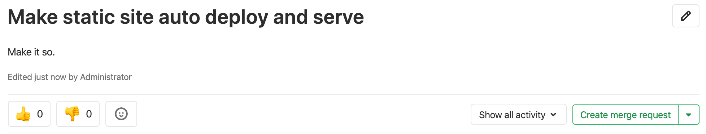

This dropdown contains the options **Create merge request and branch** and **Create branch**.

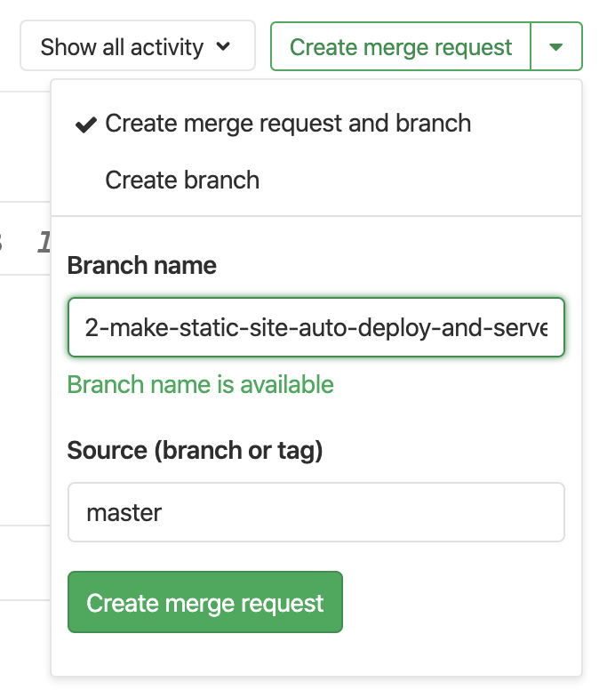

After selecting one of these options, a new branch or branch and merge request
is created based on your project's [default branch](branches/default.md).
The branch name is based on an internal ID, and the issue title. The example
screenshot above creates a branch named
`2-make-static-site-auto-deploy-and-serve`.

When you click the **Create branch** button in an empty
repository project, GitLab performs these actions:

- Creates a default branch.
- Commits a blank `README.md` file to it.
- Creates and redirects you to a new branch based on the issue title.
- _If your project is [configured with a deployment service](../integrations/overview.md) like Kubernetes,_
  GitLab prompts you to set up [auto deploy](../../../topics/autodevops/stages.md#auto-deploy)
  by helping you create a `.gitlab-ci.yml` file.

After the branch is created, you can edit files in the repository to fix
the issue. When a merge request is created based on the newly-created branch,
the description field displays the [issue closing pattern](../issues/managing_issues.md#closing-issues-automatically)
`Closes #ID`, where `ID` is the ID of the issue. This closes the issue when the
merge request is merged.

### Create a new branch from a project's dashboard

If you want to make changes to several files before creating a new merge
request, you can create a new branch upfront.

1. From a project's files page, choose **New branch** from the dropdown.

   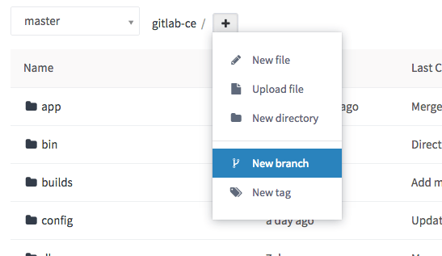

1. Enter a new **Branch name**.
1. (Optional) Change the **Create from** field to choose which branch, tag, or
   commit SHA this new branch originates from. This field autocompletes if you
   start typing an existing branch or tag.
1. Click **Create branch** to return to the file browser on this new branch.

   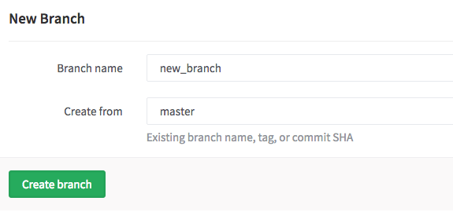

You can now make changes to any files, as needed. When you're ready to merge
the changes back to your [default branch](branches/default.md), you can use the widget at the top of the screen.
This widget only appears for a period of time after you create the branch or
modify files.

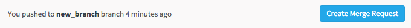

## Create a new tag

Tags help you mark major milestones such as production releases and
release candidates. You can create a tag from a branch or a commit
SHA:

1. From a project's files page, choose **New tag** from the dropdown.

   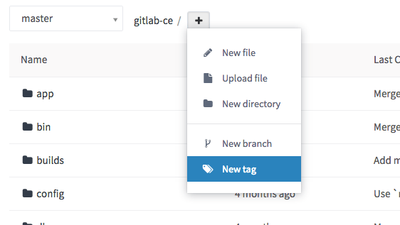

1. Give the tag a name such as `v1.0.0`.
1. Choose the branch or SHA from which you want to create this new tag.
1. (Optional) Add a message and release notes. The release notes section supports
   Markdown format.
1. (Optional) Upload an attachment.
1. Click **Create tag**, and GitLab redirects you to the tag list page.

   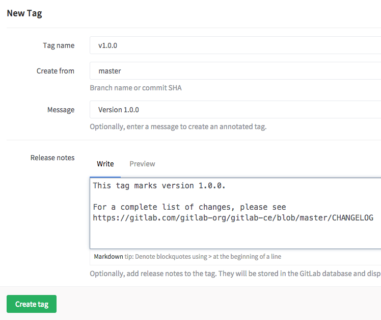

## Tips

When creating or uploading a new file or creating a new directory, you can
trigger a new merge request rather than committing directly to your default branch:

1. Enter a new branch name in the **Target branch** field.
1. GitLab displays the **Start a new merge request with these changes** check box.
1. Commit your changes, and GitLab redirects you to a new merge request form.

   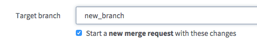

If you'd prefer to not use your primary email address for commits created
through the web editor, you can choose to use another of your linked email
addresses from the **User Settings > Edit Profile** page.

<!-- ## Troubleshooting

Include any troubleshooting steps that you can foresee. If you know beforehand what issues
one might have when setting this up, or when something is changed, or on upgrading, it's
important to describe those, too. Think of things that may go wrong and include them here.
This is important to minimize requests for support, and to avoid doc comments with
questions that you know someone might ask.

Each scenario can be a third-level heading, e.g. `### Getting error message X`.
If you have none to add when creating a doc, leave this section in place
but commented out to help encourage others to add to it in the future. -->
