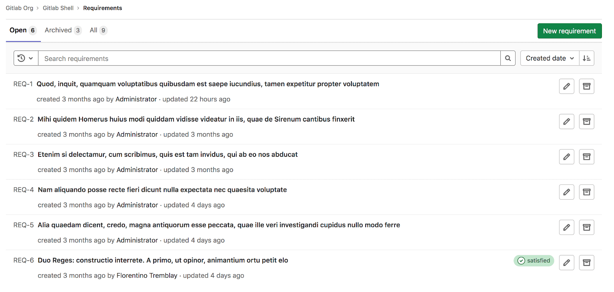
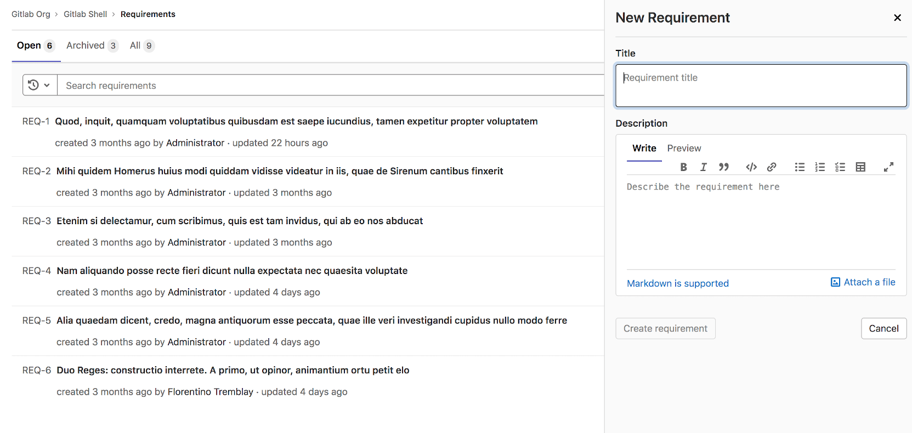
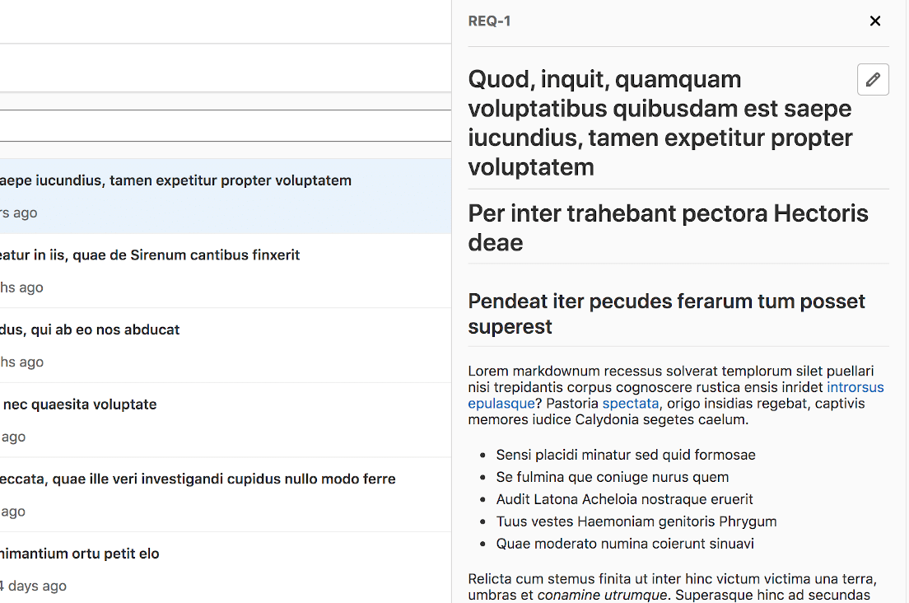
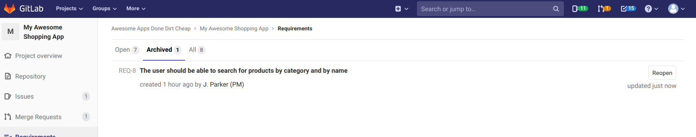

DETAILS:
**Tier:** Ultimate
**Offering:** GitLab.com, GitLab Self-Managed, GitLab Dedicated

With requirements, you can set criteria to check your products against. They can be based on users,
stakeholders, system, software, or anything else you find important to capture.

A requirement is an artifact in GitLab which describes the specific behavior of your product.
Requirements are long-lived and don't disappear unless manually cleared.

If an industry standard *requires* that your application has a certain feature or behavior, you can
[create a requirement](#create-a-requirement) to reflect this.
When a feature is no longer necessary, you can [archive the related requirement](#archive-a-requirement).

NOTE:
Requirements and [test cases](../../../ci/test_cases/_index.md) are being
[migrated to work items](https://gitlab.com/groups/gitlab-org/-/epics/5171).
[Issue 323790](https://gitlab.com/gitlab-org/gitlab/-/issues/323790) proposes to link requirements to test cases.
For more information, see [Product Stage Direction - Plan](https://about.gitlab.com/direction/plan/).

<i class="fa fa-youtube-play youtube" aria-hidden="true"></i>
For an overview, see [Requirements Management](https://www.youtube.com/watch?v=uSS7oUNSEoU).
<!-- Video published on 2020-04-09 -->

<i class="fa fa-youtube-play youtube" aria-hidden="true"></i>
For a more in-depth walkthrough see [GitLab Requirements Traceability Walkthrough](https://youtu.be/VIiuTQYFVa0) (Feb 2021).



## Create a requirement

> - [Changed](https://gitlab.com/gitlab-org/gitlab/-/merge_requests/169256) the minimum user role from Reporter to Planner in GitLab 17.7.

A paginated list of requirements is available in each project, and there you
can create a new requirement.

Prerequisites:

- You must have at least the Planner role.

To create a requirement:

1. In a project, go to **Plan > Requirements**.
1. Select **New requirement**.
1. Enter a title and description and select **New requirement**.



You can see the newly created requirement on the top of the list, with the requirements
list being sorted by creation date, in descending order.

## View a requirement

You can view a requirement from the list by selecting it.



To edit a requirement while viewing it, select the **Edit** icon (**{pencil}**)
next to the requirement title.

## Edit a requirement

> - [Changed](https://gitlab.com/gitlab-org/gitlab/-/issues/424961) in GitLab 16.11: Authors and assignees can edit requirements even if they don't have the Reporter role.
> - [Changed](https://gitlab.com/gitlab-org/gitlab/-/merge_requests/169256) the minimum user role from Reporter to Planner in GitLab 17.7.

You can edit a requirement from the requirements list page.

Prerequisites:

- You must have at least the Planner role or be the author or assignee of the requirement.

To edit a requirement:

1. From the requirements list, select the **Edit** icon (**{pencil}**).
1. Update the title and description in text input field. You can also mark a
   requirement as satisfied in the edit form by using the checkbox **Satisfied**.
1. Select **Save changes**.

## Archive a requirement

> - [Changed](https://gitlab.com/gitlab-org/gitlab/-/issues/424961) in GitLab 16.11: Authors and assignees can archive requirements even if they don't have the Reporter role.
> - [Changed](https://gitlab.com/gitlab-org/gitlab/-/merge_requests/169256) the minimum user role from Reporter to Planner in GitLab 17.7.

You can archive an open requirement while
you're in the **Open** tab.

Prerequisites:

- You must have at least the Planner role or be the author or assignee of the requirement.

To archive a requirement, select **Archive** (**{archive}**).

As soon as a requirement is archived, it no longer appears in the **Open** tab.

## Reopen a requirement

> - [Changed](https://gitlab.com/gitlab-org/gitlab/-/issues/424961) in GitLab 16.11: Authors and assignees can re-open requirements even if they don't have the Reporter role.
> - [Changed](https://gitlab.com/gitlab-org/gitlab/-/merge_requests/169256) the minimum user role from Reporter to Planner in GitLab 17.7.

You can view the list of archived requirements in the **Archived** tab.

Prerequisites:

- You must have at least the Planner role or be the author or assignee of the requirement.



To reopen an archived requirement, select **Reopen**.

As soon as a requirement is reopened, it no longer appears in the **Archived** tab.

## Search for a requirement

You can search for a requirement from the requirements list page based on the following criteria:

- Title
- Author's username
- Status (satisfied, failed, or missing)

To search for a requirement:

1. In a project, go to **Plan > Requirements > List**.
1. Select the **Search or filter results** field. A dropdown list appears.
1. Select the requirement author or status from the dropdown list or enter plain text to search by requirement title.
1. Press <kbd>Enter</kbd> on your keyboard to filter the list.

You can also sort the requirements list by:

- Created date
- Updated date

## Allow requirements to be satisfied from a CI job

GitLab supports [requirements test reports](../../../ci/yaml/artifacts_reports.md#artifactsreportsrequirements) now.
You can add a job to your CI pipeline that, when triggered, marks all existing
requirements as Satisfied (you may manually satisfy a requirement in the edit form [edit a requirement](#edit-a-requirement)).

### Add the manual job to CI

To configure your CI to mark requirements as Satisfied when the manual job is
triggered, add the code below to your `.gitlab-ci.yml` file.

```yaml
requirements_confirmation:
  when: manual
  allow_failure: false
  script:
    - mkdir tmp
    - echo "{\"*\":\"passed\"}" > tmp/requirements.json
  artifacts:
    reports:
      requirements: tmp/requirements.json
```

This definition adds a manually-triggered (`when: manual`) job to the CI
pipeline. It's blocking (`allow_failure: false`), but it's up to you what
conditions you use for triggering the CI job. Also, you can use any existing CI job
to mark all requirements as satisfied, as long as the `requirements.json`
artifact is generated and uploaded by the CI job.

When you manually trigger this job, the `requirements.json` file containing
`{"*":"passed"}` is uploaded as an artifact to the server. On the server side,
the requirement report is checked for the "all passed" record
(`{"*":"passed"}`), and on success, it marks all existing open requirements as
Satisfied.

#### Specifying individual requirements

It is possible to specify individual requirements and their statuses.

If the following requirements exist:

- `REQ-1` (with IID `1`)
- `REQ-2` (with IID `2`)
- `REQ-3` (with IID `3`)

It is possible to specify that the first requirement passed, and the second failed.
Valid values are "passed" and "failed".
By omitting a requirement IID (in this case `REQ-3`'s IID `3`), no result is noted.

```yaml
requirements_confirmation:
  when: manual
  allow_failure: false
  script:
    - mkdir tmp
    - echo "{\"1\":\"passed\", \"2\":\"failed\"}" > tmp/requirements.json
  artifacts:
    reports:
      requirements: tmp/requirements.json
```

### Add the manual job to CI conditionally

To configure your CI to include the manual job only when there are some open
requirements, add a rule which checks `CI_HAS_OPEN_REQUIREMENTS` CI/CD variable.

```yaml
requirements_confirmation:
  rules:
    - if: "$CI_HAS_OPEN_REQUIREMENTS" == "true"
      when: manual
    - when: never
  allow_failure: false
  script:
    - mkdir tmp
    - echo "{\"*\":\"passed\"}" > tmp/requirements.json
  artifacts:
    reports:
      requirements: tmp/requirements.json
```

Because requirements and [test cases](../../../ci/test_cases/_index.md) are being
[migrated to work items](https://gitlab.com/groups/gitlab-org/-/epics/5171), if you have enabled work items
in a project, you must replace `requirements` in above configs with `requirements_v2`:

```yaml
      requirements_v2: tmp/requirements.json
```

## Import requirements from a CSV file

> - [Changed](https://gitlab.com/gitlab-org/gitlab/-/merge_requests/169256) the minimum user role from Reporter to Planner in GitLab 17.7.

You must have at least the Planner role.

You can import requirements to a project by uploading a [CSV file](https://en.wikipedia.org/wiki/Comma-separated_values)
with the columns `title` and `description`.

After the import, the user uploading the CSV file is set as the author of the imported requirements.

### Import the file

Before you import your file:

- Consider importing a test file containing only a few requirements. There is no way to undo a large
  import without using the GitLab API.
- Ensure your CSV file meets the [file format](#imported-csv-file-format) requirements.

To import requirements:

1. In a project, go to **Plan > Requirements**.
   - For a project with requirements, in the
     upper-right corner, select the vertical ellipsis (**{ellipsis_v}**),
     then select **Import requirements** (**{import}**).
   - For a project without requirements, in the middle of the page, select **Import CSV**.
1. Select the file and select **Import requirements**.

The file is processed in the background and a notification email is sent
to you after the import is complete.

### Imported CSV file format

When importing requirements from a CSV file, it must be formatted in a certain way:

- **Header row:** CSV files must include the following headers:
  `title` and `description`. The headers are case insensitive.
- **Columns:** data from columns other than `title` and `description` is not imported.
- **Separators:** the column separator is automatically detected from the header row.
  Supported separator characters are: commas (`,`), semicolons (`;`), and tabs (`\t`).
  The row separator can be either `CRLF` or `LF`.
- **Double-quote character:** the double-quote (`"`) character is used to quote fields,
  enabling the use of the column separator in a field (see the third line in the
  sample CSV data below). To insert a double-quote (`"`) in a quoted
  field, use two double-quote characters in succession (`""`).
- **Data rows:** below the header row, succeeding rows must follow the same column
  order. The title text is required, while the description is optional and can be left empty.

Sample CSV data:

```plaintext
title,description
My Requirement Title,My Requirement Description
Another Title,"A description, with a comma"
"One More Title","One More Description"
```

### File size

The limit depends on the configuration value of Max Attachment Size for the GitLab instance.

For GitLab.com, it is set to 10 MB.

## Export requirements to a CSV file

> - [Changed](https://gitlab.com/gitlab-org/gitlab/-/merge_requests/169256) the minimum user role from Reporter to Planner in GitLab 17.7.

You can export GitLab requirements to a
[CSV file](https://en.wikipedia.org/wiki/Comma-separated_values) sent to your default notification
email as an attachment.

By exporting requirements, you and your team can import them into another tool or share them with
your customers. Exporting requirements can aid collaboration with higher-level systems, as well as
audit and regulatory compliance tasks.

Prerequisites:

- You must have at least the Planner role.

To export requirements:

1. In a project, go to **Plan > Requirements**.
1. In the upper-right corner, select the vertical ellipsis (**{ellipsis_v}**),
   then select **Export as CSV** (**{export}**).

   A confirmation modal appears.

1. Under **Advanced export options**, select which fields to export.

   All fields are selected by default. To exclude a field from being exported, clear the checkbox next to it.

1. Select **Export requirements**. The exported CSV file is sent to the email address associated with your user.

### Exported CSV file format

<!-- vale gitlab_base.Spelling = NO -->

You can preview the exported CSV file in a spreadsheet editor, such as Microsoft Excel,
OpenOffice Calc, or Google Sheets.

<!-- vale gitlab_base.Spelling = YES -->

The exported CSV file contains the following headers:

- Requirement ID
- Title
- Description
- Author
- Author Username
- Created At (UTC)
- State
- State Updated At (UTC)
