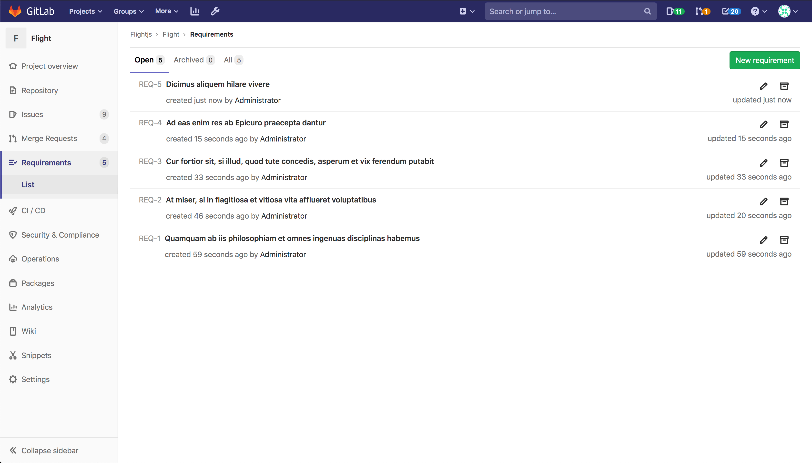
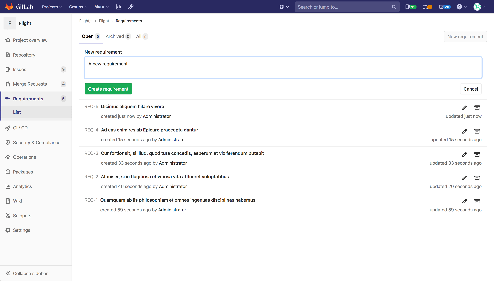
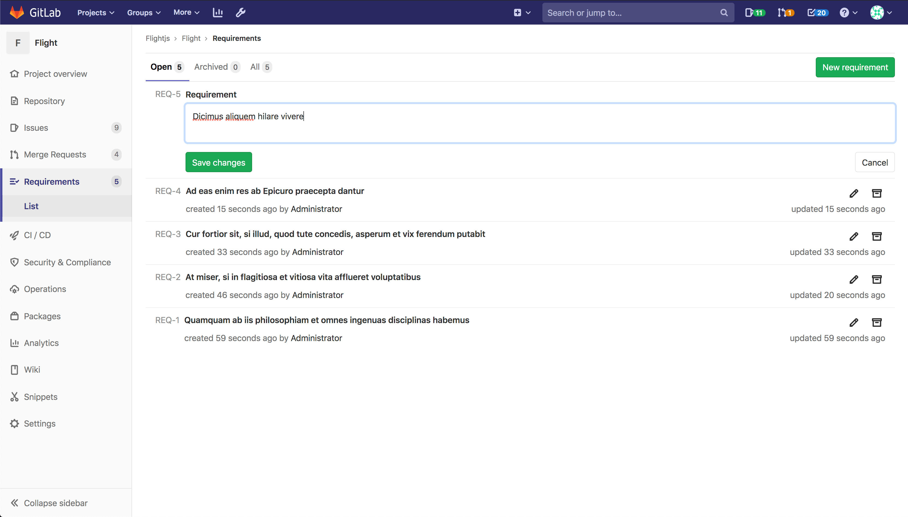
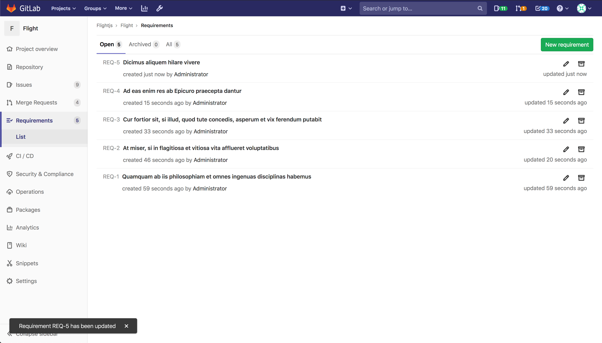
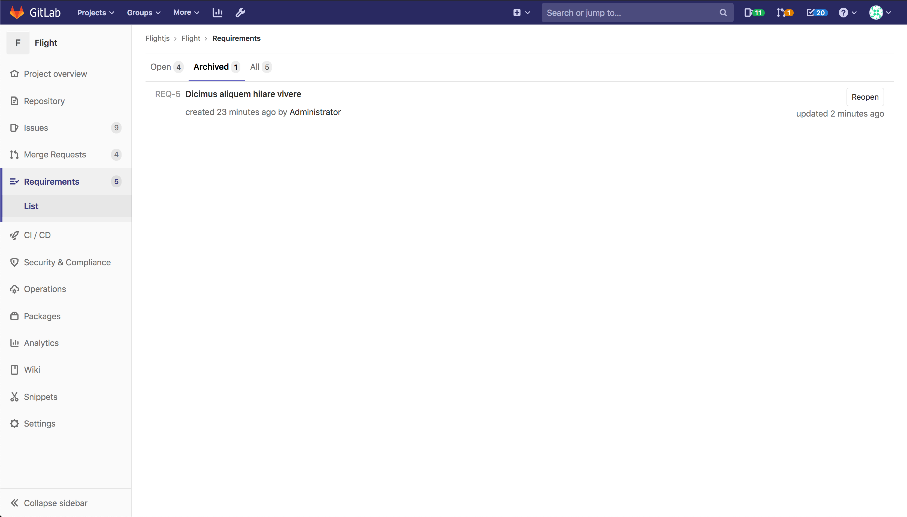

# Requirements **(ULTIMATE)**

> [Introduced](https://gitlab.com/groups/gitlab-org/-/epics/2703) in [GitLab Ultimate](https://about.gitlab.com/pricing/) 12.10.

Requirements allow you to create criteria to check your products against. They
can be based on users, stakeholders, system, software, or anything else you
find important to capture.

## Create a requirement

A paginated list of requirements is available in each project, and there you
can create a new requirement.

To create a requirement:

1. From your project page, go to **{requirements}** **Requirements**.
1. Click **New requirement**.
1. Enter a descriptive title and click **Create requirement**.

You will see the newly created requirement on the top of the list, as the requirements
list is sorted by creation date in descending order.

## Edit a requirement

You can edit a requirement (if you have the necessary privileges) from the requirements
list page.

To edit a requirement:

1. From the requirements list, click the **Edit** (**{pencil}**) button.
1. Update the title in text input field.
1. Click **Save changes**.

The requirements list shows the new title immediately.

## Archive a requirement

You can archive an open requirement (if you have the necessary privileges) while
you're in the **Open** tab.

From the requirements list page, click the **Archive** (**{archive}**) button.

As soon as a requirement is archived, it no longer appears in the **Open** tab.

## Reopen a requirement

You can view the list of archived requirements in the **Archived** tab.

To reopen an archived requirement, click the **Reopen** button.

As soon as a requirement is reopened, it no longer appears in the **Archived** tab.
