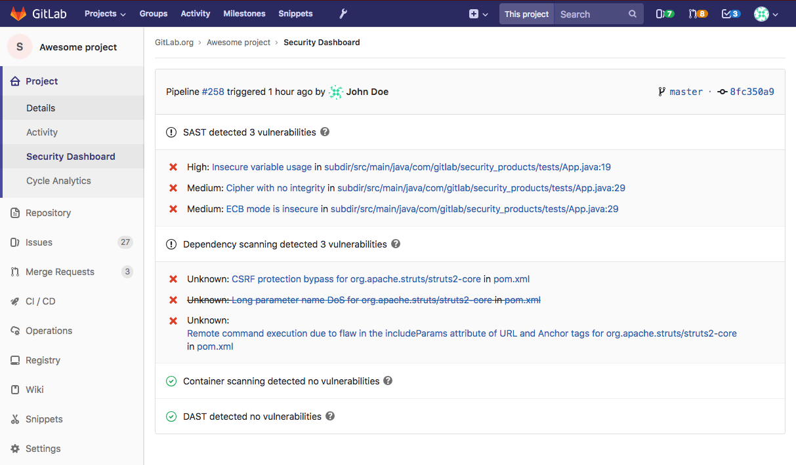

# Project Security Dashboard

> [Introduced](https://gitlab.com/gitlab-org/gitlab-ee/issues/6165) in [GitLab Ultimate](https://about.gitlab.com/pricing) 11.1.

The Security Dashboard displays the latest security reports for your project.
Use it to find and fix vulnerabilities affecting the [default branch](./repository/branches/index.md#default-branch).

## How it works?

To benefit from the Security Dashboard you must first configure the [Security Reports](merge_requests/index.md#security-reports).

The Security Dashboard will then list security vulnerabilities from the latest pipeline run on the default branch (e.g., `master`).

You will also be able to interact with the reports [the same way you can on a merge request](merge_requests/index.md#interacting-with-security-reports).

## Keeping the Security Dashboard updated

The Security Dashboard displays information from the results of the most recent security scan on the default branch. Security scans are performed every time the branch is updated.

If the default branch is updated infrequently, scans are run infrequently and the information on the Security Dashboard can become outdated as new vulnerabilities are discovered.

To ensure the information on the Security Dashboard is regularly updated, configure a [scheduled pipeline](pipelines/schedules.md) to run a daily security scan. This will update the information displayed on the Security Dashboard regardless of how often the default branch is updated.

A daily security scan can be configured to only execute jobs that to relate to security. For more information on configuring security-related jobs, see:

- [Static Application Security Testing](merge_requests/sast.md) and [example](../../ci/examples/sast.md).
- [Dynamic Application Security Testing](merge_requests/dast.md) and [example](../../ci/examples/dast.md).
- [Dependency Scanning](merge_requests/dependency_scanning.md) and [example](../../ci/examples/dependency_scanning.md).
- [Container Scanning](merge_requests/container_scanning.md) and [example](../../ci/examples/container_scanning.md).

### Security scans using Auto DevOps

When using [Auto DevOps](../../topics/autodevops/index.md), use [special environment variables](../../topics/autodevops/index.md#environment-variables) to configure daily security scans.
