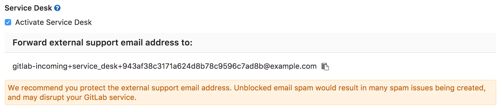
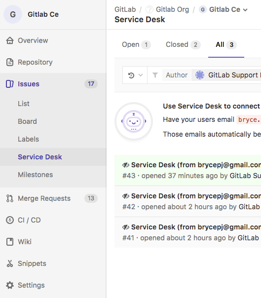
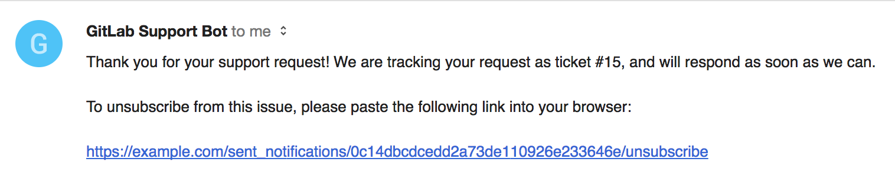
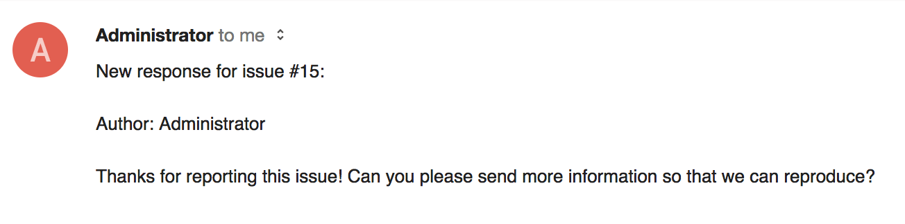
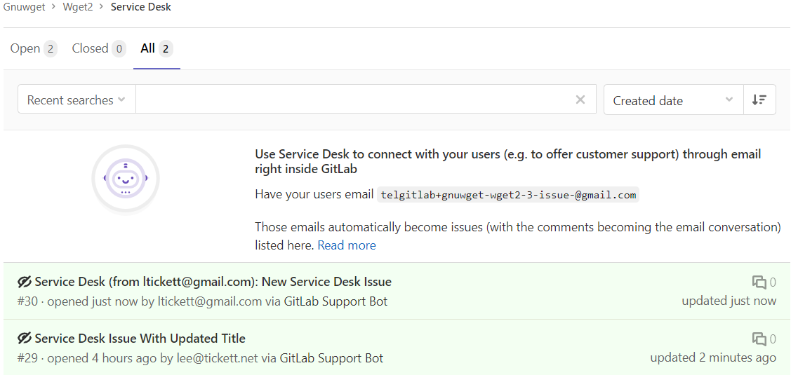
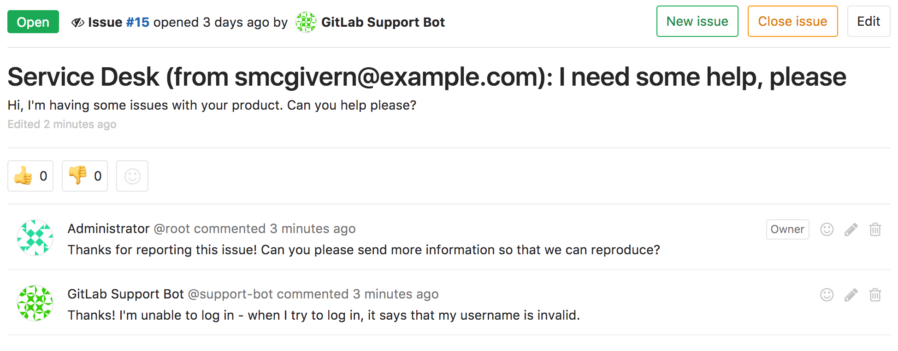

# Service Desk **(PREMIUM)**

> [Introduced](https://gitlab.com/gitlab-org/gitlab/issues/149) in [GitLab Premium 9.1](https://about.gitlab.com/blog/2017/04/22/gitlab-9-1-released/#service-desk-eep).

## Overview

Service Desk is a module that allows your team to connect directly
with any external party through email right inside of GitLab; no external tools required.
An ongoing conversation right where your software is built ensures that user feedback ends
up directly where it's needed, helping you build the right features to solve your users'
real problems.

With Service Desk, you can provide efficient email support to your customers, who can now
email you bug reports, feature requests, or general feedback that will all end up in your
GitLab project as new issues. In turn, your team can respond straight from the project.

As Service Desk is built right into GitLab itself, the complexity and inefficiencies
of multiple tools and external integrations are eliminated, significantly shortening
the cycle time from feedback to software update.

For an overview, check the video demonstration on [GitLab Service Desk](https://about.gitlab.com/blog/2017/05/09/demo-service-desk/).

## Use cases

For instance, let's assume you develop a game for iOS or Android.
The codebase is hosted in your GitLab instance, built and deployed
with GitLab CI.

Here's how Service Desk will work for you:

1. You'll provide a project-specific email address to your paying customers, who can email you directly from within the app
1. Each email they send creates an issue in the appropriate project
1. Your team members navigate to the Service Desk issue tracker, where they can see new support requests and respond inside associated issues
1. Your team communicates back and forth with the customer to understand the request
1. Your team starts working on implementing code to solve your customer's problem
1. When your team finishes the implementation, whereupon the merge request is merged and the issue is closed automatically
1. The customer will have been attended successfully via email, without having real access to your GitLab instance
1. Your team saved time by not having to leave GitLab (or setup any integrations) to follow up with your customer

## How it works

GitLab Service Desk is a simple way to allow people to create issues in your
GitLab instance without needing their own user account.

It provides a unique email address for end users to create issues in a project,
and replies can be sent either through the GitLab interface or by email. End
users will only see the thread through email.

## Configuring Service Desk

NOTE: **Note:**
Service Desk is enabled on GitLab.com. If you're a [Silver subscriber](https://about.gitlab.com/pricing/#gitlab-com),
you can skip step 1 below; you only need to enable it per project.

If you have the correct access and a Premium license, you have the option to set up Service Desk.
Follow these steps to do so:

1. [Set up incoming email](../../administration/incoming_email.md#set-it-up) for the GitLab instance.
   This must support [email sub-addressing](../../administration/incoming_email.md#email-sub-addressing).
1. Navigate to your project's **Settings > General** and locate the **Service Desk** section.
1. Enable the **Activate Service Desk** toggle. This reveals a unique email address to email issues
   to the project. These issues will be [confidential](issues/confidential_issues.md), so they will
   only be visible to project members. Note that in GitLab 11.7, we updated the generated email
   address's format. The older format is still supported, however, allowing existing aliases or
   contacts to continue working.

   DANGER: **Danger:**
   This email address can be used by anyone to create an issue on this project, whether or not they
   have access to your GitLab instance. We recommend **putting this behind an alias** so it can be
   changed if needed, and **[enabling Akismet](../../integration/akismet.md)** on your GitLab
   instance to add spam checking to this service. Unblocked email spam would result in many spam
   issues being created, and may disrupt your GitLab service.

   If you have [templates](description_templates.md) in your repository, you can optionally select
   one from the selector menu to append it to all Service Desk issues.

   

Service Desk is now enabled for this project! You should be able to access it from your project
navigation's **Issues** menu.

### Using customized email templates

 > [Introduced](https://gitlab.com/gitlab-org/gitlab/issues/2460) in [GitLab Premium](https://about.gitlab.com/pricing/) 12.7.

When a user submits a new issue using Service Desk, or when a new note is created on a Service Desk issue, an email is sent to the author.

The body of these email messages can customized by using templates. To create a new customized template,
create a new Markdown (`.md`) file inside the `.gitlab/service_desk_templates/`
directory in your repository. Commit and push to your default branch.

#### Thank you email

The **Thank you email** is the email sent to a user after they submit an issue.
The file name of the template has to be `thank_you.md`.
You can use `%{ISSUE_ID}` placeholder which will be replaced by an issue iid in the email and
`%{ISSUE_PATH}` placeholder which will be replaced by project path and the issue iid.
As the service desk issues are created as confidential (only project members can see them)
the response email doesn't provide the issue link.

#### New note email

The **New note email** is the email sent to a user when the issue they submitted has a new comment.
The file name of the template has to be `new_note.md`.
You can use `%{ISSUE_ID}` placeholder which will be replaced by an issue iid
in the email, `%{ISSUE_PATH}` placeholder which will be replaced by
 project path and the issue iid and `%{NOTE_TEXT}` placeholder which will be replaced by the note text.

## Using Service Desk

### As an end user (issue creator)

To create a Service Desk issue, an end user doesn't need to know anything about
the GitLab instance. They just send an email to the address they are given, and
receive an email back confirming receipt:

This also gives the end user an option to unsubscribe.

If they don't choose to unsubscribe, then any new comments added to the issue
will be sent as emails:

And any responses they send will be displayed in the issue itself.

### As a responder to the issue

For responders to the issue, everything works as usual. They'll see a familiar looking
issue tracker, where they can see issues created via customer support requests and
filter and interact with them just like other GitLab issues.

Messages from the end user will show as coming from the special Support Bot user, but apart from that,
you can read and write comments as you normally do:

Note that:

- The project's visibility (private, internal, public) does not affect Service Desk.
- The path to the project, including its group or namespace, will be shown on emails.

### Support Bot user

Behind the scenes, Service Desk works by the special Support Bot user creating issues. This user
does not count toward the license limit count.
