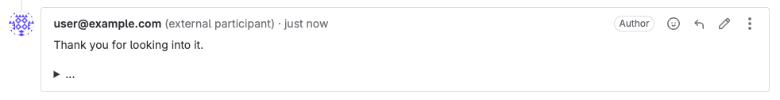
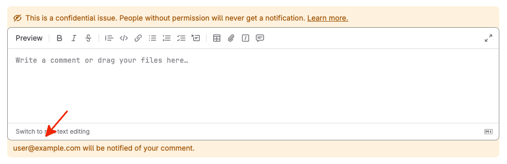

DETAILS:
**Tier:** Free, Premium, Ultimate
**Offering:** GitLab.com, GitLab Self-Managed

> - [Introduced](https://gitlab.com/groups/gitlab-org/-/epics/3758) in GitLab 17.0.

External participants are users without a GitLab account that can interact with an issue or Service Desk ticket only by email.
They get notified of public comments on an issue or ticket by [Service Desk emails](configure.md#customize-emails-sent-to-external-participants).

The maximum number of external participants on an issue or ticket is 10.

<i class="fa fa-youtube-play youtube" aria-hidden="true"></i>
For an overview, see [Multiple external participants in GitLab Service Desk](https://www.youtube.com/watch?v=eKNe7fYQCLc).
<!-- Video published on 2024-05-13 -->

## Service Desk tickets

GitLab adds the external author of a Service Desk ticket as an external participant.
That usually is the email address from the `From` header of the initial email that created the ticket.

### Add external participants from the `Cc` header

By default GitLab only adds the sender of the email that creates the Service Desk ticket as an external participant.

You can configure GitLab to also add all email addresses from the `Cc` header to the Service Desk ticket.
This works for the initial email and all replies to the [`thank_you` email](configure.md#customize-emails-sent-to-external-participants).

External participants added from the `Cc` header receive the `new_participant` email instead of the `thank_you` email to let them know they were added to the ticket.

Prerequisites:

- You must have at least the Maintainer role for the project.

To enable the setting for the project:

1. On the left sidebar, select **Search or go to** and find your project.
1. Select **Settings > General**.
1. Expand **Service Desk**.
1. Select **Add external participants from the `Cc` header**.
1. Select **Save changes**.

## As an external participant

An external participant receives a notification for each public comment on the issue or ticket
using [Service Desk emails](configure.md#customize-emails-sent-to-external-participants).

### Replying to notification emails

An external participant can [reply to the received notification email](../../../administration/reply_by_email.md#you-reply-to-the-notification-email).
It creates a new comment on the issue or ticket and displays the email address of the external participant
instead of a GitLab username. The email address is followed by `(external participant)`.

### Unsubscribing from notification emails

External participants can use the unsubscribe link in the default Service Desk email template to
unsubscribe from the issue or ticket.

If you [customize your `thank_you`, `new_participant`, and `new_note` email templates](configure.md#customize-emails-sent-to-external-participants),
you can use the `%{UNSUBSCRIBE_URL}` placeholder to add the unsubscribe link to the templates.

Your GitLab instance must be reachable (for example, from the public internet) for the external participant to successfully unsubscribe.
If that's not the case, consider removing the unsubscribe link from your template.

Emails from GitLab also contain special headers that allow supported email clients and other software
to [unsubscribe external participants automatically](../../profile/notifications.md#using-an-email-client-or-other-software).

## As a GitLab user

To see the email address of an external participant you must have at least the Reporter role for the project.

The external participant's email address is obfuscated if both these conditions are true:

- You are not a member of the project or have the Guest role.
- The issue or ticket is public ([non-confidential](../issues/confidential_issues.md)).

The external participant's email address is then obfuscated in:

- The author field of a Service Desk ticket.
- All [system notes](../system_notes.md) that mention an external participant.
- The [REST](../../../api/notes.md) and [GraphQL](../../../api/graphql/_index.md) APIs.
- The warning message below the comment editor.

For example:

### Notifications sent to external participants

External participants get notifications for all public comments on an issue.
For private communication, use [internal notes](../../discussions/_index.md#add-an-internal-note).

External participants don't receive notifications for any other issue or ticket event.

### View all external participants

Get an overview of all external participants that receive a Service Desk email for a new comment.

Prerequisites:

- You must have at least the Reporter role for the project.

To see a list of all external participants:

1. Go to the issue or ticket.
1. Scroll down to the comment editor.
1. If the issue or ticket has external participants, you can see a warning under the comment editor
   that lists all external participants.

### Add an external participant

> - [Introduced](https://gitlab.com/gitlab-org/gitlab/-/issues/350460) in GitLab 13.8 [with a flag](../../feature_flags.md) named `issue_email_participants`. Enabled by default.

FLAG:
The availability of this feature is controlled by a feature flag. For more information, see the history.

Add an external participant using the `/add_email` [quick action](../quick_actions.md) when you want
to include them in the conversation at any time.

When added, the external participant starts receiving notifications using Service Desk emails.

New external participants receive the `new_participant` email to let them know they were added to the ticket.
GitLab doesn't send a `thank_you` email for manually added external participants.

You should add external participants in a dedicated comment because they don't receive a notification
email for the comment that contains the `/add_email` quick action.

Prerequisites:

- You must have at least the Reporter role for the project.

To add an external participant to an issue or ticket:

1. Go to the issue or ticket.
1. Add a comment that contains only the quick action `/add_email user@example.com`.
   You can chain up to 6 email addresses. For example `/add_email user@example.com user2@example.com`

You should see a success message and a new system note with the email address.

### Remove an external participant

> - [Introduced](https://gitlab.com/gitlab-org/gitlab/-/issues/350460) in GitLab 13.8 [with a flag](../../feature_flags.md) named `issue_email_participants`. Enabled by default.

FLAG:
The availability of this feature is controlled by a feature flag. For more information, see the history.

Remove an external participant from an issue or Service Desk ticket using the `/remove_email`
[quick action](../quick_actions.md) when they should stop receiving notifications.

After removing them from the issue or ticket they don't receive new notifications.
But they can still reply to emails they received before and create a new comment on the issue or ticket.

Prerequisites:

- You must have at least the Reporter role for the project.
- There must be at least one external participant on the issue or ticket.

To remove an existing external participant from an issue or ticket:

1. Go to the issue or ticket.
1. Add a comment that contains only the quick action `/remove_email user@example.com`.
   You can chain up to 6 email addresses. For example `/remove_email user@example.com user2@example.com`

You should see a success message and a new system note with the email address.
