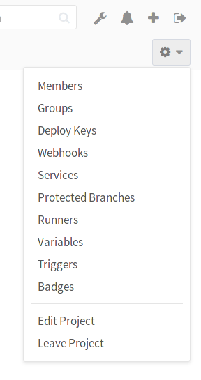

# Project import/export

>**Notes:**
>
>  - [Introduced][ce-3050] in GitLab 8.9.
>  - Importing will not be possible if the import instance version differs from
>    that of the exporter.
>  - For existing installations, the project import option has to be enabled in
>    application settings (`/admin/application_settings`) under 'Import sources'.
>    Ask your administrator if you don't see the **GitLab export** button when
>    creating a new project.
>  - Starting with GitLab 10.0, administrators can disable the project export option
>    on the GitLab instance in application settings (`/admin/application_settings`)
>    under 'Visibility and Access Controls'.
>  - You can find some useful raketasks if you are an administrator in the
>    [import_export](../../../administration/raketasks/project_import_export.md)
>    raketask.
>  - The exports are stored in a temporary [shared directory][tmp] and are deleted
>    every 24 hours by a specific worker.
>  - Group members will get exported as project members, as long as the user has
>    master or admin access to the group where the exported project lives. An admin
>    in the import side is required to map the users, based on email or username.
>    Otherwise, a supplementary comment is left to mention the original author and
>    the MRs, notes or issues will be owned by the importer.
>  - Control project Import/Export with the [API](../../../api/project_import_export.md).

Existing projects running on any GitLab instance or GitLab.com can be exported
with all their related data and be moved into a new GitLab instance.

## Version history

| GitLab version   | Import/Export version |
| ---------------- | --------------------- |
| 10.4 to current  | 0.2.2                 |
| 10.3             | 0.2.1                 |
| 10.0             | 0.2.0                 |
| 9.4.0            | 0.1.8                 |
| 9.2.0            | 0.1.7                 |
| 8.17.0           | 0.1.6                 |
| 8.13.0           | 0.1.5                 |
| 8.12.0           | 0.1.4                 |
| 8.10.3           | 0.1.3                 |
| 8.10.0           | 0.1.2                 |
| 8.9.5            | 0.1.1                 |
| 8.9.0            | 0.1.0                 |

 > The table reflects what GitLab version we updated the Import/Export version at.
 > For instance, 8.10.3 and 8.11 will have the same Import/Export version (0.1.3)
 > and the exports between them will be compatible.

## Exported contents

The following items will be exported:

- Project and wiki repositories
- Project uploads
- Project configuration including web hooks and services
- Issues with comments, merge requests with diffs and comments, labels, milestones, snippets,
  and other project entities

The following items will NOT be exported:

- Build traces and artifacts
- LFS objects
- Container registry images
- CI variables
- Any encrypted tokens

## Exporting a project and its data

1. Go to the project settings page by clicking on **Edit Project**:

    

1. Scroll down to find the **Export project** button:

    

1. Once the export is generated, you should receive an e-mail with a link to
   download the file:

    

1. Alternatively, you can come back to the project settings and download the
   file from there, or generate a new export. Once the file available, the page
   should show the **Download export** button:

    

## Importing the project

1. The new GitLab project import feature is at the far right of the import
   options when creating a New Project. Make sure you are in the right namespace
   and you have entered a project name. Click on **GitLab export**:

    

1. You can see where the project will be imported to. You can now select file
   exported previously:

    

1. Click on **Import project** to begin importing. Your newly imported project
   page will appear soon.

[ce-3050]: https://gitlab.com/gitlab-org/gitlab-ce/issues/3050
[tmp]: ../../../development/shared_files.md
