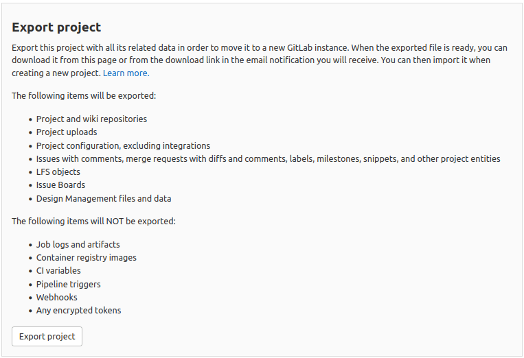
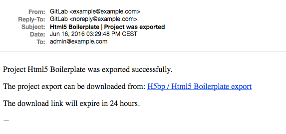
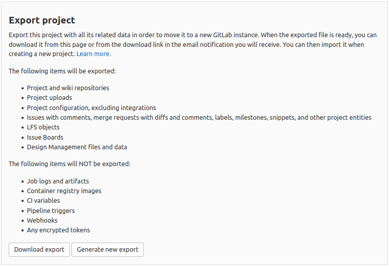
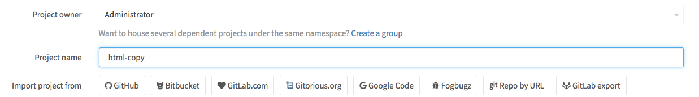
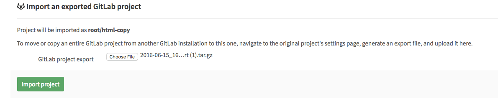

# Project import/export **(FREE)**

> - [Introduced](https://gitlab.com/gitlab-org/gitlab-foss/-/issues/3050) in GitLab 8.9.
> - From GitLab 10.0, administrators can disable the project export option on the GitLab instance.

Existing projects running on any GitLab instance or GitLab.com can be exported with all their related
data and be moved into a new GitLab instance.

The **GitLab import/export** button is displayed if the project import option is enabled.

See also:

- [Project import/export API](../../../api/project_import_export.md)
- [Project import/export administration Rake tasks](../../../administration/raketasks/project_import_export.md) **(FREE SELF)**
- [Group import/export](../../group/settings/import_export.md)
- [Group import/export API](../../../api/group_import_export.md)

To set up a project import/export:

  1. On the top bar, go to **Menu > Admin > Settings > General > Visibility and access controls**.
  1. Scroll to **Import sources**.
  1. Enable the desired **Import sources**.

## Important notes

Note the following:

- Before you can import a project, you need to export the data first.
  See [Exporting a project and its data](#exporting-a-project-and-its-data)
  for how you can export a project through the UI.
- Imports from a newer version of GitLab are not supported.
  The Importing GitLab version must be greater than or equal to the Exporting GitLab version.
- Imports fail unless the import and export GitLab instances are
  compatible as described in the [Version history](#version-history).
- Exports are generated in your configured `shared_path`, a temporary shared directory,
  and are moved to your configured `uploads_directory`. Every 24 hours, a specific worker deletes these export files.
- Group members are exported as project members, as long as the user has
  maintainer or administrator access to the group where the exported project lives.
- Project members with the [Owner role](../../permissions.md) are imported as Maintainers.
- Imported users can be mapped by their primary email on self-managed instances, if an administrative user (not an owner) does the import.
  Otherwise, a supplementary comment is left to mention that the original author and
  the MRs, notes, or issues are owned by the importer.
  - For project migration imports performed over GitLab.com Groups, preserving author information is
    possible through a [professional services engagement](https://about.gitlab.com/services/migration/).
- If an imported project contains merge requests originating from forks,
  then new branches associated with such merge requests are created
  within a project during the import/export. Thus, the number of branches
  in the exported project could be bigger than in the original project.
- Deploy keys allowed to push to protected branches are not exported. Therefore,
  you need to recreate this association by first enabling these deploy keys in your
  imported project and then updating your protected branches accordingly.

## Version history

### 14.0+

In GitLab 14.0, the JSON format is no longer supported for project and group exports. To allow for a
transitional period, you can still import any JSON exports. The new format for imports and exports
is NDJSON.

### 13.0+

Starting with GitLab 13.0, GitLab can import bundles that were exported from a different GitLab deployment.
This ability is limited to two previous GitLab [minor](../../../policy/maintenance.md#versioning)
releases, which is similar to our process for [Security Releases](../../../policy/maintenance.md#security-releases).

For example:

| Current version | Can import bundles exported from |
|-----------------|----------------------------------|
| 13.0            | 13.0, 12.10, 12.9                |
| 13.1            | 13.1, 13.0, 12.10                |

### 12.x

Prior to 13.0 this was a defined compatibility table:

| Exporting GitLab version   | Importing GitLab version   |
| -------------------------- | -------------------------- |
| 11.7 to 12.10              | 11.7 to 12.10              |
| 11.1 to 11.6               | 11.1 to 11.6               |
| 10.8 to 11.0               | 10.8 to 11.0               |
| 10.4 to 10.7               | 10.4 to 10.7               |
| 10.3                       | 10.3                       |
| 10.0 to 10.2               | 10.0 to 10.2               |
| 9.4 to 9.6                 | 9.4 to 9.6                 |
| 9.2 to 9.3                 | 9.2 to 9.3                 |
| 8.17 to 9.1                | 8.17 to 9.1                |
| 8.13 to 8.16               | 8.13 to 8.16               |
| 8.12                       | 8.12                       |
| 8.10.3 to 8.11             | 8.10.3 to 8.11             |
| 8.10.0 to 8.10.2           | 8.10.0 to 8.10.2           |
| 8.9.5 to 8.9.11            | 8.9.5 to 8.9.11            |
| 8.9.0 to 8.9.4             | 8.9.0 to 8.9.4             |

Projects can be exported and imported only between versions of GitLab with matching Import/Export versions.

For example, 8.10.3 and 8.11 have the same Import/Export version (0.1.3)
and the exports between them are compatible.

## Between CE and EE

You can export projects from the [Community Edition to the Enterprise Edition](https://about.gitlab.com/install/ce-or-ee/) and vice versa.
This assumes [version history](#version-history) requirements are met.

If you're exporting a project from the Enterprise Edition to the Community Edition, you may lose data that is retained only in the Enterprise Edition. For more information, see [downgrading from EE to CE](../../../index.md).

## Exported contents

The following items are exported:

- Project and wiki repositories
- Project uploads
- Project configuration, excluding integrations
- Issues with comments, merge requests with diffs and comments, labels, milestones, snippets, time tracking,
  and other project entities
- Design Management files and data
- LFS objects
- Issue boards
- Pipelines history
- Push Rules
- Awards

The following items are **not** exported:

- Build traces and artifacts
- Container registry images
- CI/CD variables
- Webhooks
- Any encrypted tokens
- Merge Request Approvers

NOTE:
For more details on the specific data persisted in a project export, see the
[`import_export.yml`](https://gitlab.com/gitlab-org/gitlab/-/blob/master/lib/gitlab/import_export/project/import_export.yml) file.

## Exporting a project and its data

Full project export functionality is limited to project maintainers and owners.
You can configure such functionality through [project settings](index.md):

To export a project and its data, follow these steps:

1. Go to your project's homepage.

1. Click **Settings** in the sidebar.

1. Scroll down to find the **Export project** button:

   

1. Once the export is generated, you should receive an email with a link to
   download the file:

   

1. Alternatively, you can come back to the project settings and download the
   file from there, or generate a new export. Once the file is available, the page
   should show the **Download export** button:

   

## Importing the project

1. The GitLab project import feature is the first import option when creating a
   new project. Click on **GitLab export**:

   

1. Enter your project name and URL. Then select the file you exported previously:

   

1. Click on **Import project** to begin importing. Your newly imported project
   page appears shortly.

NOTE:
If use of the `Internal` visibility level
[is restricted](../../../public_access/public_access.md#restricting-the-use-of-public-or-internal-projects),
all imported projects are given the visibility of `Private`.

NOTE:
The maximum import file size can be set by the Administrator, default is `0` (unlimited).
As an administrator, you can modify the maximum import file size. To do so, use the `max_import_size` option in the [Application settings API](../../../api/settings.md#change-application-settings) or the [Admin Area UI](../../admin_area/settings/account_and_limit_settings.md). Default [modified](https://gitlab.com/gitlab-org/gitlab/-/issues/251106) from 50MB to 0 in GitLab 13.8.

### Project import status

You can query an import through the [Project import/export API](../../../api/project_import_export.md#import-status).
As described in the API documentation, the query may return an import error or exceptions.

### Import large projects **(FREE SELF)**

If you have a larger project, consider using a Rake task, as described in our [developer documentation](../../../development/import_project.md#importing-via-a-rake-task).

## Rate Limits

To help avoid abuse, by default, users are rate limited to:

| Request Type     | Limit                                    |
| ---------------- | ---------------------------------------- |
| Export           | 6 projects per minute                |
| Download export  | 1 download per group per minute  |
| Import           | 6 projects per minute                |

Please note that GitLab.com may have [different settings](../../gitlab_com/index.md#importexport) from the defaults.
