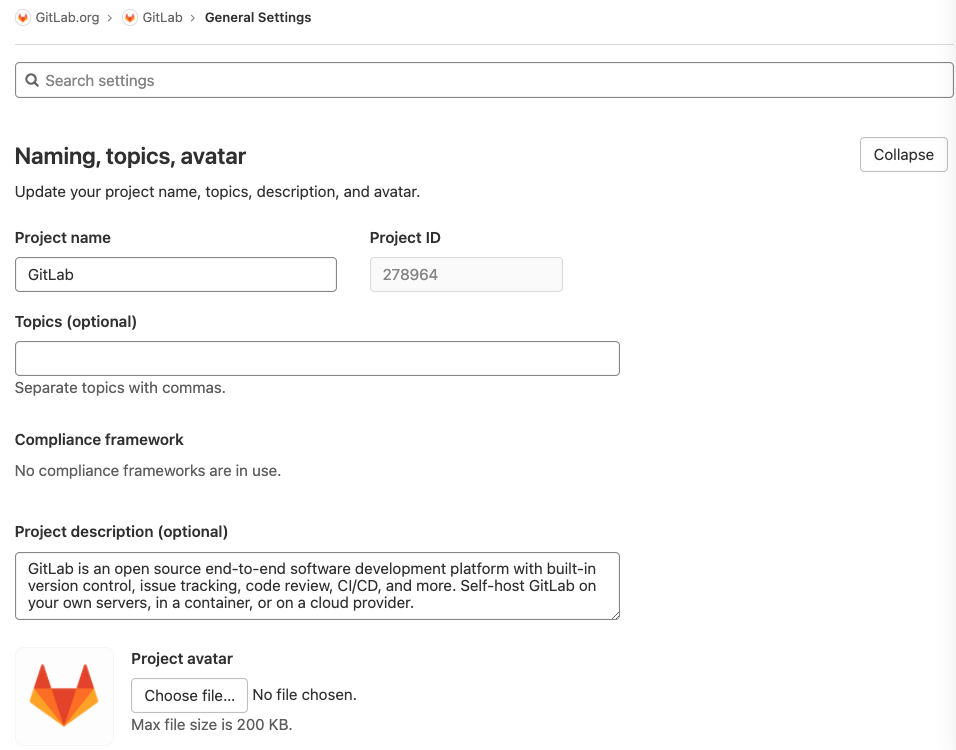

# Project settings **(FREE)**

NOTE:
Only project maintainers and administrators have the [permissions](../../permissions.md#project-members-permissions)
to access project settings.

The **Settings** page in GitLab provides a centralized home for your
[project](../index.md) configuration options. To access it, go to your project's homepage
and, in the left navigation menu, clicking **Settings**. To reduce complexity, settings are
grouped by topic into sections. To display all settings in a section, click **Expand**.

In GitLab versions [13.10 and later](https://gitlab.com/groups/gitlab-org/-/epics/4842),
GitLab displays a search box to help you find the settings you want to view.

## General settings

Under a project's general settings, you can find everything concerning the
functionality of a project.

### General project settings

Adjust your project's name, description, avatar, [default branch](../repository/branches/default.md), and topics:



The project description also partially supports [standard Markdown](../../markdown.md#features-extended-from-standard-markdown). You can use [emphasis](../../markdown.md#emphasis), [links](../../markdown.md#links), and [line-breaks](../../markdown.md#line-breaks) to add more context to the project description.

#### Compliance frameworks **(PREMIUM)**

> - [Introduced](https://gitlab.com/gitlab-org/gitlab/-/issues/276221) in GitLab 13.9.
> - [Feature flag removed](https://gitlab.com/gitlab-org/gitlab/-/issues/287779) in GitLab 13.12.

You can create a framework label to identify that your project has certain compliance requirements or needs additional oversight.

Group owners can create, edit and delete compliance frameworks by going to **Settings** > **General** and expanding the **Compliance frameworks** section.
Compliance frameworks created can then be assigned to any number of projects via the project settings page inside the group or subgroups.

NOTE:
Attempting to create compliance frameworks on subgroups via GraphQL will cause the framework to be created on the root ancestor if the user has the correct permissions.
The web UI presents a read-only view to discourage this behavior.

#### Compliance pipeline configuration **(ULTIMATE)**

> - [Introduced](https://gitlab.com/groups/gitlab-org/-/epics/3156) in GitLab 13.9.
> - [Deployed behind a feature flag](../../feature_flags.md).
> - [Enabled by default](https://gitlab.com/gitlab-org/gitlab/-/issues/300324) in GitLab 13.11.
> - Enabled on GitLab.com.
> - Recommended for production use.

WARNING:
This feature might not be available to you. Check the **version history** note above for details.

Group owners can use the compliance pipeline configuration to define compliance requirements
such as scans or tests, and enforce them in individual projects.

The [custom compliance framework](#compliance-frameworks) feature allows group owners to specify the location
of a compliance pipeline configuration stored and managed in a dedicated project, distinct from a developer's project.

When you set up the compliance pipeline configuration field, use the
`file@group/project` format. For example, you can configure
`.compliance-gitlab-ci.yml@compliance-group/compliance-project`.
This field is inherited by projects where the compliance framework label is applied. The result
forces the project to run the compliance configurations.

When a project with a custom label executes a pipeline, it begins by evaluating the compliance pipeline configuration.
The custom pipeline configuration can then execute any included individual project configuration.

The user running the pipeline in the project should at least have Reporter access to the compliance project.

Example `.compliance-gitlab-ci.yml`

```yaml
# Allows compliance team to control the ordering and interweaving of stages/jobs.
# Stages without jobs defined will remain hidden.
stages:
- pre-compliance
- build
- test
- pre-deploy-compliance
- deploy
- post-compliance

variables: # can be overriden by a developer's local .gitlab-ci.yml
  FOO: sast

sast: # none of these attributes can be overriden by a developer's local .gitlab-ci.yml
  variables:
    FOO: sast
  image: ruby:2.6
  stage: pre-compliance
  rules:
        - when: always
  allow_failure: false
  before_script:
  - "# No before scripts."
  script:
  - echo "running $FOO"
  after_script:
  - "# No after scripts."

sanity check:
  image: ruby:2.6
  stage: pre-deploy-compliance
  rules:
        - when: always
  allow_failure: false
  before_script:
  - "# No before scripts."
  script:
  - echo "running $FOO"
  after_script:
  - "# No after scripts."


audit trail:
  image: ruby:2.6
  stage: post-compliance
  rules:
        - when: always
  allow_failure: false
  before_script:
  - "# No before scripts."
  script:
  - echo "running $FOO"
  after_script:
  - "# No after scripts."

include: # Execute individual project's configuration
  project: '$CI_PROJECT_PATH'
  file: '$CI_CONFIG_PATH'
```

##### Ensure compliance jobs are always run

Compliance pipelines use GitLab CI/CD to give you an incredible amount of flexibility
for defining any sort of compliance jobs you like. Depending on your goals, these jobs
can be configured to be:

- Modified by users.
- Non-modifiable.

At a high-level, if a value in a compliance job:

- Is set, it cannot be changed or overridden by project-level configurations.
- Is not set, a project-level configuration may set.

Either might be wanted or not depending on your use case.

There are a few best practices for ensuring that these jobs are always run exactly
as you define them and that downstream, project-level pipeline configurations
cannot change them:

- Add a `rules:when:always` block to each of your compliance jobs. This ensures they are
  non-modifiable and are always run.
- Explicitly set any variables the job references. This:
  - Ensures that project-level pipeline configurations do not set them and alter their
    behavior.
  - Includes any jobs that drive the logic of your job.
- Explicitly set the container image file to run the job in. This ensures that your script
  steps execute in the correct environment.
- Explicitly set any relevant GitLab pre-defined [job keywords](../../../ci/yaml/index.md#job-keywords).
  This ensures that your job uses the settings you intend and that they are not overriden by
  project-level pipelines.

### Sharing and permissions

For your repository, you can set up features such as public access, repository features,
documentation, access permissions, and more. To do so from your project,
go to **Settings** > **General**, and expand the **Visibility, project features, permissions**
section.

You can now change the [Project visibility](../../../public_access/public_access.md).
If you set **Project Visibility** to public, you can limit access to some features
to **Only Project Members**. In addition, you can select the option to
[Allow users to request access](../members/index.md#prevent-users-from-requesting-access-to-a-project).

Use the switches to enable or disable the following features:

| Option                            | More access limit options | Description                                                                                                                                                                                    |
|:----------------------------------|:--------------------------|:-----------------------------------------------------------------------------------------------------------------------------------------------------------------------------------------------|
| **Issues**                        | ✓                         | Activates the GitLab issues tracker                                                                                                                                                            |
| **Repository**                    | ✓                         | Enables [repository](../repository/) functionality                                                                                                                                             |
| **Merge Requests**                | ✓                         | Enables [merge request](../merge_requests/) functionality; also see [Merge request settings](#merge-request-settings)                                                                          |
| **Forks**                         | ✓                         | Enables [forking](../repository/forking_workflow.md) functionality                                                                                                                             |
| **Pipelines**                     | ✓                         | Enables [CI/CD](../../../ci/index.md) functionality                                                                                                                                           |
| **Container Registry**            |                           | Activates a [registry](../../packages/container_registry/) for your Docker images                                                                                                              |
| **Git Large File Storage**        |                           | Enables the use of [large files](../../../topics/git/lfs/index.md#git-large-file-storage-lfs)                                                                                    |
| **Packages**                      |                           | Supports configuration of a [package registry](../../../administration/packages/index.md#gitlab-package-registry-administration) functionality                                    |
| **Analytics**                     | ✓                         | Enables [analytics](../../analytics/)                                                                                                                                                          |
| **Wiki**                          | ✓                         | Enables a separate system for [documentation](../wiki/)                                                                                                                                        |
| **Snippets**                      | ✓                         | Enables [sharing of code and text](../../snippets.md)                                                                                                                                          |
| **Pages**                         | ✓                         | Allows you to [publish static websites](../pages/)                                                                                                                                             |
| **Metrics Dashboard**             | ✓                         | Control access to [metrics dashboard](../integrations/prometheus.md)
| **Requirements**                  | ✓                         | Control access to [Requirements Management](../requirements/index.md) |
| **Operations Dashboard**          | ✓                         | Control access to [operations dashboard](../../../operations/index.md)

Some features depend on others:

- If you disable the **Issues** option, GitLab also removes the following
  features:
  - **Issue Boards**
  - [**Service Desk**](#service-desk)

  NOTE:
  When the **Issues** option is disabled, you can still access **Milestones**
  from merge requests.

- Additionally, if you disable both **Issues** and **Merge Requests**, you cannot access:
  - **Labels**
  - **Milestones**

- If you disable **Repository** functionality, GitLab also disables the following
  features for your project:
  - **Merge Requests**
  - **Pipelines**
  - **Container Registry**
  - **Git Large File Storage**
  - **Packages**

- Metrics dashboard access requires reading both project environments and deployments.
  Users with access to the metrics dashboard can also access environments and deployments.

#### Disabling the CVE ID request button

> [Introduced](https://gitlab.com/gitlab-org/gitlab/-/merge_requests/41203) in GitLab 13.4, only for public projects on GitLab.com.

In applicable environments, a [**Create CVE ID Request** button](../../application_security/cve_id_request.md)
is present in the issue sidebar. The button may be disabled on a per-project basis by toggling the
setting **Enable CVE ID requests in the issue sidebar**.


#### Disabling email notifications

Project owners can disable all [email notifications](../../profile/notifications.md#gitlab-notification-emails)
related to the project by selecting the **Disable email notifications** checkbox.

### Merge request settings

Set up your project's merge request settings:

- Set up the merge request method (merge commit, [fast-forward merge](../merge_requests/fast_forward_merge.md)).
- Add merge request [description templates](../description_templates.md#description-templates).
- Enable [merge request approvals](../merge_requests/approvals/index.md).
- Enable [status checks](../merge_requests/status_checks.md).
- Enable [merge only if pipeline succeeds](../merge_requests/merge_when_pipeline_succeeds.md).
- Enable [merge only when all threads are resolved](../../discussions/index.md#prevent-merge-unless-all-threads-are-resolved).
- Enable [require an associated issue from Jira](../../../integration/jira/issues.md#require-associated-jira-issue-for-merge-requests-to-be-merged).
- Enable [`delete source branch after merge` option by default](../merge_requests/getting_started.md#deleting-the-source-branch).
- Configure [suggested changes commit messages](../merge_requests/reviews/suggestions.md#configure-the-commit-message-for-applied-suggestions).
- Configure [the default target project](../merge_requests/creating_merge_requests.md#set-the-default-target-project) for merge requests coming from forks.

### Service Desk

Enable [Service Desk](../service_desk.md) for your project to offer customer support.

### Export project

Learn how to [export a project](import_export.md#importing-the-project) in GitLab.

### Advanced settings

Here you can run housekeeping, archive, rename, transfer,
[remove a fork relationship](#removing-a-fork-relationship), or delete a project.

#### Archiving a project

Archiving a project makes it read-only for all users and indicates that it's
no longer actively maintained. Projects that have been archived can also be
unarchived. Only project owners and administrators have the
[permissions](../../permissions.md#project-members-permissions) to archive a project.

When a project is archived, the repository, packages, issues, merge requests, and all
other features are read-only. Archived projects are also hidden
in project listings.

To archive a project:

1. Navigate to your project's **Settings > General**.
1. Under **Advanced**, click **Expand**.
1. In the **Archive project** section, click the **Archive project** button.
1. Confirm the action when asked to.

#### Unarchiving a project

Unarchiving a project removes the read-only restriction on a project, and makes it
available in project listings. Only project owners and administrators have the
[permissions](../../permissions.md#project-members-permissions) to unarchive a project.

To find an archived project:

1. Sign in to GitLab as a user with project owner or administrator permissions.
1. If you:
   - Have the project's URL, open the project's page in your browser.
   - Don't have the project's URL:
     1. On the top bar, select **Menu > Project**.
     1. Select **Explore projects**.
     1. In the **Sort projects** dropdown box, select **Show archived projects**.
     1. In the **Filter by name** field, provide the project's name.
     1. Click the link to the project to open its **Details** page.

Next, to unarchive the project:

1. Navigate to your project's **Settings > General**.
1. Under **Advanced**, click **Expand**.
1. In the **Unarchive project** section, click the **Unarchive project** button.
1. Confirm the action when asked to.

#### Renaming a repository

NOTE:
Only project maintainers and administrators have the [permissions](../../permissions.md#project-members-permissions) to rename a
repository. Not to be confused with a project's name where it can also be
changed from the [general project settings](#general-project-settings).

A project's repository name defines its URL (the one you use to access the
project via a browser) and its place on the file disk where GitLab is installed.

To rename a repository:

1. Navigate to your project's **Settings > General**.
1. Under **Advanced**, click **Expand**.
1. Under **Change path**, update the repository's path.
1. Click **Change path**.

Remember that this can have unintended side effects since everyone with the
old URL can't push or pull. Read more about what happens with the
[redirects when renaming repositories](../repository/index.md#what-happens-when-a-repository-path-changes).

#### Transferring an existing project into another namespace

NOTE:
Only project owners and administrators have the [permissions](../../permissions.md#project-members-permissions)
to transfer a project.

You can transfer an existing project into a [group](../../group/index.md) if:

- You have at least the Maintainer** role in that group.
- You're at least an **Owner** of the project to be transferred.
- The group to which the project is being transferred to must allow creation of new projects.

To transfer a project:

1. Navigate to your project's **Settings > General**.
1. Under **Advanced**, click **Expand**.
1. Under "Transfer project", choose the namespace you want to transfer the
   project to.
1. Confirm the transfer by typing the project's path as instructed.

Once done, you are redirected to the new project's namespace. At this point,
read what happens with the
[redirects from the old project to the new one](../repository/index.md#what-happens-when-a-repository-path-changes).

NOTE:
GitLab administrators can use the administration interface to move any project to any
namespace if needed.

#### Delete a project

You can mark a project to be deleted.

Prerequisite:

- You must have at least the Owner role for a project.

To delete a project:

1. On the top bar, select **Menu > Projects** and find your project.
1. On the left sidebar, select **Settings > General**.
1. Expand **Advanced**.
1. In the "Delete project" section, select **Delete project**.
1. Confirm the action when asked to.

This action deletes a project including all associated resources (issues, merge requests, and so on).

In [GitLab 13.2](https://gitlab.com/gitlab-org/gitlab/-/issues/220382) and later, on Premium or higher tiers,
group Owners can [configure](../../group/index.md#enable-delayed-project-removal) projects in a group
to be deleted after a delayed period.
When enabled, actual deletion happens after number of days
specified in [instance settings](../../admin_area/settings/visibility_and_access_controls.md#default-deletion-delay).

WARNING:
The default behavior of [delayed project deletion](https://gitlab.com/gitlab-org/gitlab/-/issues/32935) in GitLab 12.6 was changed to
[Immediate deletion](https://gitlab.com/gitlab-org/gitlab/-/issues/220382) in GitLab 13.2.

#### Delete a project immediately **(PREMIUM)**

> [Introduced](https://gitlab.com/gitlab-org/gitlab/-/issues/191367) in GitLab 14.1.

If you don't want to wait, you can delete a project immediately.

Prerequisites:

- You must have at least the Owner role for a project.
- You have [marked the project for deletion](#delete-a-project).

To immediately delete a project marked for deletion:

1. On the top bar, select **Menu > Projects** and find your project.
1. On the left sidebar, select **Settings > General**.
1. Expand **Advanced**.
1. In the "Permanently delete project" section, select **Delete project**.
1. Confirm the action when asked to.

Your project, its repository, and all related resources, including issues and merge requests,
are deleted.

#### Restore a project **(PREMIUM)**

> [Introduced](https://gitlab.com/gitlab-org/gitlab/-/issues/32935) in GitLab 12.6.

To restore a project marked for deletion:

1. Navigate to your project, and select **Settings > General > Advanced**.
1. In the Restore project section, click the **Restore project** button.

#### Removing a fork relationship

Forking is a great way to [contribute to a project](../repository/forking_workflow.md)
of which you're not a member.
If you want to use the fork for yourself and don't need to send
[merge requests](../merge_requests/index.md) to the upstream project,
you can safely remove the fork relationship.

WARNING:
Once removed, the fork relationship cannot be restored. You can't send merge requests to the source, and if anyone has forked your project, their fork also loses the relationship.

To do so:

1. Navigate to your project's **Settings > General > Advanced**.
1. Under **Remove fork relationship**, click the likewise-labeled button.
1. Confirm the action by typing the project's path as instructed.

NOTE:
Only project Owners have the [permissions](../../permissions.md#project-members-permissions)
to remove a fork relationship.

## Monitor settings

### Alerts

Configure [alert integrations](../../../operations/incident_management/integrations.md#configuration) to triage and manage critical problems in your application as [alerts](../../../operations/incident_management/alerts.md).

### Incidents

#### Alert integration

Automatically [create](../../../operations/incident_management/incidents.md#create-incidents-automatically), [notify on](../../../operations/incident_management/paging.md#email-notifications), and [resolve](../../../operations/incident_management/incidents.md#automatically-close-incidents-via-recovery-alerts) incidents based on GitLab alerts.

#### PagerDuty integration

[Create incidents in GitLab for each PagerDuty incident](../../../operations/incident_management/incidents.md#create-incidents-via-the-pagerduty-webhook).

#### Incident settings

[Manage Service Level Agreements for incidents](../../../operations/incident_management/incidents.md#service-level-agreement-countdown-timer) with an SLA countdown timer.

### Error Tracking

Configure Error Tracking to discover and view [Sentry errors within GitLab](../../../operations/error_tracking.md).

### Jaeger tracing **(ULTIMATE)**

Add the URL of a Jaeger server to allow your users to [easily access the Jaeger UI from within GitLab](../../../operations/tracing.md).

### Status Page

[Add Storage credentials](../../../operations/incident_management/status_page.md#sync-incidents-to-the-status-page)
to enable the syncing of public Issues to a [deployed status page](../../../operations/incident_management/status_page.md#create-a-status-page-project).
