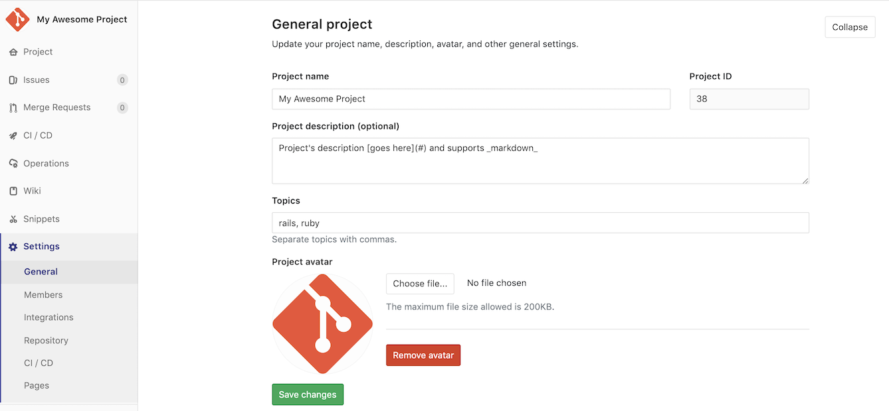
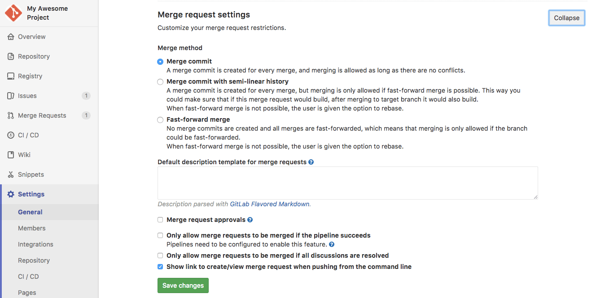

# Project settings

NOTE: **Note:**
Only project Maintainers and Admin users have the [permissions] to access a project
settings.

You can adjust your [project](../index.md) settings by navigating
to your project's homepage and clicking **Settings**.

## General settings

Under a project's general settings, you can find everything concerning the
functionality of a project.

### General project settings

Adjust your project's name, description, avatar, [default branch](../repository/branches/index.md#default-branch), and topics:

The project description also partially supports [standard Markdown](../../markdown.md#standard-markdown-and-extensions-in-gitlab). You can use [emphasis](../../markdown.md#emphasis), [links](../../markdown.md#links), and [line-breaks](../../markdown.md#line-breaks) to add more context to the project description.

### Sharing and permissions

For your repository, you can set up features such as public access, repository features,
documentation, access permissions, and more. To do so from your project,
go to **Settings** > **General**, and expand the **Visibility, project features, permissions**
section.

You can now change the [Project visibility](../../../public_access/public_access.md).
If you set **Project Visibility** to public, you can limit access to some features
to **Only Project Members**. In addition, you can select the option to
[Allow users to request access](../members/index.md#project-membership-and-requesting-access).

CAUTION: **Caution:**
If you [reduce a project's visibility level](../../../public_access/public_access.md#reducing-visibility),
that action unlinks all forks of that project.

Use the switches to enable or disable the following features:

| Option                            | More access limit options | Description                                                                                                                                                                                    |
|:----------------------------------|:--------------------------|:-----------------------------------------------------------------------------------------------------------------------------------------------------------------------------------------------|
| **Issues**                        | ✓                         | Activates the GitLab issues tracker                                                                                                                                                            |
| **Repository**                    | ✓                         | Enables [repository](../repository/) functionality                                                                                                                                             |
| **Merge Requests**                | ✓                         | Enables [merge request](../merge_requests/) functionality; also see [Merge request settings](#merge-request-settings)                                                                          |
| **Pipelines**                     | ✓                         | Enables [CI/CD](../../../ci/README.md) functionality                                                                                                                                           |
| **Container Registry**            |                           | Activates a [registry](../../packages/container_registry/) for your docker images                                                                                                              |
| **Git Large File Storage**        |                           | Enables the use of [large files](../../../administration/lfs/manage_large_binaries_with_git_lfs.md#git-lfs)                                                                                    |
| **Packages**                      |                           | Supports configuration of a [package registry](../../../administration/packages/index.md#gitlab-package-registry-administration-premium-only) functionality                                    |
| **Wiki**                          | ✓                         | Enables a separate system for [documentation](../wiki/)                                                                                                                                        |
| **Snippets**                      | ✓                         | Enables [sharing of code and text](../../snippets.md)                                                                                                                                          |
| **Pages**                         | ✓                         | Allows you to [publish static websites](../pages/)                                                                                                                                             |

Some features depend on others:

- If you disable the **Issues** option, GitLab also removes the following
  features:
  - **Issue Boards**
  - [**Service Desk**](#service-desk-premium) **(PREMIUM)**

  NOTE: **Note:**
  When the **Issues** option is disabled, you can still access **Milestones**
  from merge requests.

- Additionally, if you disable both **Issues** and **Merge Requests**, you will no
  longer have access to:
  - **Labels**
  - **Milestones**

- If you disable **Repository** functionality, GitLab also disables the following
  features for your project:

  - **Merge Requests**
  - **Pipelines**
  - **Container Registry**
  - **Git Large File Storage**
  - **Packages**

#### Disabling email notifications

Project owners can disable all [email notifications](../../profile/notifications.md#gitlab-notification-emails)
related to the project by selecting the **Disable email notifications** checkbox.

### Merge request settings

Set up your project's merge request settings:

- Set up the merge request method (merge commit, [fast-forward merge](../merge_requests/fast_forward_merge.html)).
- Add merge request [description templates](../description_templates.md#description-templates).
- Enable [merge request approvals](../merge_requests/merge_request_approvals.md). **(STARTER)**
- Enable [merge only if pipeline succeeds](../merge_requests/merge_when_pipeline_succeeds.md).
- Enable [merge only when all threads are resolved](../../discussions/index.md#only-allow-merge-requests-to-be-merged-if-all-threads-are-resolved).
- Enable [`delete source branch after merge` option by default](../merge_requests/getting_started.md#deleting-the-source-branch)

### Service Desk **(PREMIUM)**

Enable [Service Desk](../service_desk.md) for your project to offer customer support.

### Export project

Learn how to [export a project](import_export.md#importing-the-project) in GitLab.

### Advanced settings

Here you can run housekeeping, archive, rename, transfer, or remove a project.

#### Archiving a project

NOTE: **Note:**
Only project Owners and Admin users have the [permissions] to archive a project.

Archiving a project makes it read-only for all users and indicates that it is
no longer actively maintained. Projects that have been archived can also be
unarchived.

When a project is archived, the repository, issues, merge requests and all
other features are read-only. Archived projects are also hidden
in project listings.

To archive a project:

1. Navigate to your project's **Settings > General > Advanced settings**.
1. In the Archive project section, click the **Archive project** button.
1. Confirm the action when asked to.

#### Renaming a repository

NOTE: **Note:**
Only project Maintainers and Admin users have the [permissions] to rename a
repository. Not to be confused with a project's name where it can also be
changed from the [general project settings](#general-project-settings).

A project's repository name defines its URL (the one you use to access the
project via a browser) and its place on the file disk where GitLab is installed.

To rename a repository:

1. Navigate to your project's **Settings > General > Advanced settings**.
1. Under "Rename repository", change the "Path" to your liking.
1. Hit **Rename project**.

Remember that this can have unintended side effects since everyone with the
old URL will not be able to push or pull. Read more about what happens with the
[redirects when renaming repositories](../index.md#redirects-when-changing-repository-paths).

#### Transferring an existing project into another namespace

NOTE: **Note:**
Only project Owners and Admin users have the [permissions] to transfer a project.

You can transfer an existing project into a [group](../../group/index.md) if:

1. You have at least **Maintainer** [permissions] to that group.
1. The project is in a subgroup you own.
1. You are at least a **Maintainer** of the project under your personal namespace.
   Similarly, if you are an owner of a group, you can transfer any of its projects
   under your own user.

To transfer a project:

1. Navigate to your project's **Settings > General > Advanced settings**.
1. Under "Transfer project", choose the namespace you want to transfer the
   project to.
1. Confirm the transfer by typing the project's path as instructed.

Once done, you will be taken to the new project's namespace. At this point,
read what happens with the
[redirects from the old project to the new one](../index.md#redirects-when-changing-repository-paths).

NOTE: **Note:**
GitLab administrators can use the admin interface to move any project to any
namespace if needed.

[permissions]: ../../permissions.md#project-members-permissions

## Operations settings

### Error Tracking

Configure Error Tracking to discover and view [Sentry errors within GitLab](../operations/error_tracking.md).

### Jaeger tracing **(ULTIMATE)**

Add the URL of a Jaeger server to allow your users to [easily access the Jaeger UI from within GitLab](../operations/tracing.md).
