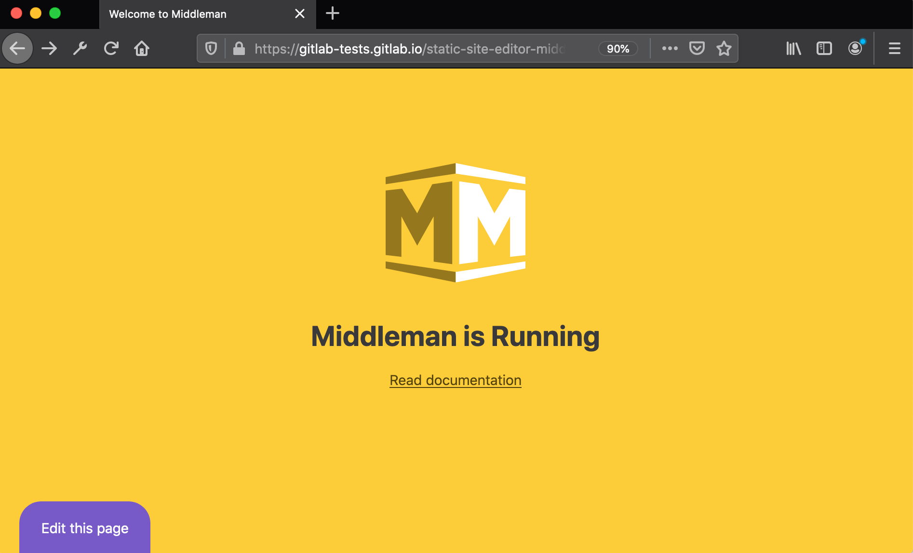
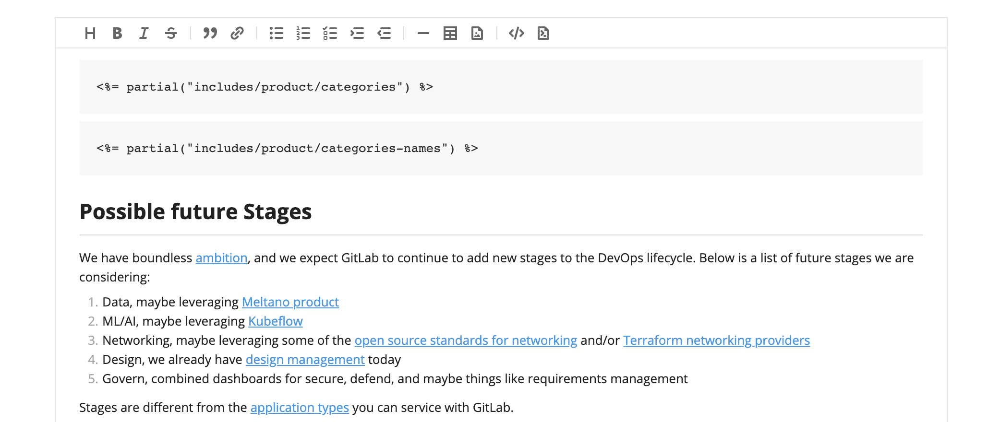
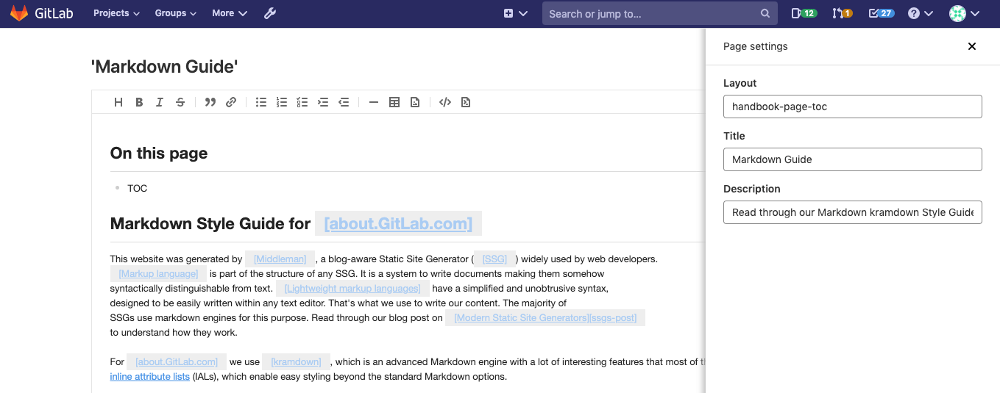

# Static Site Editor **(FREE)**

> - [Introduced](https://gitlab.com/gitlab-org/gitlab/-/merge_requests/28758) in GitLab 12.10.
> - WYSIWYG editor [introduced](https://gitlab.com/gitlab-org/gitlab/-/issues/214559) in GitLab 13.0.
> - Non-Markdown content blocks not editable on the WYSIWYG mode [introduced](https://gitlab.com/gitlab-org/gitlab/-/issues/216836) in GitLab 13.3.
> - Formatting Markdown [introduced](https://gitlab.com/gitlab-org/gitlab/-/merge_requests/49052) in GitLab 13.7.

Static Site Editor (SSE) enables users to edit content on static websites without
prior knowledge of the underlying templating language, site architecture, or
Git commands. A contributor to your project can quickly edit a Markdown page
and submit the changes for review.

## Use cases

The Static Site Editor allows collaborators to submit changes to static site
files seamlessly. For example:

- Non-technical collaborators can edit a page directly from the browser.
  They don't need to know Git and the details of your project to contribute.
- Recently hired team members can quickly edit content.
- Temporary collaborators can jump from project to project and quickly edit pages instead
  of having to clone or fork every single project they need to submit changes to.

## Requirements

- In order use the Static Site Editor feature, your project needs to be
  pre-configured with the [Static Site Editor Middleman template](https://gitlab.com/gitlab-org/project-templates/static-site-editor-middleman).
- You need to be logged into GitLab and be a member of the
  project (with Developer or higher permission levels).

## How it works

The Static Site Editor is in an early stage of development and only supports
Middleman sites for now. You have to use a specific site template to start
using it. The project template is configured to deploy a [Middleman](https://middlemanapp.com/)
static website with [GitLab Pages](../pages/index.md).

Once your website is up and running, an **Edit this page** button displays on
the bottom-left corner of its pages:



When you click it, GitLab opens up an editor window from which the content
can be directly edited. When you're ready, you can submit your changes in a
click of a button:



When an editor submits their changes, these are the following actions that GitLab
performs automatically in the background:

1. Creates a new branch.
1. Commits their changes.
   1. Fixes formatting according to the [Handbook Markdown Style Guide](https://about.gitlab.com/handbook/markdown-guide/)
      style guide and add them through another commit.
1. Opens a merge request against the default branch.

The editor can then navigate to the merge request to assign it to a colleague for review.

## Set up your project

First, set up the project. Once done, you can use the Static Site Editor to
[edit your content](#edit-content).

1. To get started, create a new project from the [Static Site Editor - Middleman](https://gitlab.com/gitlab-org/project-templates/static-site-editor-middleman)
   template. You can either [fork it](../repository/forking_workflow.md#creating-a-fork)
   or [create a new project from a template](../working_with_projects.md#built-in-templates).
1. Edit the [`data/config.yml`](#static-site-generator-configuration) configuration file
   to replace `<username>` and `<project-name>` with the proper values for
   your project's path.
1. (Optional) Edit the [`.gitlab/static-site-editor.yml`](#static-site-editor-configuration-file) file
   to customize the behavior of the Static Site Editor.
1. When you submit your changes, GitLab triggers a CI/CD pipeline to deploy your project with GitLab Pages.
1. When the pipeline finishes, from your project's left-side menu, go to **Settings > Pages** to find the URL of your new website.
1. Visit your website and look at the bottom-left corner of the screen to see the new **Edit this page** button.

Anyone satisfying the [requirements](#requirements) can edit the
content of the pages without prior knowledge of Git or of your site's
codebase.

## Edit content

> - Support for modifying the default merge request title and description [introduced](https://gitlab.com/gitlab-org/gitlab/-/issues/216861) in GitLab 13.5.
> - Support for selecting a merge request template [introduced](https://gitlab.com/gitlab-org/gitlab/-/issues/263252) in GitLab 13.6.

After setting up your project, you can start editing content directly from the Static Site Editor.

To edit a file:

1. Visit the page you want to edit.
1. Click the **Edit this page** button.
1. The file is opened in the Static Site Editor in **WYSIWYG** mode. If you
   wish to edit the raw Markdown instead, you can toggle the **Markdown** mode
   in the bottom-right corner.
1. When you're done, click **Submit changes...**.
1. (Optional) Adjust the default title and description of the merge request, to submit
   with your changes. Alternatively, select a [merge request template](../../../user/project/description_templates.md#create-a-merge-request-template)
   from the dropdown menu and edit it accordingly.
1. Click **Submit changes**.
1. A new merge request is automatically created and you can assign a colleague for review.

### Text

> Support for `*.md.erb` files [introduced](https://gitlab.com/gitlab-org/gitlab/-/issues/223171) in GitLab 13.2.

The Static Site Editors supports Markdown files (`.md`, `.md.erb`) for editing text.

### Images

> - Support for adding images through the WYSIWYG editor [introduced](https://gitlab.com/gitlab-org/gitlab/-/issues/216640) in GitLab 13.1.
> - Support for uploading images via the WYSIWYG editor [introduced](https://gitlab.com/gitlab-org/gitlab/-/issues/218529) in GitLab 13.6.

#### Upload an image

You can upload image files via the WYSIWYG editor directly to the repository to default upload directory
`source/images`. To do so:

1. Click the image icon (**{doc-image}**).
1. Choose the **Upload file** tab.
1. Click **Choose file** to select a file from your computer.
1. Optional: add a description to the image for SEO and accessibility ([ALT text](https://moz.com/learn/seo/alt-text)).
1. Click **Insert image**.

The selected file can be any supported image file (`.png`, `.jpg`, `.jpeg`, `.gif`). The editor renders
thumbnail previews so you can verify the correct image is included and there aren't any references to
missing images.

#### Link to an image

You can also link to an image if you'd like:

1. Click the image icon (**{doc-image}**).
1. Choose the **Link to an image** tab.
1. Add the link to the image into the **Image URL** field (use the full path; relative paths are not supported yet).
1. Optional: add a description to the image for SEO and accessibility ([ALT text](https://moz.com/learn/seo/alt-text)).
1. Click **Insert image**.

The link can reference images already hosted in your project, an asset hosted
externally on a content delivery network, or any other external URL. The editor renders thumbnail previews
so you can verify the correct image is included and there aren't any references to missing images.

### Videos

> - Support for embedding YouTube videos through the WYSIWYG editor [introduced](https://gitlab.com/gitlab-org/gitlab/-/issues/216642) in GitLab 13.5.

You can embed YouTube videos on the WYSIWYG mode by clicking the video icon (**{live-preview}**).
The following URL/ID formats are supported:

- **YouTube watch URLs**: `https://www.youtube.com/watch?v=0t1DgySidms`
- **YouTube embed URLs**: `https://www.youtube.com/embed/0t1DgySidms`
- **YouTube video IDs**: `0t1DgySidms`

### Front matter

> - Markdown front matter hidden on the WYSIWYG editor [introduced](https://gitlab.com/gitlab-org/gitlab/-/issues/216834) in GitLab 13.1.
> - Ability to edit page front matter [introduced](https://gitlab.com/gitlab-org/gitlab/-/issues/235921) in GitLab 13.5.

Front matter is a flexible and convenient way to define page-specific variables in data files
intended to be parsed by a static site generator. Use it to set a page's
title, layout template, or author. You can also pass any kind of metadata to the
generator as the page renders out to HTML. Included at the very top of each data file, the
front matter is often formatted as YAML or JSON, and requires consistent and accurate syntax.

To edit the front matter from the Static Site Editor you can use the GitLab regular file editor,
the Web IDE, or update the data directly from the WYSIWYG editor:

1. Click the **Page settings** button on the bottom-right to reveal a web form with the data you
   have on the page's front matter. The form is populated with the current data:

   

1. Update the values as you wish and close the panel.
1. When you're done, click **Submit changes...**.
1. Describe your changes (add a commit message).
1. Click **Submit changes**.
1. Click **View merge request** to view it.

Adding new attributes to the page's front matter from the form is not supported.
To add new attributes:

- Edit the file locally
- Edit the file with the GitLab regular file editor.
- Edit the file with the Web IDE.

After adding an attribute, the form loads the new fields.

## Configuration files

You can customize the behavior of a project which uses the Static Site Editor with
the following configuration files:

- The [`.gitlab/static-site-editor.yml`](#static-site-editor-configuration-file), which customizes the
  behavior of the Static Site Editor.
- [Static Site Generator configuration files](#static-site-generator-configuration),
  such as `data/config.yml`, which configures the Static Site Generator itself.
  It also controls the **Edit this page** button when the site is generated.

### Static Site Editor configuration file

> [Introduced](https://gitlab.com/groups/gitlab-org/-/epics/4267) in GitLab 13.6.

The `.gitlab/static-site-editor.yml` configuration file contains entries you can
use to customize behavior of the Static Site Editor (SSE). If the file does not exist,
default values which support a default Middleman project configuration are used.
The [Static Site Editor - Middleman](https://gitlab.com/gitlab-org/project-templates/static-site-editor-middleman) project template generates a file pre-populated with these defaults.

To customize the behavior of the SSE, edit `.gitlab/static-site-editor.yml`'s entries,
according to your project's needs. Make sure to respect YAML syntax.

After the table, see an [example of the SSE configuration file](#gitlabstatic-site-editoryml-example).

| Entry | GitLab version | Type | Default value | Description |
|---|---|---|---|---|
| `image_upload_path` | [13.6](https://gitlab.com/gitlab-org/gitlab/-/issues/216641) | String | `source/images` | Directory for images uploaded from the WYSIWYG editor. |

#### `.gitlab/static-site-editor.yml` example

```yaml
image_upload_path: 'source/images' # Relative path to the project's root. Don't include leading or trailing slashes.
```

### Static Site Generator configuration

The Static Site Editor uses Middleman's configuration file, `data/config.yml`
to customize the behavior of the project itself. This file also controls the
**Edit this page** button, rendered through the file
[`layout.erb`](https://gitlab.com/gitlab-org/project-templates/static-site-editor-middleman/-/blob/master/source/layouts/layout.erb).

To [configure the project template to your own project](#set-up-your-project),
you must replace the `<username>` and `<project-name>` in the `data/config.yml`
file with the proper values for your project's path.

[Other Static Site Generators](#using-other-static-site-generators) used with
the Static Site Editor may use different configuration files or approaches.

## Using Other Static Site Generators

Although Middleman is the only Static Site Generator officially supported
by the Static Site Editor, you can configure your project's build and deployment
to use a different Static Site Generator. In this case, use the Middleman layout
as an example, and follow a similar approach to properly render an **Edit this page**
button in your Static Site Generator's layout.

## Upgrade from GitLab 12.10 to 13.0

In GitLab 13.0, we [introduced breaking changes](https://gitlab.com/gitlab-org/gitlab/-/issues/213282)
to the URL structure of the Static Site Editor. Follow the instructions in this
[snippet](https://gitlab.com/gitlab-org/project-templates/static-site-editor-middleman/snippets/1976539)
to update your project with the 13.0 changes.

## Limitations

- The Static Site Editor still cannot be quickly added to existing Middleman sites.
  Follow this [epic](https://gitlab.com/groups/gitlab-org/-/epics/2784) for updates.
