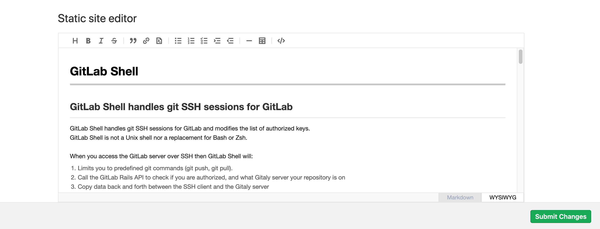

# Static Site Editor

> - [Introduced](https://gitlab.com/gitlab-org/gitlab/-/merge_requests/28758) in GitLab 12.10.
> - WYSIWYG editor [introduced](https://gitlab.com/gitlab-org/gitlab/-/issues/214559) in GitLab 13.0.

DANGER: **Danger:**
In GitLab 13.0, we [introduced breaking changes](https://gitlab.com/gitlab-org/gitlab/-/issues/213282)
to the URL structure of the Static Site Editor. Follow the instructions in this
[snippet](https://gitlab.com/gitlab-org/project-templates/static-site-editor-middleman/snippets/1976539)
to update your project with the latest changes.

Static Site Editor enables users to edit content on static websites without
prior knowledge of the underlying templating language, site architecture, or
Git commands. A contributor to your project can quickly edit a Markdown page
and submit the changes for review.

## Use cases

The Static Site Editors allows collaborators to submit changes to static site
files seamlessly. For example:

- Non-technical collaborators can easily edit a page directly from the browser; they don't need to know Git and the details of your project to be able to contribute.
- Recently hired team members can quickly edit content.
- Temporary collaborators can jump from project to project and quickly edit pages instead of having to clone or fork every single project they need to submit changes to.

## Requirements

- In order use the Static Site Editor feature, your project needs to be
pre-configured with the [Static Site Editor Middleman template](https://gitlab.com/gitlab-org/project-templates/static-site-editor-middleman).
- The editor needs to be logged into GitLab and needs to be a member of the
project (with Developer or higher permission levels).

## How it works

The Static Site Editor is in an early stage of development and only works for
Middleman sites for now. You have to use a specific site template to start
using it. The project template is configured to deploy a [Middleman](https://middlemanapp.com/)
static website with [GitLab Pages](../pages/index.md).

Once your website is up and running, you'll see a button **Edit this page** on
the bottom-left corner of its pages:

When clicking it, GitLab will open up an editor window from which the content
can be directly edited. When you're ready, you can submit your changes in a
click of a button:

When an editor submits their changes, in the background, GitLab automatically
creates a new branch, commits their changes, and opens a merge request. The
editor will land directly on the merge request, and then they can assign it to
a colleague for review.

## Getting started

First, set up the project. Once done, you can use the Static Site Editor to
easily edit your content.

### Set up your project

1. To get started, create a new project from the
[Static Site Editor - Middleman](https://gitlab.com/gitlab-org/project-templates/static-site-editor-middleman)
template. You can either [fork it](../repository/forking_workflow.md#creating-a-fork)
or [create a new project from a template](../../../gitlab-basics/create-project.md#built-in-templates).
1. Edit the `data/config.yml` file adding your project's path.
1. Editing the file will trigger a CI/CD pipeline to deploy your project with GitLab Pages.
1. When the pipeline finishes, from your project's left-side menu, go to **Settings > Pages** to find the URL of your new website.
1. Visit your website and look at the bottom-left corner of the screen to see the new **Edit this page** button.

Anyone satisfying the [requirements](#requirements) will be able to edit the
content of the pages without prior knowledge of Git nor of your site's
codebase.

### Use the Static Site Editor to edit your content

For instance, suppose you are a recently hired technical writer at a large
company and a new feature has been added to the company product.

1. You are assigned the task of updating the documentation.
1. You visit a page and see content that needs to be edited.
1. Click the **Edit this page** button on the production site.
1. The file is opened in the Static Site Editor in **WYSIWYG** mode. If you wish to edit the raw Markdown
   instead, you can toggle the **Markdown** mode in the bottom-right corner.
1. You edit the file right there and click **Submit changes**.
1. A new merge request is automatically created and you assign it to your colleague for review.

## Limitations

- Currently, the Static Site Editor only works for files ending in `.md`. For example, it will not work for a file `index.html.md.erb` while it works for `index.html.md`.
- The Static Site Editor still cannot be quickly added to existing Middleman sites. Follow this [epic](https://gitlab.com/groups/gitlab-org/-/epics/2784) for updates.
