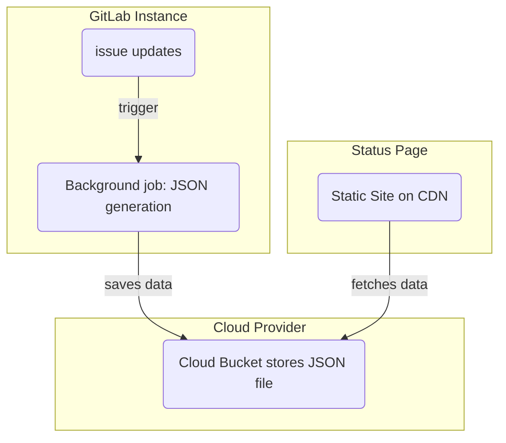
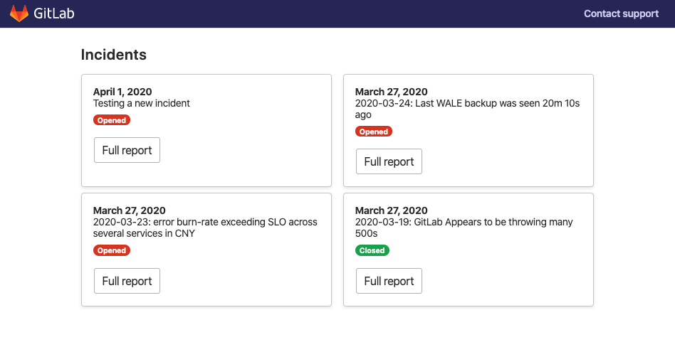
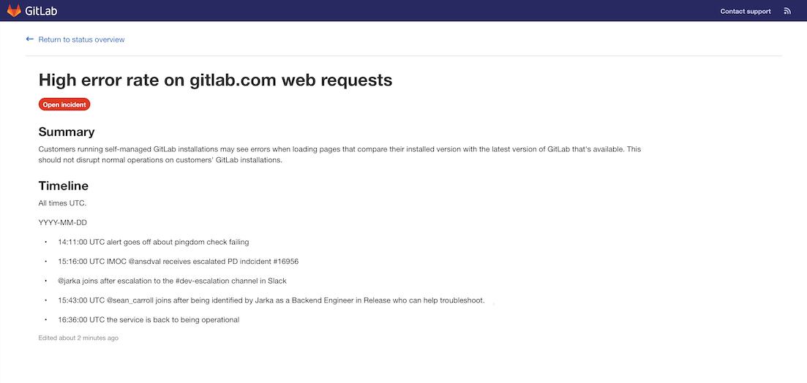

# GitLab Status Page

> [Introduced](https://gitlab.com/groups/gitlab-org/-/epics/2479) in GitLab 12.10.

GitLab Status Page allows you to create and deploy a static website to communicate efficiently to users during an incident.

## How to set up

NOTE: **Note:**
Only AWS S3 is supported as a deploy target.

Setting up a Status Page is pretty painless but there are a few things you need to do.

### Cloud account set up

To use GitLab Status Page you first need to set up your account details for your cloud provider in the operations settings page. Today, only AWS is supported.

1. Within your AWS account, create an AWS access key.
1. Add the following permissions policies:
    - [Create bucket](https://gitlab.com/gitlab-org/status-page/-/blob/master/deploy/etc/s3_create_policy.json).
    - [Update bucket contents](https://gitlab.com/gitlab-org/status-page/-/blob/master/deploy/etc/s3_update_bucket_policy.json) (Remember replace `S3_BUCKET_NAME` with your bucket name).

### Status Page project

To deploy the status page to AWS S3 you need to add the Status Page project & configure the necessary CI variables.

1. Fork the [Status Page](https://gitlab.com/gitlab-org/status-page) project. This can also be done via [Repository Mirroring](https://gitlab.com/gitlab-org/status-page#repository-mirroring) which will ensure you get the up-to-date Status Page features.
1. Add the following variables in **Settings > CI/CD > Variables**. (To get these variables from Amazon, use your Amazon Console):
    - `S3_BUCKET_NAME` - name of the Amazon S3 bucket
    - `AWS_DEFAULT_REGION` - the AWS region
    - `AWS_ACCESS_KEY_ID` - the AWS access key ID
    - `AWS_SECRET_ACCESS_KEY` - the AWS secret
1. Run the pipeline to deploy the status page to S3.

### Syncing incidents to the Status Page

Once the CI/CD variables are set, you'll need to set up the Project you want to use for Incident issues:

1. Navigate to **Settings > Operations > Status Page**.
1. Fill in your cloud provider's credentials and make sure the **Active** checkbox is checked.
1. Click **Save changes**.

## Status Page UI

The Status page landing page shows you an overview of the recent incidents. Clicking on an incident will take you to the incident's detail page.

### Incident detail page

The incident detail page shows detailed information about a particular incident. For example:

- Status on the incident, including when the incident was last updated.
- The incident title.
- The description of the incident.
- A chronological ordered list of updates to the incident.

## How it works

### Publishing Incidents

To publish an Incident, you first need to create an issue in the Project you enabled the Status Page settings in.

Once this issue is created, a background worker will publish the issue onto the status page using the credentials you provided during setup.

NOTE: **Note:**
Confidential issues are not published. If a published issue is made confidential it will be unpublished.

### Publishing updates

To publish an update to the Incident, update the incident issue's description.

CAUTION: **Caution:**
When referenced issues are changed (e.g. title, confidentiality) the incident they were referenced in are not updated automatically.

### Adding comments

To add comments to the Status Page Incident, create a comment on the incident issue.

When you're ready to publish the comment, add a microphone [award emoji](../../../user/award_emojis.md) reaction (`:microphone` 🎤) to the comment. This marks the comment as one which should be deployed to the Status Page.

CAUTION: **Caution:**
Anyone with access to view the Issue can add an Emoji Award to a comment, so you may want to keep your Issues limited to team members only.

### Changing the Incident status

To change the incident status from `open` to `closed`, close the incident issue within GitLab. This will then be updated shortly on the Status page website.
