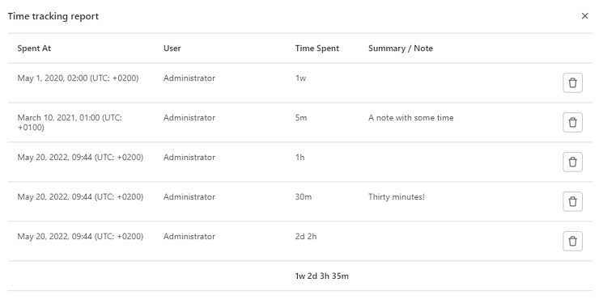

# Time tracking **(FREE ALL)**

You can estimate and track the time you spend on [issues](issues/index.md)
and [merge requests](merge_requests/index.md).

Then you can [view a report](#view-a-time-tracking-report) that shows totals over time.

Use time tracking for these tasks:

- Record the time spent working on an issue or a merge request.
- Add or update an estimate of the total time to complete an issue or a merge
  request.
- View a breakdown of time spent working on an issue or a merge request.

You don't have to indicate an estimate to enter the time spent, and vice versa.

To enter and remove time tracking data, you must use [quick actions](quick_actions.md).
Type all quick actions on their own lines.
If you use any quick action more than once in a single comment, only its last occurrence is applied.

You can see the data about time tracking on the right sidebar in issues and merge requests:


## Estimates

The estimate is designed to show the total time needed to complete an issue or merge request.

You can see the estimated time remaining when you hover over the time tracking information in the right sidebar.


### Add an estimate

Prerequisites:

- In issues, you must have at least the Reporter role for the project.
- In merge requests, you must have at least the Developer role for the project.

To enter an estimate, use the `/estimate` [quick action](quick_actions.md), followed by the time.

For example, if you need to enter an estimate of 1 month, 2 weeks, 3 days, 4 hours, and 5 minutes,
type `/estimate 1mo 2w 3d 4h 5m`.
Check the [time units you can use](#available-time-units).

An issue or a merge request can have only one estimate.
Every time you enter a new time estimate, it overwrites the previous value.

### Remove an estimate

Prerequisites:

- In issues, you must have at least the Reporter role for the project.
- In merge requests, you must have at least the Developer role for the project.

To remove an estimate entirely, use the `/remove_estimate` [quick action](quick_actions.md).

## Time spent

As you work, you can log the time you've spent.

Every new time spent entry is added to the current total time spent for the
issue or the merge request.

The total amount of time spent on an issue or merge request cannot exceed a year.

### Add time spent

Prerequisites:

- You must have at least the Reporter role for the project.

#### Using the user interface

> [Introduced](https://gitlab.com/gitlab-org/gitlab/-/merge_requests/101563) in GitLab 15.7.

To add a time entry using the user interface:

1. In the **Time tracking** section of the sidebar, select **Add time entry** (**{plus}**). A modal opens.
1. Enter:

   - The amount of time spent.
   - Optional. When it was spent.
   - Optional. A summary.

1. Select **Save**.

The **Spent** total in the sidebar is updated and you can view all entries in a [time tracking report](#view-a-time-tracking-report).

#### Using a quick action

To enter time spent, use the `/spend` [quick action](quick_actions.md), followed by the time.

For example, if you need
to log 1 month, 2 weeks, 3 days, 4 hours, and 5 minutes, type `/spend 1mo 2w 3d 4h 5m`.
Check the [time units you can use](#available-time-units).

To add a [time tracking report](#view-a-time-tracking-report) entry with a note, create a comment
with a description and the quick action.
It then shows in the time tracking report **Summary/Notes** column. For example:

```plaintext
Draft MR and respond to initial comments

/spend 30m
```

To log when time was spent, enter a date after the time, using the `YYYY-MM-DD` format.

For example, to log 1 hour of time spent on 31 January 2021,
enter `/spend 1h 2021-01-31`.

If you type a future date, no time is logged.

### Subtract time spent

Prerequisites:

- You must have at least the Reporter role for the project.

To subtract time, enter a negative value. For example, `/spend -3d` removes three
days from the total time spent. You can't go below 0 minutes of time spent,
so if you remove more time than already entered, GitLab ignores the subtraction.

### Delete time spent

> - [Introduced](https://gitlab.com/gitlab-org/gitlab/-/issues/356796) in GitLab 14.10.
> - Delete button [introduced](https://gitlab.com/gitlab-org/gitlab/-/issues/356796) in GitLab 15.1.

A timelog is a single entry of time spent, either positive or negative.

Prerequisites:

- You must be the author of the timelog or have at least the Maintainer role for the project.

To delete a timelog, either:

- In the time tracking report, on the right of a timelog entry, select **Delete time spent** (**{remove}**).
- Use the [GraphQL API](../../api/graphql/reference/index.md#mutationtimelogdelete).

### Delete all the time spent

Prerequisites:

- You must have at least the Reporter role for the project.

To delete all the time spent at once, use the `/remove_time_spent` [quick action](quick_actions.md).

## View a time tracking report

> [Introduced](https://gitlab.com/gitlab-org/gitlab/-/issues/271409) in GitLab 13.12.

You can view a breakdown of time spent on an issue or merge request.

To view a time tracking report:

1. Go to an issue or a merge request.
1. In the right sidebar, select **Time tracking report**.



The breakdown of spent time displayed is limited to a maximum of 100 entries.

## Available time units

The following time units are available:

| Time unit | What to type                | Conversion rate |
| --------- | --------------------------- | --------------- |
| Month     | `mo`, `month`, or `months`  | 4 w (160 h)      |
| Week      | `w`, `week`, or `weeks`     | 5 d (40 h)       |
| Day       | `d`, `day`, or `days`       | 8 h              |
| Hour      | `h`, `hour`, or `hours`     | 60 m             |
| Minute    | `m`, `minute`, or `minutes` |                 |

### Limit displayed units to hours **(FREE SELF)**

> [Introduced](https://gitlab.com/gitlab-org/gitlab-foss/-/merge_requests/29469/) in GitLab 12.1.

In GitLab self-managed instances, you can limit the display of time units to hours.
To do so:

1. On the left sidebar, select **Search or go to**.
1. Select **Settings > Preferences**.
1. Expand **Localization**.
1. Under **Time tracking**, select the **Limit display of time tracking units to hours** checkbox.
1. Select **Save changes**.

With this option enabled, `75h` is displayed instead of `1w 4d 3h`.

## Related topics

- [Time tracking solutions page](https://about.gitlab.com/solutions/time-tracking/)
- Time tracking GraphQL references:
  - [Connection](../../api/graphql/reference/index.md#timelogconnection)
  - [Edge](../../api/graphql/reference/index.md#timelogedge)
  - [Fields](../../api/graphql/reference/index.md#timelog)
  - [Timelogs](../../api/graphql/reference/index.md#querytimelogs)
  - [Group timelogs](../../api/graphql/reference/index.md#grouptimelogs)
  - [Project Timelogs](../../api/graphql/reference/index.md#projecttimelogs)
  - [User Timelogs](../../api/graphql/reference/index.md#usertimelogs)
