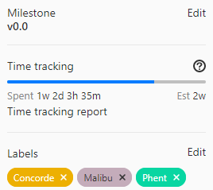
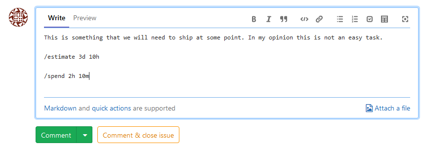
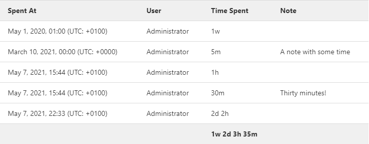

# Time tracking **(FREE)**

With time tracking you can track estimates and time spent on issues and merge
requests in GitLab.

Use time tracking for these tasks:

- Record the time spent working on an issue or a merge request.
- Add an estimate of the amount of time needed to complete an issue or a merge
  request.
- View a breakdown of time spent working on an issue or a merge request.

You don't have to indicate an estimate to enter the time spent, and vice versa.

Data about time tracking shows up on the issue and merge request sidebar:

## How to enter data

Time tracking uses two [quick actions](quick_actions.md): `/spend` and `/estimate`.

If you use either quick action more than once in a single comment, only the last occurrence is applied.

Below is an example of how you can use those new quick actions inside a comment.

Adding time entries (time spent or estimates) is limited to project members
with [Reporter and higher permission levels](../permissions.md).

### Estimates

To enter an estimate, type `/estimate`, followed by the time.

For example, if you need to enter an estimate of 1 month, 2 weeks, 3 days, 4 hours, and 5 minutes,
type `/estimate 1mo 2w 3d 4h 5m`.
Check the [time units you can use](#configuration).

Every time you enter a new time estimate, any previous time estimates are
overridden by this new value. There should only be one valid estimate in an
issue or a merge request.

To remove an estimation entirely, use `/remove_estimate`.

### Time spent

To enter time spent, type `/spend`, followed by the time.

For example, if you need
to log 1 month, 2 weeks, 3 days, 4 hours, and 5 minutes, type `/spend 1mo 2w 3d 4h 5m`.
Check the [time units you can use](#configuration).

Every new time spent entry is added to the current total time spent for the
issue or the merge request.

To subtract time, enter a negative value. For example, `/spend -3d` removes three
days from the total time spent. You can't go below 0 minutes of time spent,
so if you remove more time than already entered, GitLab ignores the subtraction.

You can log time in the past by providing a date after the time.
For example, if you want to log 1 hour of time spent on the 31 January 2021,
you would type `/spend 1h 2021-01-31`. If you supply a date in the future, the
command fails and no time is logged.

To remove all the time spent at once, use `/remove_time_spent`.

## View a time tracking report

> [Introduced](https://gitlab.com/gitlab-org/gitlab/-/issues/271409) in GitLab 13.12.

You can view a breakdown of time spent on an issue or merge request.

Prerequisites:

- You must have at least the [Reporter role](../permissions.md#project-members-permissions) for a project.

To view a time tracking report, go to an issue or a merge request and select **Time tracking report**
in the right sidebar.

The breakdown of spent time is limited to a maximum of 100 entries.

## Configuration

The following time units are available:

| Time unit | What to type | Default conversion rate |
| --------- | ------------ | ----------------------- |
| Month     | `mo`         | 4w                      |
| Week      | `w`          | 5d                      |
| Day       | `d`          | 8h                      |
| Hour      | `h`          | 60m                     |
| Minute    | `m`          |                         |

### Limit displayed units to hours **(FREE SELF)**

> [Introduced](https://gitlab.com/gitlab-org/gitlab-foss/-/merge_requests/29469/) in GitLab 12.1.

In GitLab self-managed instances, you can limit the display of time units to
hours.
To do so:

1. On the top bar, select **Menu >** **{admin}** **Admin**.
1. On the left sidebar, select **Settings > Preferences**.
1. Expand **Localization**.
1. Under **Time tracking**, select the **Limit display of time tracking units to hours** checkbox.
1. Select **Save changes**.

With this option enabled, `75h` is displayed instead of `1w 4d 3h`.

## Related links

- [Time tracking solutions page](https://about.gitlab.com/solutions/time-tracking/)
- Time tracking GraphQL references:
  - [Connection](../../api/graphql/reference/index.md#timelogconnection)
  - [Edge](../../api/graphql/reference/index.md#timelogedge)
  - [Fields](../../api/graphql/reference/index.md#timelog)
  - [Group timelogs](../../api/graphql/reference/index.md#grouptimelogs)
