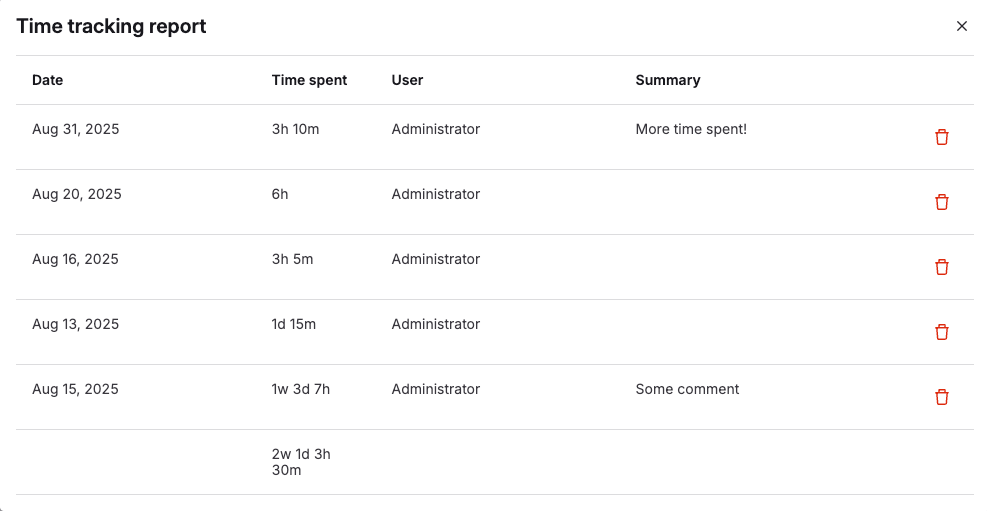



- Tier: Free, Premium, Ultimate
- Offering: GitLab.com, GitLab Self-Managed, GitLab Dedicated





- Time tracking for tasks [introduced](https://gitlab.com/gitlab-org/gitlab/-/issues/438577) in GitLab 17.0.
- Time tracking for epics [introduced](https://gitlab.com/groups/gitlab-org/-/epics/12396) in GitLab 17.5. [The new look for epics](../group/epics/_index.md#epics-as-work-items) must be enabled.
- Minimum role to add, edit, and remove estimate [changed](https://gitlab.com/gitlab-org/gitlab/-/merge_requests/169256) from Reporter to Planner in GitLab 17.7.
- Time tracking for epics [generally available](https://gitlab.com/gitlab-org/gitlab/-/issues/468310) in GitLab 18.1.



Time tracking helps record and manage time invested in GitLab work items.
Time tracking:

- Records actual time spent on issues, merge requests, epics, and tasks.
- Estimates total time needed for completion.
- Provides detailed reports of time entries.
- Calculates totals using standardized time units.
- Tracks history through quick actions and the UI.

You can see time tracking information in the right sidebar of your work items:


Enter and remove time tracking data using [quick actions](quick_actions.md) or the user interface.
Type quick actions on their own lines.
If you use any quick action more than once in a single comment, only its last occurrence is applied.

## Permissions

Different time tracking features are available based on your role:

- To add, edit, and remove estimates, you need at least the Planner role for issues and tasks, or the Developer role for merge requests.
- To add and edit time spent, you need at least the Planner role for the project.
- To delete a time entry, you must be the author or have at least the Maintainer role.

## Estimates

The estimate is designed to show the total time needed to complete an item.

You can see the estimated time remaining when you hover over the time tracking information in the right sidebar.


### Add an estimate

Prerequisites:

- In issues, you must have at least the Planner role for the project.
- In tasks, you must have at least the Planner role for the project.
- In merge requests, you must have at least the Developer role for the project.

To enter an estimate, use the `/estimate` [quick action](quick_actions.md), followed by the time.

For example, if you need to enter an estimate of 1 month, 2 weeks, 3 days, 4 hours, and 5 minutes,
type `/estimate 1mo 2w 3d 4h 5m`.
Check the [time units you can use](#available-time-units).

An item can have only one estimate.
Every time you enter a new time estimate, it overwrites the previous value.

### Remove an estimate

Prerequisites:

- In issues, you must have at least the Planner role for the project.
- In tasks, you must have at least the Planner role for the project.
- In merge requests, you must have at least the Developer role for the project.

To remove an estimate entirely, use the `/remove_estimate` [quick action](quick_actions.md).

## Time spent

As you work, you can log the time you've spent.

Every new time spent entry is added to the current total time spent for the
issue, task, or the merge request.

The total amount of time spent on an issue, task, or merge request cannot exceed a year.

### Add time spent

Prerequisites:

- You must have at least the Planner role for the project.

#### Using the user interface



- [Introduced](https://gitlab.com/gitlab-org/gitlab/-/merge_requests/101563) in GitLab 15.7.
- [Changed](https://gitlab.com/gitlab-org/gitlab/-/merge_requests/150564) in GitLab 17.0. When you don't specify when time was spent, current time is used.



To add a time entry using the user interface:

1. In the **Time tracking** section of the sidebar, select **Add time entry** (). A dialog opens.
1. Enter:

   - The amount of time spent.
   - Optional. When it was spent. If empty, uses current time.
   - Optional. A summary.

1. Select **Save**.

The **Spent** total in the sidebar is updated and you can view all entries in a [time tracking report](#view-an-items-time-tracking-report).

#### Using a quick action

To enter time spent, use the `/spend` [quick action](quick_actions.md), followed by the time.

For example, if you need
to log 1 month, 2 weeks, 3 days, 4 hours, and 5 minutes, type `/spend 1mo 2w 3d 4h 5m`.
Check the [time units you can use](#available-time-units).

To add a [time tracking report](#view-an-items-time-tracking-report) entry with a note, create a comment
with a description and the quick action.
It then shows in the time tracking report **Summary/Notes** column. For example:

```plaintext
Draft MR and respond to initial comments

/spend 30m
```

To log when time was spent, enter a date after the time, using the `YYYY-MM-DD` format.

For example, to log 1 hour of time spent on 31 January 2021,
enter `/spend 1h 2021-01-31`.

If you type a future date, no time is logged.

#### Using commit messages



- [Introduced](https://gitlab.com/gitlab-org/gitlab/-/issues/16543) in GitLab 18.3 with a flag named `commit_time_tracking`. Disabled by default.





The availability of this feature is controlled by a feature flag.
For more information, see the history.



You can record time spent on issues directly in commit messages. This approach is useful when you want to track time as you work, without updating the issue separately.

To add time spent in a commit message, include an issue reference and a time tracking marker in the format `@<time>` with no spaces between time units.

For example:

```plaintext
Fix a bug in the login form #123 @1mo2d3h15m
```

This commit message adds 1 month, 2 days, 3 hours, and 15 minutes of time spent to issue #123.

The time tracking marker must:

- Start with the `@` symbol.
- Be followed immediately by time units with no spaces between them.
- Support the following time units: months (`mo`), days (`d`), hours (`h`), minutes (`m`), and seconds (`s`).
- Use the same [time units](#available-time-units) as regular time tracking.

When you push a commit with time tracking information:

1. GitLab extracts the time spent from the commit message.
1. The time is added to any issues referenced in the same commit message.
1. A system note is added to the issue indicating time was added from a commit.
1. The time tracking entry includes the commit SHA and title as the description.

##### Commit author permissions

Time is added to an issue from a commit message only if the commit author has permission to update the issue:

- The commit author must have at least the Planner role for the project where the issue exists.
- If the author doesn't have sufficient permissions, the time tracking information in their commit is ignored.
- Permission checks use the same rules as regular time tracking.

##### Known issues

**Multiple time amounts in one commit**

When a commit message references multiple issues with different time amounts, only the first time amount is applied to all referenced issues.

For example, this commit message:

```plaintext
Fixes #41 @1h30m and fixes #40 @2h
```

Adds 1h30m to both issue #41 and issue #40. The second time amount (`@2h`) is ignored.

**Duplicate time entries from commit SHA changes**

When a commit's SHA changes (for example, after rebasing or amending), GitLab treats it as a new commit for time tracking. This can create duplicate time entries if both the original and new commits are referenced in the issue.

To avoid duplicate time entries when commit SHAs might change:

- Add time directly to the issue using the UI or quick actions instead of commit messages.
- If you must use commit messages for time tracking, add the time only after your branch's history is finalized.
- Before merging, check the issue's time tracking report to identify and remove any potential duplicates.

### Prevent duplicate time tracking in merge requests

When you merge a merge request containing commits with time tracking information, GitLab prevents duplicate time tracking:

- Time is tracked only once per commit, even if the same commit message appears multiple times in the repository history.
- GitLab prevents duplicate time tracking by checking if a time entry with the same commit title and ID already exists for an issue.
- When commits are merged, no additional time is tracked. This prevents double-counting time when feature branches are merged to the default branch.

### Subtract time spent

Prerequisites:

- You must have at least the Planner role for the project.

To subtract time, enter a negative value. For example, `/spend -3d` removes three
days from the total time spent. You can't go below 0 minutes of time spent,
so if you remove more time than already entered, GitLab ignores the subtraction.

### Delete time spent



- Delete button [introduced](https://gitlab.com/gitlab-org/gitlab/-/issues/356796) in GitLab 15.1.



A timelog is a single entry of time spent, either positive or negative.

Prerequisites:

- You must be the author of the timelog or have at least the Maintainer role for the project.

To delete a timelog, either:

- In the time tracking report, on the right of a timelog entry, select **Delete time spent** ().
- Use the [GraphQL API](../../api/graphql/reference/_index.md#mutationtimelogdelete).

### Delete all the time spent

Prerequisites:

- You must have at least the Planner role for the project.

To delete all the time spent at once, use the `/remove_time_spent` [quick action](quick_actions.md).

## View an item's time tracking report

To view a time tracking report of time spent on an item:

- On the right sidebar, next to **Spent**, select the time.



The breakdown of spent time displayed is limited to a maximum of 100 entries.

## Global time tracking report



- Status: Experiment





- [Introduced](https://gitlab.com/gitlab-org/gitlab/-/issues/344002) in GitLab 15.11 [with a flag](../../administration/feature_flags/_index.md) named `global_time_tracking_report`. Disabled by default.
- Enabled on GitLab.com in GitLab 16.5.





On GitLab Self-Managed, by default this feature is not available. To make it available, an administrator can [enable the feature flag](../../administration/feature_flags/_index.md) named `global_time_tracking_report`.
On GitLab.com, this feature is available. On GitLab Dedicated, this feature is not available.
This feature is not ready for production use.



View a report of time spent in issues, tasks, and merge requests across all of GitLab.

This feature is an [experiment](../../policy/development_stages_support.md).
If you find a bug, let us know in the [feedback issue](https://gitlab.com/gitlab-org/gitlab/-/issues/435222).

To view the global time tracking report:

1. In your browser, enter the global report's URL:
   - For GitLab Self-Managed, add `/-/timelogs` to your base URL. For example, `https://gitlab.example.com/-/timelogs`.
   - For GitLab.com, go to <https://gitlab.com/-/timelogs>.
1. Optional. To filter by a specific user, enter their username without the `@` symbol.
1. Select start and end dates.
1. Select **Run report**.


## Available time units

The following time units are available:

| Time unit | What to type                | Conversion rate |
| --------- | --------------------------- | --------------- |
| Month     | `mo`, `month`, or `months`  | 4 w (160 h)     |
| Week      | `w`, `week`, or `weeks`     | 5 d (40 h)      |
| Day       | `d`, `day`, or `days`       | 8 h             |
| Hour      | `h`, `hour`, or `hours`     | 60 m            |
| Minute    | `m`, `minute`, or `minutes` |                 |

### Limit displayed units to hours



- Tier: Free, Premium, Ultimate
- Offering: GitLab Self-Managed, GitLab Dedicated



On GitLab Self-Managed, you can limit the display of time units to hours.
To do so:

1. On the left sidebar, select **Search or go to**. If you've [turned on the new navigation](../interface_redesign.md#turn-new-navigation-on-or-off), this field is on the top bar.
1. Select **Settings** > **Preferences**.
1. Expand **Localization**.
1. Under **Time tracking**, select the **Limit display of time tracking units to hours** checkbox.
1. Select **Save changes**.

With this option enabled, `75h` is displayed instead of `1w 4d 3h`.

## Related topics

- Time tracking GraphQL references:
  - [Connection](../../api/graphql/reference/_index.md#timelogconnection)
  - [Edge](../../api/graphql/reference/_index.md#timelogedge)
  - [Fields](../../api/graphql/reference/_index.md#timelog)
  - [Timelogs](../../api/graphql/reference/_index.md#querytimelogs)
  - [Group timelogs](../../api/graphql/reference/_index.md#grouptimelogs)
  - [Project Timelogs](../../api/graphql/reference/_index.md#projecttimelogs)
  - [User Timelogs](../../api/graphql/reference/_index.md#usertimelogs)
