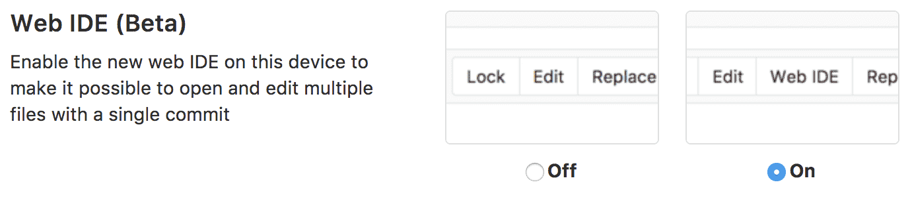
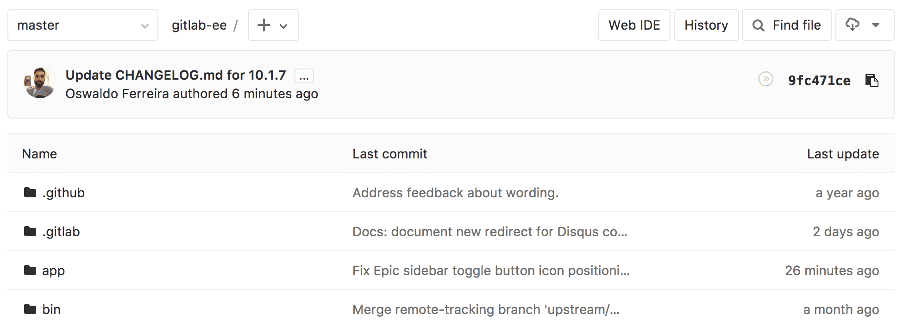
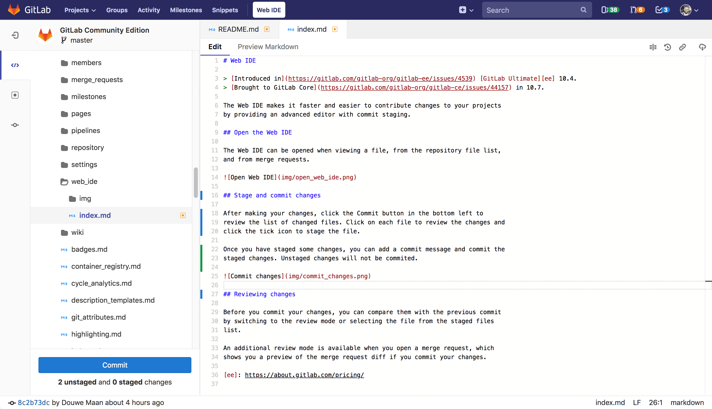

# Web IDE

> Introduced in [GitLab Ultimate][ee] 10.4.
> Brought to [GitLab CE][ce] in 10.7.

The Web IDE editor makes it faster and easier to contribute changes to your
projects by providing an advanced editor with commit staging.

## Enable the Web IDE

While in the early stages of the Beta, access to the Web IDE is by opting in.

To enable the Web IDE, click on your profile image in the top right corner and
navigate to **Settings > Preferences**, check **Enable Web IDE** and save.

## Open the Web IDE

Once enabled, the Web IDE can be opened when viewing a file, from the
repository file list.

## Commit changes

Changed files are shown on the right in the commit panel. All changes are
automatically staged. To commit your changes, add a commit message and click
the 'Commit Button'.

[ee]: https://about.gitlab.com/products/
