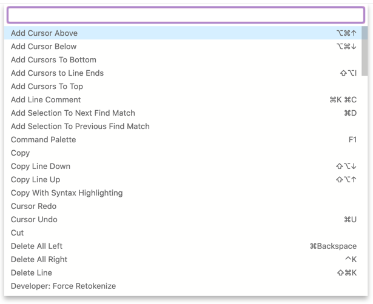
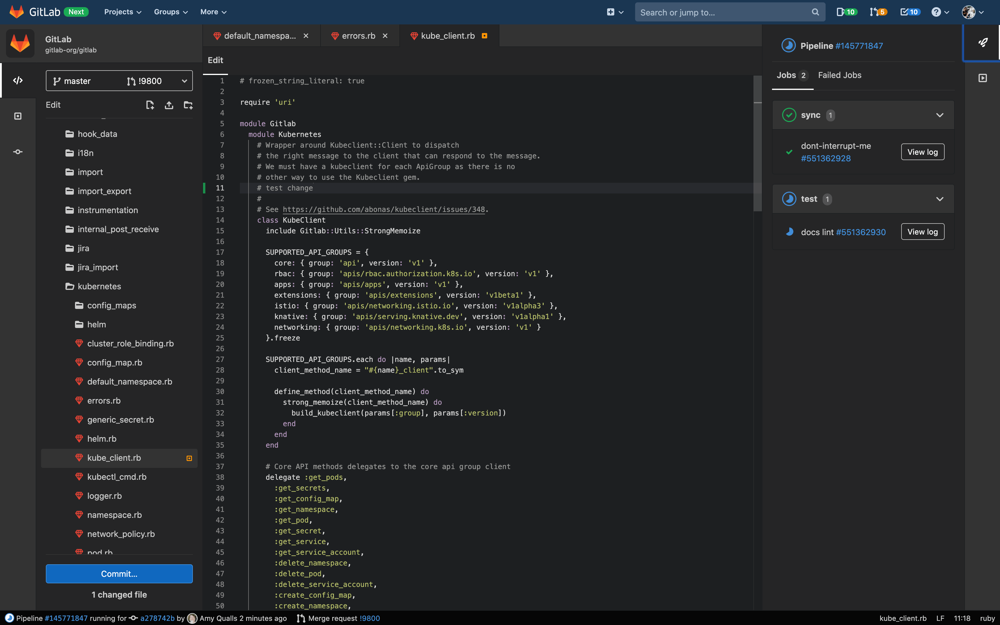
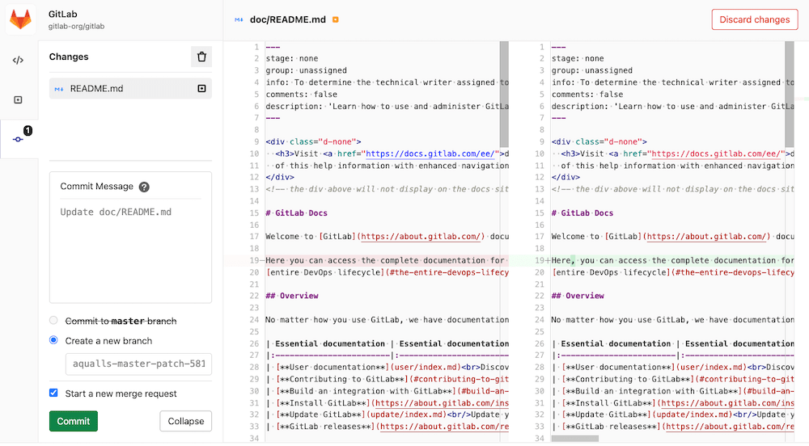
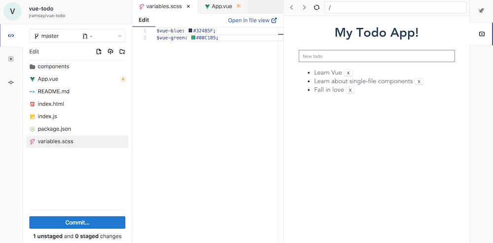
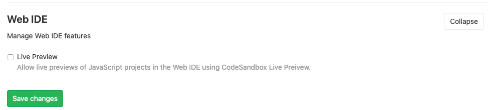
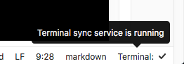

# Web IDE **(FREE)**

> - [Introduced](https://gitlab.com/gitlab-org/gitlab/-/issues/4539) in [GitLab Ultimate](https://about.gitlab.com/pricing/) 10.4.
> - [Moved](https://gitlab.com/gitlab-org/gitlab-foss/-/issues/44157) to GitLab Free in 10.7.

The Web Integrated Development Environment (IDE) editor makes it faster and easier to contribute changes to your
projects by providing an advanced editor with commit staging.

## Open the Web IDE

You can open the Web IDE when viewing a file, from the repository file list,
and from merge requests.


## File finder

> [Introduced](https://gitlab.com/gitlab-org/gitlab-foss/-/merge_requests/18323) in [GitLab Free](https://about.gitlab.com/pricing/) 10.8.

The file finder allows you to quickly open files in the current branch by
searching for fragments of the file path. The file finder is launched using the keyboard shortcut
<kbd>Command</kbd>+<kbd>p</kbd>, <kbd>Control</kbd>+<kbd>p</kbd>, or <kbd>t</kbd>
(when editor is not in focus). Type the filename or file path fragments to
start seeing results.

## Command palette

You can see all available commands for manipulating editor content by pressing
the <kbd>F1</kbd> key when the editor is in focus. After that, the editor displays
a complete list of available commands for
manipulating editor content. The editor supports commands for multi-cursor
editing, code block folding, commenting, searching and replacing, navigating
editor warnings and suggestions, and more.

Some commands have a keyboard shortcut assigned to them. The command palette
displays this shortcut next to each command. You can use this shortcut to invoke
the command without having to select it in the command palette.



## Syntax highlighting

As expected from an IDE, syntax highlighting for many languages in
the Web IDE makes your direct editing even easier.

The Web IDE currently provides:

- Basic syntax colorization for a variety of programming, scripting and markup
  languages such as XML, PHP, C#, C++, Markdown, Java, VB, Batch, Python, Ruby,
  and Objective-C.
- IntelliSense and validation support (displaying errors and warnings, providing
  smart completions, formatting, and outlining) for some languages. For example:
  TypeScript, JavaScript, CSS, LESS, SCSS, JSON, and HTML.

Because the Web IDE is based on the [Monaco Editor](https://microsoft.github.io/monaco-editor/),
you can find a more complete list of supported languages in the
[Monaco languages](https://github.com/Microsoft/monaco-languages) repository. Under the hood,
Monaco uses the [Monarch](https://microsoft.github.io/monaco-editor/monarch.html) library for syntax highlighting.

If you are missing Syntax Highlighting support for any language, we prepared a short guide on how to [add support for a missing language Syntax Highlighting.](https://gitlab.com/gitlab-org/gitlab/-/blob/master/app/assets/javascripts/ide/lib/languages/README.md)

### Themes

> - [Introduced](https://gitlab.com/groups/gitlab-org/-/epics/2389) in GitLab 13.0.
> - Full Solarized Dark Theme [introduced](https://gitlab.com/gitlab-org/gitlab/-/issues/219228) in GitLab 13.1.
> - Full [Solarized Light](https://gitlab.com/gitlab-org/gitlab/-/issues/221035) and [Monokai](https://gitlab.com/gitlab-org/gitlab/-/issues/221034) Themes introduced in GitLab 13.6.

All the themes GitLab supports for syntax highlighting are applied to the Web IDE's entire screen.
You can pick a theme from your [profile preferences](../../profile/preferences.md).

| Solarized Dark Theme                                        | Dark Theme                              |
|-------------------------------------------------------------|-----------------------------------------|
|  |  |

## Highlight lines

WebIDE is built with the [Web Editor](../repository/web_editor.md). This enables WebIDE to share the
same core features for highlighting and linking to particular lines in the edited files
[described for the Web Editor](../repository/web_editor.md#highlight-lines).

## Schema based validation

> - Support for validation based on predefined schemas [introduced](https://gitlab.com/gitlab-org/gitlab/-/issues/218472) in GitLab 13.2.
> - It was deployed behind a feature flag, disabled by default.
> - It's enabled on GitLab.com.
> - It cannot be enabled or disabled per-project.
> - For GitLab self-managed instances, GitLab administrators can opt to [enable it](#enable-or-disable-validation-based-on-predefined-schemas).
> - Support for validation based on custom schemas [introduced](https://gitlab.com/gitlab-org/gitlab/-/issues/226982) in [GitLab Premium](https://about.gitlab.com/pricing/) 13.4.

The Web IDE provides validation support for certain JSON and YAML files using schemas
based on the [JSON Schema Store](https://www.schemastore.org/json/).

### Predefined schemas

The Web IDE has validation for certain files built in. This feature is only supported for
the `*.gitlab-ci.yml` files.

#### Enable or disable validation based on predefined schemas **(FREE SELF)**

Validation based on predefined schemas is under development and not ready for production use. It is
deployed behind a feature flag that is **disabled by default** for self-managed instances,
[GitLab administrators with access to the GitLab Rails console](../../../administration/feature_flags.md)
can enable it for your instance.

To enable it:

```ruby
Feature.enable(:schema_linting)
```

To disable it:

```ruby
Feature.disable(:schema_linting)
```

### Custom schemas **(PREMIUM)**

> [Introduced](https://gitlab.com/gitlab-org/gitlab/-/issues/226982) in [GitLab Premium](https://about.gitlab.com/pricing/) 13.4.

The Web IDE also allows you to define custom schemas for certain JSON/YAML files in your project.
You can do so by defining a `schemas` entry in the `.gitlab/.gitlab-webide.yml` file inside the
repository's root. Here is an example configuration:

```yaml
schemas:
  - uri: https://json.schemastore.org/package
    match:
      - package.json
  - uri: https://somewebsite.com/first/raw/url
    match:
      - data/release_posts/unreleased/*.{yml,yaml}
  - uri: https://somewebsite.com/second/raw/url
    match:
      - "*.meta.json"
```

Each schema entry supports two properties:

- `uri`: please provide an absolute URL for the schema definition file here.
  The schema from this URL is loaded when a matching file is open.
- `match`: a list of matching paths or glob expressions. If a schema matches a
  particular path pattern, it is applied to that file. Please enclose the pattern
  in quotes if it begins with an asterisk (`*`), it's be applied to that file.
  If a pattern begins with an asterisk (`*`), enclose it in quotation marks.
  Otherwise, the configuration file is not valid YAML.

## Configure the Web IDE

> [Introduced](https://gitlab.com/gitlab-org/gitlab/-/issues/23352) in [GitLab Free](https://about.gitlab.com/pricing/) 13.1.

The Web IDE supports configuration of certain editor settings by using
[`.editorconfig` files](https://editorconfig.org/). When opening a file, the
Web IDE looks for a file named `.editorconfig` in the current directory
and all parent directories. If a configuration file is found and has settings
that match the file's path, these settings are enforced on the opened file.

The Web IDE currently supports the following `.editorconfig` settings:

- `indent_style`
- `indent_size`
- `end_of_line`
- `trim_trailing_whitespace`
- `tab_width`
- `insert_final_newline`

## Commit changes

> - [Introduced](https://gitlab.com/gitlab-org/gitlab/-/issues/4539) in [GitLab Ultimate](https://about.gitlab.com/pricing/) 10.4.
> - [Moved](https://gitlab.com/gitlab-org/gitlab-foss/-/issues/44157) to GitLab Free in 10.7.
> - From [GitLab 12.7 onward](https://gitlab.com/gitlab-org/gitlab/-/issues/33441), files were automatically staged.
> - From [GitLab 12.9 onward](https://gitlab.com/gitlab-org/gitlab/-/issues/196609), support for staging files was removed to prevent loss of unstaged data. All your current changes necessarily have to be committed or discarded.

After making your changes, click the **Commit** button on the bottom-left to
review the list of changed files.

After you have finalized your changes, you can add a commit message, commit the
changes and directly create a merge request. In case you don't have write
access to the selected branch, you see a warning, but can still create
a new branch and start a merge request.

To discard a change in a particular file, click the **Discard changes** button on that
file in the changes tab. To discard all the changes, click the trash icon on the
top-right corner of the changes sidebar.



## Reviewing changes

Before you commit your changes, you can compare them with the previous commit
by switching to the review mode or selecting the file from the list of changes.

An additional review mode is available when you open a merge request, which
shows you a preview of the merge request diff if you commit your changes.

## View CI job logs

> [Introduced](https://gitlab.com/gitlab-org/gitlab-foss/-/merge_requests/19279) in [GitLab Free](https://about.gitlab.com/pricing/) 11.0.

You can use the Web IDE to quickly fix failing tests by opening
the branch or merge request in the Web IDE and opening the logs of the failed
job. You can access the status of all jobs for the most recent pipeline and job
traces for the current commit by clicking the **Pipelines** button in the top
right.

The pipeline status is also shown at all times in the status bar in the bottom
left.

## Switching merge requests

> [Introduced](https://gitlab.com/gitlab-org/gitlab-foss/-/merge_requests/19318) in [GitLab Free](https://about.gitlab.com/pricing/) 11.0.

To switch between your authored and assigned merge requests, click the
dropdown in the top of the sidebar to open a list of merge requests. You need to commit or discard all your changes before switching to a different merge
request.

## Switching branches

> [Introduced](https://gitlab.com/gitlab-org/gitlab-foss/-/merge_requests/20850) in [GitLab Free](https://about.gitlab.com/pricing/) 11.2.

To switch between branches of the current project repository, click the dropdown
in the top of the sidebar to open a list of branches.
You need to commit or discard all your changes before switching to a
different branch.

## Markdown editing

> - Markdown preview [introduced](https://gitlab.com/gitlab-org/gitlab-foss/-/merge_requests/18059) in [GitLab Free](https://about.gitlab.com/pricing/) 10.7.
> - Support for pasting images [introduced](https://gitlab.com/gitlab-org/gitlab/-/issues/22822) in [GitLab Free](https://about.gitlab.com/pricing/) 13.1.

When you edit Markdown files in the Web IDE, you can preview your changes by
clicking the **Preview Markdown** tab above the file editor. The Markdown preview
supports [GitLab Flavored Markdown](../../markdown.md#gitlab-flavored-markdown).

You can also upload any local images by pasting them directly in the Markdown file.
The image is uploaded to the same directory and is named `image.png` by default.
If another file already exists with the same name, a numeric suffix is automatically
added to the filename.

## Live Preview

> - [Introduced](https://gitlab.com/gitlab-org/gitlab-foss/-/merge_requests/19764) in [GitLab Free](https://about.gitlab.com/pricing/) 11.2.
> - [Renamed](https://gitlab.com/gitlab-org/gitlab/-/issues/213853) from _Client Side Evaluation_ to _Live Preview_ in GitLab 13.0.

You can use the Web IDE to preview JavaScript projects right in the browser.
This feature uses CodeSandbox to compile and bundle the JavaScript used to
preview the web application.



Additionally, for public projects an **Open in CodeSandbox** button is available
to transfer the contents of the project into a public CodeSandbox project to
quickly share your project with others.

### Enable Live Preview

With Live Preview enabled, you can preview projects with a `package.json` file and
a `main` entry point inside the Web IDE.

Live Preview is enabled for all projects on GitLab.com. If you are an administrator
of a self-managed GitLab instance, and you want to enable Live Preview:

1. On the top bar, select **Menu >** **{admin}** **Admin**.
1. In the left sidebar, select **Settings > General**.
1. Scroll to **Web IDE** and select **Expand**:
   
1. Select **Enable Live Preview** and select **Save changes**.

[In GitLab 12.9 and later](https://gitlab.com/gitlab-org/gitlab/-/issues/268288),
third-party assets and libraries required for Live Preview are hosted at
`https://sandbox-prod.gitlab-static.net` when it is enabled. However, some libraries
are still served from other third-party services, which may or may not be desirable
in your environment.

An example `package.json`:

```json
{
  "main": "index.js",
  "dependencies": {
    "vue": "latest"
  }
}
```

## Interactive Web Terminals for the Web IDE

> - [Introduced](https://gitlab.com/gitlab-org/gitlab/-/issues/5426) in [GitLab Ultimate](https://about.gitlab.com/pricing/) 11.6.
> - [Moved](https://gitlab.com/gitlab-org/gitlab/-/issues/211685) to GitLab Free in 13.1.

WARNING:
Interactive Web Terminals for the Web IDE is currently in **Beta**.
GitLab.com shared runners [do not yet support Interactive Web Terminals](https://gitlab.com/gitlab-org/gitlab/-/issues/24674),
so you would need to use your own private runner to make use of this feature.

[Interactive Web Terminals](../../../ci/interactive_web_terminal/index.md)
give the project [Maintainers](../../permissions.md#project-members-permissions)
user access to a terminal to interact with the runner directly from
GitLab, including through the Web IDE.

### Runner configuration

Some things need to be configured in the runner for the interactive web terminal
to work:

- The runner needs to have
  [`[session_server]` configured properly](https://docs.gitlab.com/runner/configuration/advanced-configuration.html#the-session_server-section).
  This section requires at least a `session_timeout` value (which defaults to 1800
  seconds) and a `listen_address` value. If `advertise_address` is not defined, `listen_address` is used.
- If you are using a reverse proxy with your GitLab instance, web terminals need to be
  [enabled](../../../administration/integration/terminal.md#enabling-and-disabling-terminal-support). **(ULTIMATE SELF)**

If you have the terminal open and the job has finished with its tasks, the
terminal blocks the job from finishing for the duration configured in
[`[session_server].session_timeout`](https://docs.gitlab.com/runner/configuration/advanced-configuration.html#the-session_server-section)
until you close the terminal window.

NOTE:
Not all executors are
[supported](https://docs.gitlab.com/runner/executors/#compatibility-chart).
The [File Sync](#file-syncing-to-web-terminal) feature is supported on Kubernetes runners only.

### Web IDE configuration file

In order to enable the Web IDE terminals you need to create the file
`.gitlab/.gitlab-webide.yml` inside the repository's root. This
file is fairly similar to the [CI configuration file](../../../ci/yaml/index.md)
syntax but with some restrictions:

- No global blocks (such as `before_script` or `after_script`) can be defined.
- Only one job named `terminal` can be added to this file.
- Only the keywords `image`, `services`, `tags`, `before_script`, `script`, and
  `variables` are allowed to be used to configure the job.
- To connect to the interactive terminal, the `terminal` job must be still alive
  and running, otherwise the terminal cannot connect to the job's session.
  By default the `script` keyword has the value `sleep 60` to prevent
  the job from ending and giving the Web IDE enough time to connect. This means
  that, if you override the default `script` value, you have to add a command
  which would keep the job running, like `sleep`.

In the code below there is an example of this configuration file:

```yaml
terminal:
  # This can be any image that has the necessary runtime environment for your project.
  image: node:10-alpine
  before_script:
    - apk update
  script: sleep 60
  variables:
    RAILS_ENV: "test"
    NODE_ENV: "test"
```

After the terminal has started, the console is displayed and we could access
the project repository files.

**Important**. The terminal job is branch dependent. This means that the
configuration file used to trigger and configure the terminal is the one in
the selected branch of the Web IDE.

If there is no configuration file in a branch, an error message is shown.

### Running interactive terminals in the Web IDE

If Interactive Terminals are available for the current user, the **Terminal** button is visible in the right sidebar of the Web IDE. Click this button to open
or close the terminal tab.

After opening, the tab shows the **Start Web Terminal** button. This button may
be disabled if the environment is not configured correctly. If so, a status
message describes the issue. Here are some reasons why **Start Web Terminal**
may be disabled:

- `.gitlab/.gitlab-webide.yml` does not exist or is set up incorrectly.
- No active private runners are available for the project.

If active, clicking the **Start Web Terminal** button loads the terminal view
and start connecting to the runner's terminal. At any time, the **Terminal** tab
can be closed and reopened and the state of the terminal is not affected.

When the terminal is started and is successfully connected to the runner, then the
runner's shell prompt appears in the terminal. From here, you can enter
commands executed in the runner's environment. This is similar
to running commands in a local terminal or through SSH.

While the terminal is running, it can be stopped by clicking **Stop Terminal**.
This disconnects the terminal and stops the runner's terminal job. From here,
click **Restart Terminal** to start a new terminal session.

### File syncing to web terminal

> - [Introduced](https://gitlab.com/gitlab-org/gitlab/-/issues/5276) in [GitLab Ultimate](https://about.gitlab.com/pricing/) 12.0.
> - [Moved](https://gitlab.com/gitlab-org/gitlab/-/issues/211686) to GitLab Free in 13.1.

File changes in the Web IDE can be synced to a running web terminal.
This enables users to test their code changes in a preconfigured terminal
environment.

NOTE:
Only file changes in the Web IDE are synced to the terminal.
Changes made in the terminal are **not** synced to the Web IDE.
This feature is only available for Kubernetes runners.

To enable file syncing to the web terminal, the `.gitlab/.gitlab-webide.yml`
file needs to have a `webide-file-sync` service configured. Here is an example
configuration for a Node JS project which uses this service:

```yaml
terminal:
  # This can be any image that has the necessary runtime environment for your project.
  image:
    name: node:10-alpine
  services:
    - name: registry.gitlab.com/gitlab-org/webide-file-sync:latest
      alias: webide-file-sync
      entrypoint: ["/bin/sh"]
      command: ["-c", "sleep 5 && ./webide-file-sync -project-dir $CI_PROJECT_DIR"]
      ports:
        # The `webide-file-sync` executable defaults to port 3000.
        - number: 3000
```

- The `webide-file-sync` executable must start **after** the project
  directory is available. This is why we need to add `sleep 5` to the `command`.
  See [this issue](https://gitlab.com/gitlab-org/webide-file-sync/-/issues/7) for
  more information.
- `$CI_PROJECT_DIR` is a
  [predefined CI/CD variable](../../../ci/variables/predefined_variables.md)
  for GitLab Runners. This is where your project's repository resides.

After you have configured the web terminal for file syncing, then when the web
terminal is started, a **Terminal** status is visible in the status bar.



Changes made to your files via the Web IDE sync to the running terminal
when:

- <kbd>Control</kbd> + <kbd>S</kbd> (or <kbd>Command</kbd> + <kbd>S</kbd> on Mac)
  is pressed while editing a file.
- Anything outside the file editor is clicked after editing a file.
- A file or folder is created, deleted, or renamed.

### Limitations

The Web IDE has a few limitations:

- Interactive Terminals is in a beta phase and continues to be improved in upcoming releases. In the meantime, please note that the user is limited to having only one
  active terminal at a time.

- LFS files can be rendered and displayed but they cannot be updated and committed using the Web IDE. If an LFS file is modified and pushed to the repository, the LFS pointer in the repository is overwritten with the modified LFS file content.

### Troubleshooting

- If the terminal's text is gray and unresponsive, then the terminal has stopped
  and it can no longer be used. A stopped terminal can be restarted by clicking
  **Restart Terminal**.
- If the terminal displays **Connection Failure**, then the terminal could not
  connect to the runner. Please try to stop and restart the terminal. If the
  problem persists, double check your runner configuration.
