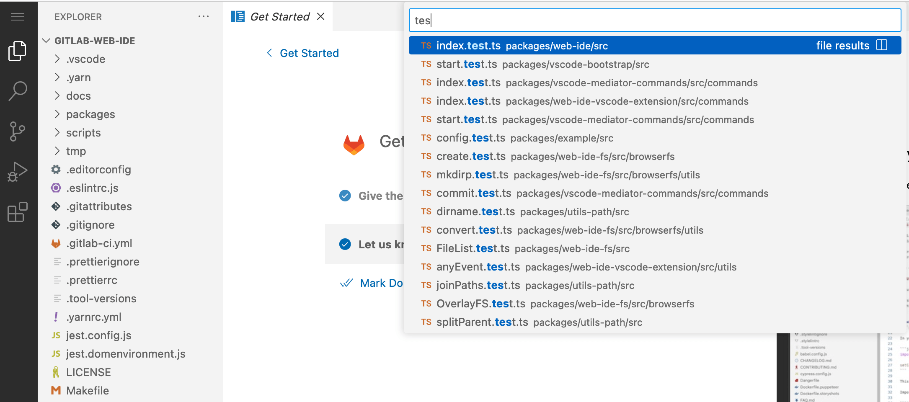

# Web IDE **(FREE ALL)**

> - [Introduced](https://gitlab.com/gitlab-org/gitlab/-/merge_requests/95169) in GitLab 15.7 [with a flag](../../../administration/feature_flags.md) named `vscode_web_ide`. Disabled by default.
> - [Enabled on GitLab.com](https://gitlab.com/gitlab-org/gitlab/-/issues/371084) in GitLab 15.7.
> - [Enabled on self-managed](https://gitlab.com/gitlab-org/gitlab/-/merge_requests/115741) in GitLab 15.11.

FLAG:
On self-managed GitLab, by default this feature is available. To hide the feature, an administrator can [disable the feature flag](../../../administration/feature_flags.md) named `vscode_web_ide`. On GitLab.com, this feature is available.

The Web IDE is an advanced editor with commit staging.
You can use the Web IDE to make changes to multiple files directly from the GitLab UI.
For a more basic implementation, see [Web Editor](../repository/web_editor.md).

To pair the Web IDE with a remote development environment, see [remote development](../remote_development/index.md).

## Use the Web IDE

To open the Web IDE from the GitLab UI:

1. On the left sidebar, select **Search or go to** and find your project.
1. Use the <kbd>.</kbd> keyboard shortcut.

You can also open the Web IDE from:

- A file
- The repository file list
- A merge request

### From a file or the repository file list

To open the Web IDE from a file or the repository file list:

- In the upper right, select **Edit > Open in Web IDE**.

### From a merge request

To open the Web IDE from a merge request:

1. Go to your merge request.
1. In the upper-right corner, select **Code > Open in Web IDE**.

The Web IDE opens new and modified files in separate tabs and displays changes side by side with the original source.
To optimize loading time, only the top 10 files (by number of lines changed) are opened automatically.

In the file tree, any new or modified file in the merge request is indicated by an icon next to the filename.
To view changes to a file, right-click the filename and select **Compare with merge request base**.

## Open a file in the Web IDE

To open any file by its name:

1. Press <kbd>Command</kbd>+<kbd>P</kbd>.
1. Enter the name of your file.

## Search across files

You can use the Web IDE to search all files in the opened folder.

To search across files:

1. Press <kbd>Shift</kbd>+<kbd>Command</kbd>+<kbd>F</kbd>.
1. Enter your search term.

In the Web IDE, only partial results from opened files are displayed.

## View a list of changed files

To view a list of files you changed in the Web IDE:

- On the activity bar on the left, select **Source Control**,
  or press <kbd>Control</kbd>+<kbd>Shift</kbd>+<kbd>G</kbd>.

Your `CHANGES`, `STAGED CHANGES`, and `MERGE CHANGES` are displayed.
For more information, see the [VS Code documentation](https://code.visualstudio.com/docs/sourcecontrol/overview#_commit).

## Restore uncommitted changes

You don't have to manually save any file you modify in the Web IDE.
Modified files are automatically staged and can be [committed](#commit-changes).
Uncommitted changes are saved in your browser's local storage and persist
even if you close the browser tab or refresh the Web IDE.

If your uncommitted changes are not available, you can restore the changes from local history.
To restore uncommitted changes in the Web IDE:

1. Press <kbd>Shift</kbd>+<kbd>Command</kbd>+<kbd>P</kbd>.
1. In the search box, enter `Local History: Find Entry to Restore`.
1. Select the file that contains the uncommitted changes.

## Upload a new file

To upload a new file in the Web IDE:

1. On the activity bar on the left, select **Explorer** and go to the directory where you want to upload the file.
1. Optional. For a new directory, go to the path where you want to have the directory and do one of the following:
   - Right-click the path, and select **New Folder...**. You can create a nested path with `/` (for example, `parentdir/subdir1/subdir2`).
   - In the upper right of the **Explorer** panel, select **New Folder...** (**{folder-new}**).
1. Enter the name of the new directory, and press <kbd>Enter</kbd>.
1. Right-click the path, and select **Upload...**.
1. Select the file you want to upload, then select **Open**. You can upload multiple files at once.

The new file is uploaded and automatically added to the repository.

## Switch branches

The Web IDE uses the currently selected branch by default.
To switch branches in the Web IDE:

1. On the status bar, in the lower-left corner, select the current branch name.
1. In the search box, start typing the branch name.
1. From the dropdown list, select the branch.

## Create a branch

To create a branch from the current branch in the Web IDE:

1. On the status bar, in the lower-left corner, select the current branch name.
1. From the dropdown list, select **Create new branch...**.
1. Enter the branch name.
1. Press <kbd>Enter</kbd>.

If you don't have write access to the repository, **Create new branch...** is not visible.

## Commit changes

To commit changes in the Web IDE:

1. On the activity bar on the left, select **Source Control**,
   or press <kbd>Control</kbd>+<kbd>Shift</kbd>+<kbd>G</kbd>.
1. Enter your commit message.
1. Select **Commit & Push**.
1. Commit to the current branch, or [create a new branch](#create-a-branch).

## Create a merge request

To create a merge request in the Web IDE:

1. [Commit the changes](#commit-changes).
1. In the pop-up notification in the lower-right corner, select **Create Merge Request**.
   A new window opens for you to create the [merge request](../merge_requests/index.md).

To access missed notifications, see [Access notifications](#access-notifications).

## Use the command palette

In the Web IDE, you can access many commands through the command palette.
To open the command palette and run a command in the Web IDE:

1. Press <kbd>Shift</kbd>+<kbd>Command</kbd>+<kbd>P</kbd>.
1. In the search box, start typing the command name.
1. From the dropdown list, select the command.

## Edit settings

You can use the settings editor to view and modify your user and workspace settings.
To open the settings editor in the Web IDE:

- On the top menu bar, select **File > Preferences > Settings**,
  or press <kbd>Command</kbd>+<kbd>,</kbd>.

In the settings editor, you can search for the settings you want to modify.

## Edit keyboard shortcuts

You can use the keyboard shortcuts editor to view and modify the default keybindings for all available commands.
To open the keyboard shortcuts editor in the Web IDE:

- On the top menu bar, select **File > Preferences > Keyboard Shortcuts**,
  or press <kbd>Command</kbd>+<kbd>K</kbd> then <kbd>Command</kbd>+<kbd>S</kbd>.

In the keyboard shortcuts editor, you can search for:

- The keybindings you want to change
- The commands you want to add or remove keybindings for

Keybindings are based on your keyboard layout. If you change your keyboard layout, existing keybindings are updated automatically.

## Change themes

You can choose between different themes for the Web IDE. The default theme for the Web IDE is **GitLab Dark**.

To change the Web IDE theme:

1. On the top menu bar, select **File > Preferences > Theme > Color Theme**,
   or press <kbd>Command</kbd>+<kbd>K</kbd> then <kbd>Command</kbd>+<kbd>T</kbd>.
1. From the dropdown list, preview the themes with the arrow keys.
1. Select a theme.

The active color theme is stored in the [user settings](#edit-settings).

## Access notifications

When you perform actions in the Web IDE, notifications appear in the lower-right corner. To access missed notifications:

1. On the status bar, in the lower-right corner, select the bell (**{notifications}**) for a list of notifications.
1. Select the notification you want to access.

<!-- ## Privacy and data collection for extensions

The Web IDE Extension Marketplace is based on Open VSX. Open VSX does not collect any
data about you or your activities on the platform.

However, the privacy and data collection practices of extensions available on Open VSX can vary.
Some extensions might collect data to provide personalized recommendations or to improve the functionality.
Other extensions might collect data for analytics or advertising purposes.

To protect your privacy and data:

- Carefully review the permissions requested by an extension before you install the extension.
- Keep your extensions up to date to ensure that any security or privacy vulnerabilities are addressed promptly. -->

## Interactive web terminals for the Web IDE **(BETA)**

WARNING:
This feature is in [Beta](../../../policy/experiment-beta-support.md#beta) and subject to change without notice.

When you set up a remote development server in the Web IDE, you can use interactive web terminals to:

- Access a remote shell on the server.
- Interact with the server's file system and execute commands remotely.

You cannot use interactive web terminals to interact with a runner.
However, you can use a terminal to install dependencies and compile and debug code.

For more information about configuring a workspace that supports interactive web terminals, see [remote development](../remote_development/index.md).

## Related topics

- [GitLab Duo Chat in the Web IDE](../../gitlab_duo_chat.md#web-ide)

## Troubleshooting

When working with the Web IDE, you might encounter the following issues.

### Character offset in the Web IDE

When you type in the Web IDE, you might get a four-character offset. To resolve the issue, do one of the following:

- Add `"editor.disableMonospaceOptimizations": true` to your settings.
- Modify your `"editor.font"` setting.

For more information, see [VS Code issue 80170](https://github.com/microsoft/vscode/issues/80170).
