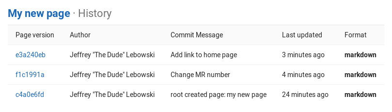
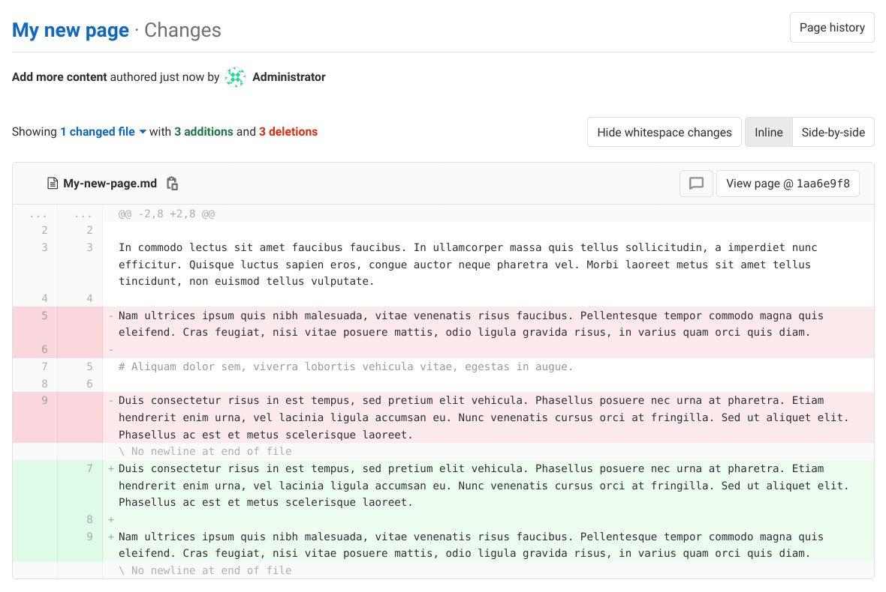
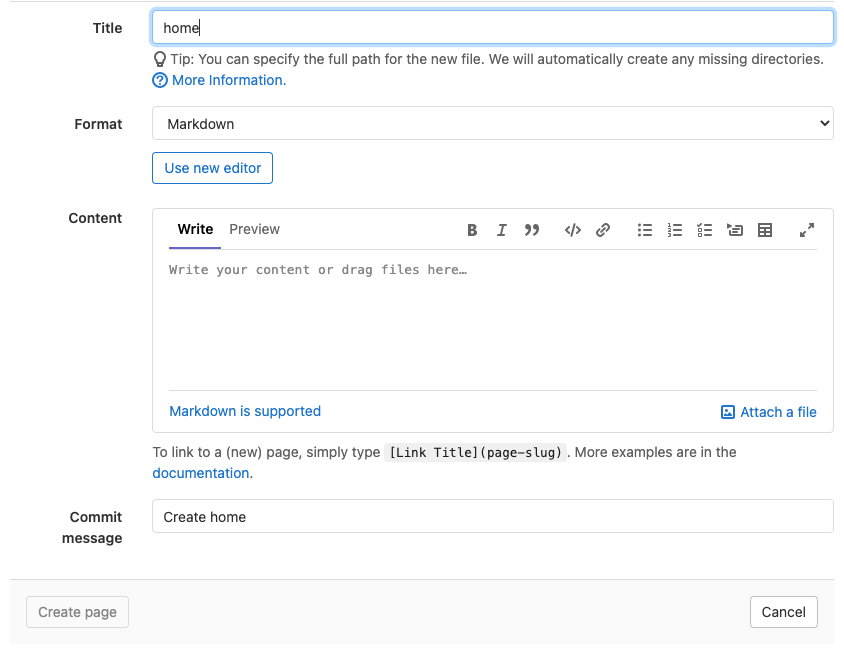

# Wiki **(FREE)**

If you don't want to keep your documentation in your repository, but you want
to keep it in the same project as your code, you can use the wiki GitLab provides
in each GitLab project. Every wiki is a separate Git repository, so you can create
wiki pages in the web interface, or [locally using Git](#create-or-edit-wiki-pages-locally).

To access the wiki for a project or group, go to the page for your project or group
and, in the left sidebar, select **Wiki**. If **Wiki** is not listed in the
left sidebar, a project administrator has [disabled it](#enable-or-disable-a-project-wiki).

GitLab wikis support Markdown, RDoc, AsciiDoc, and Org for content.
Wiki pages written in Markdown support all [Markdown features](../../markdown.md),
and also provide some [wiki-specific behavior](../../markdown.md#wiki-specific-markdown)
for links.

In [GitLab 13.5 and later](https://gitlab.com/gitlab-org/gitlab/-/issues/17673/),
wiki pages display a sidebar, which you [can customize](#customize-sidebar). This
sidebar contains a partial list of pages in the wiki, displayed as a nested tree,
with sibling pages listed in alphabetical order. To view a list of all pages, select
**View All Pages** in the sidebar:


## Create the wiki home page

When a wiki is created, it is empty. On your first visit, create the landing page
users see when viewing the wiki:

1. Go to your project or group and select **Wiki**.
1. Select **Create your first page**.
1. Select a **Format** for styling your text.
1. Add a welcome message in the **Content** section. You can always edit it later.
1. Add a **Commit message**. Git requires a commit message, so GitLab creates one
   if you don't enter one yourself.
1. Select **Create page**.

## Create a new wiki page

Users with the [Developer role](../../permissions.md) can create new wiki pages:

1. Go to your project or group and select **Wiki**.
1. Select **New page** on this page, or any other wiki page.
1. Select a content format.
1. Add a title for your new page. Page titles use
   [special characters](#special-characters-in-page-titles) for subdirectories and formatting,
   and have [length restrictions](#length-restrictions-for-file-and-directory-names).
1. Add content to your wiki page.
1. (Optional) Attach a file, and GitLab stores it according to your installed version of GitLab:
   - *Files added in [GitLab 11.3 and later](https://gitlab.com/gitlab-org/gitlab-foss/-/issues/33475):*
     Files are stored in the wiki's Git repository.
   - *Files added GitLab 11.2 and earlier:* Files are stored in GitLab itself. To add
     the file to the wiki's Git repository, you must re-upload the file.
1. Add a **Commit message**. Git requires a commit message, so GitLab creates one
   if you don't enter one yourself.
1. Select **Create page**.

### Create or edit wiki pages locally

Wikis are based on Git repositories, so you can clone them locally and edit
them like you would do with every other Git repository. To clone a wiki repository
locally, select **Clone repository** from the right-hand sidebar of any wiki page,
and follow the on-screen instructions.

Files you add to your wiki locally must use one of the following
supported extensions, depending on the markup language you wish to use.
Files with unsupported extensions don't display when pushed to GitLab:

- Markdown extensions: `.mdown`, `.mkd`, `.mkdn`, `.md`, `.markdown`.
- AsciiDoc extensions: `.adoc`, `.ad`, `.asciidoc`.
- Other markup extensions: `.textile`, `.rdoc`, `.org`, `.creole`, `.wiki`, `.mediawiki`, `.rst`.

### Special characters in page titles

Wiki pages are stored as files in a Git repository, so certain characters have a special meaning:

- Spaces are converted into hyphens when storing a page.
- Hyphens (`-`) are converted back into spaces when displaying a page.
- Slashes (`/`) are used as path separators, and can't be displayed in titles. If you
  create a title containing `/` characters, GitLab creates all the subdirectories
  needed to build that path. For example, a title of `docs/my-page` creates a wiki
  page with a path `/wikis/docs/my-page`.

### Length restrictions for file and directory names

> - [Introduced](https://gitlab.com/gitlab-org/gitlab/-/merge_requests/24364) in GitLab 12.8.

Many common file systems have a [limit of 255 bytes](https://en.wikipedia.org/wiki/Comparison_of_file_systems#Limits)
for file and directory names. Git and GitLab both support paths exceeding
those limits. However, if your file system enforces these limits, you cannot check out a
local copy of a wiki that contains filenames exceeding this limit. To prevent this
problem, the GitLab web interface and API enforce these limits:

- 245 bytes for page titles (reserving 10 bytes for the file extension).
- 255 bytes for directory names.

Non-ASCII characters take up more than one byte.

While you can still create files locally that exceed these limits, your teammates
may not be able to check out the wiki locally afterward.

## Edit a wiki page

You need the [Developer role](../../permissions.md) or higher to edit a wiki page:

1. Go to your project or group and select **Wiki**.
1. Go to the page you want to edit.
1. Select the edit icon (**{pencil}**).
1. Edit the content.
1. Select **Save changes**.

### Create a table of contents

To generate a table of contents from a wiki page's subheadings, use the `[[_TOC_]]` tag.
For an example, read [Table of contents](../../markdown.md#table-of-contents).

## Delete a wiki page

You need the [Maintainer role](../../permissions.md) or higher to delete a wiki page:

1. Go to your project or group and select **Wiki**.
1. Go to the page you want to delete.
1. Select the edit icon (**{pencil}**).
1. Select **Delete page**.
1. Confirm the deletion.

## Move a wiki page

You need the [Developer role](../../permissions.md) or higher to move a wiki page:

1. Go to your project or group and select **Wiki**.
1. Go to the page you want to move.
1. Select the edit icon (**{pencil}**).
1. Add the new path to the **Title** field. For example, if you have a wiki page
   called `about` under `company` and you want to move it to the wiki's root,
   change the **Title** from `about` to `/about`.
1. Select **Save changes**.

## View history of a wiki page

The changes of a wiki page over time are recorded in the wiki's Git repository.
To view the changes for a wiki page, select **Page history**.

From the history page you can see:



- The revision (Git commit SHA) of the page.
- The page author.
- The commit message.
- The last update.
- Previous revisions, by selecting a revision number in the **Page version** column.

### View changes between page versions

> - [Introduced](https://gitlab.com/gitlab-org/gitlab/-/issues/15242) in GitLab 13.2.

You can see the changes made in a version of a wiki page, similar to versioned diff file views:

1. Go to your project or group and select **Wiki**.
1. Go to the wiki page you're interested in.
1. Select **Page history** to see all page versions.
1. Select the commit message in the **Changes** column for the version you're interested in.

   

## Track wiki events

> - [Introduced](https://gitlab.com/gitlab-org/gitlab/-/issues/14902) in **GitLab 12.10.**
> - Git events were [introduced](https://gitlab.com/gitlab-org/gitlab/-/issues/216014) in **GitLab 13.0.**
> - [Feature flag for Git events was removed](https://gitlab.com/gitlab-org/gitlab/-/issues/258665) in **GitLab 13.5**

GitLab tracks wiki creation, deletion, and update events. These events are displayed on the
[user profile](../../profile/index.md#access-your-user-profile),
[group](../../group/index.md#view-group-activity),
and [project](../working_with_projects.md#project-activity) activity pages.

Commits to wikis are not counted in [repository analytics](../../analytics/repository_analytics.md).

## Customize sidebar

> - [Introduced](https://gitlab.com/gitlab-org/gitlab/-/issues/23109) in GitLab 13.8, the sidebar can be customized by selecting the **Edit sidebar** button.

You need Developer [permissions](../../permissions.md) or higher to customize the wiki
navigation sidebar. This process creates a wiki page named `_sidebar` which fully
replaces the default sidebar navigation:

1. Go to your project or group and select **Wiki**.
1. In the top right corner of the page, select **Edit sidebar**.
1. When complete, select **Save changes**.

A `_sidebar` example, formatted with Markdown:

```markdown
### [Home](home)

- [Hello World](hello)
- [Foo](foo)
- [Bar](bar)

---

- [Sidebar](_sidebar)
```

Support for displaying a generated table of contents with a custom side navigation is planned.

## Enable or disable a project wiki

Wikis are enabled by default in GitLab. Project [administrators](../../permissions.md)
can enable or disable the project wiki by following the instructions in
[Sharing and permissions](../settings/index.md#sharing-and-permissions).

Administrators for self-managed GitLab installs can
[configure additional wiki settings](../../../administration/wikis/index.md).

## Group wikis **(PREMIUM)**

> - [Introduced](https://gitlab.com/gitlab-org/gitlab/-/issues/13195) in [GitLab Premium](https://about.gitlab.com/pricing/) 13.5.

Group wikis work the same way as project wikis. Their usage is similar to project
wikis, with a few limitations:

- Git LFS is not supported.
- Group wikis are not included in global search.
- Changes to group wikis don't show up in the group's activity feed.

For updates, follow [the epic that tracks feature parity with project wikis](https://gitlab.com/groups/gitlab-org/-/epics/2782).

Group wikis can be edited by members with the [Developer role](../../permissions.md#group-members-permissions)
and above. Group wiki repositories can be moved using the
[Group repository storage moves API](../../../api/group_repository_storage_moves.md).

## Link an external wiki

To add a link to an external wiki from a project's left sidebar:

1. Go to your project and select **Settings > Integrations**.
1. Select **External wiki**.
1. Add the URL to your external wiki.
1. (Optional) Select **Test settings** to verify the connection.
1. Select **Save changes**.

You can now see the **External wiki** option from your project's
left sidebar.

When you enable this integration, the link to the external
wiki doesn't replace the link to the internal wiki.
To hide the internal wiki from the sidebar, [disable the project's wiki](#disable-the-projects-wiki).

To hide the link to an external wiki:

1. Go to your project and select **Settings > Integrations**.
1. Select **External wiki**.
1. In the **Enable integration** section, clear the **Active** checkbox.
1. Select **Save changes**.

## Disable the project's wiki

To disable a project's internal wiki:

1. Go to your project and select **Settings > General**.
1. Expand **Visibility, project features, permissions**.
1. Scroll down to find **Wiki** and toggle it off (in gray).
1. Select **Save changes**.

The internal wiki is now disabled, and users and project members:

- Cannot find the link to the wiki from the project's sidebar.
- Cannot add, delete, or edit wiki pages.
- Cannot view any wiki page.

Previously added wiki pages are preserved in case you
want to re-enable the wiki. To re-enable it, repeat the process
to disable the wiki but toggle it on (in blue).

## Content Editor **(FREE)**

> - [Introduced](https://gitlab.com/groups/gitlab-org/-/epics/5643) in GitLab 14.0.

GitLab version 14.0 introduces a WYSIWYG editing experience for GitLab Flavored Markdown
in Wikis through the [Content Editor](../../../development/fe_guide/content_editor.md).
The Content Editor is under active development, and is not yet the default editing
experience in the Wiki. To opt in for the new editor:

1. Create a new wiki page, or edit an existing one.
1. Ensure the wiki page uses the Markdown format. Other formats are not yet supported.
1. Below the **Format** select box, select **Use the new editor**:

   

### Use the Content Editor

1. [Create](#create-a-new-wiki-page) a new wiki page, or [edit](#edit-a-wiki-page) an existing one.
1. Select **Markdown** as your format.
1. Below the **Format** select box, select **Use new editor**.
1. Customize your page's content using the various formatting options available in the content editor.
1. Select **Create page** for a new page, or **Save changes** for an existing page:

   

### Switch back to the old editor

1. *If you're editing the page in the content editor,* scroll to **Content**.
1. Select **Switch me back to the classic editor**.
1. Select **Switch to classic editor** in the confirmation popup to confirm.

When you switch back to the old editor, any unsaved changes are lost.

### GitLab Flavored Markdown support

Supporting all GitLab Flavored Markdown content types in the Content Editor is a work in progress.
For the status of the ongoing development for CommonMark and GitLab Flavored Markdown support, read:

- [Basic Markdown formatting extensions](https://gitlab.com/groups/gitlab-org/-/epics/5404) epic.
- [GitLab Flavored Markdown extensions](https://gitlab.com/groups/gitlab-org/-/epics/5438) epic.

## Resources

- [Wiki settings for administrators](../../../administration/wikis/index.md)
- [Project wikis API](../../../api/wikis.md)
- [Group repository storage moves API](../../../api/group_repository_storage_moves.md)
- [Group wikis API](../../../api/group_wikis.md)
