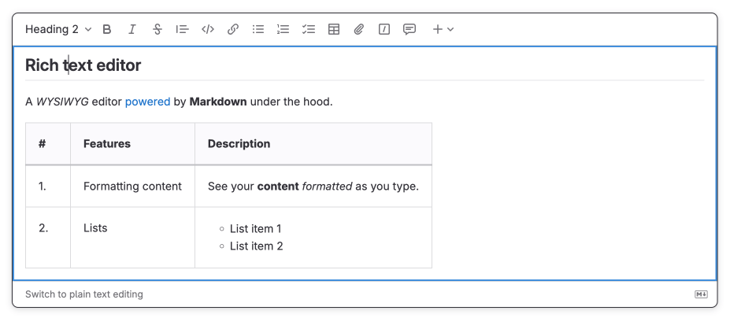
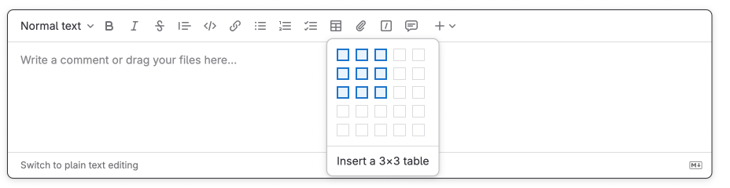
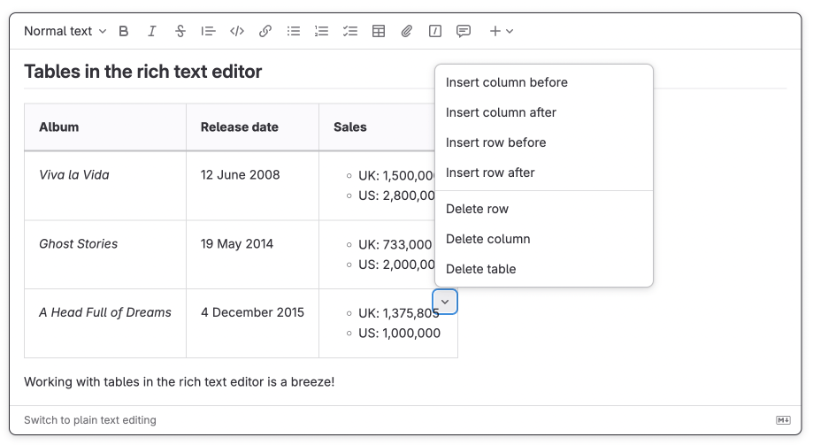
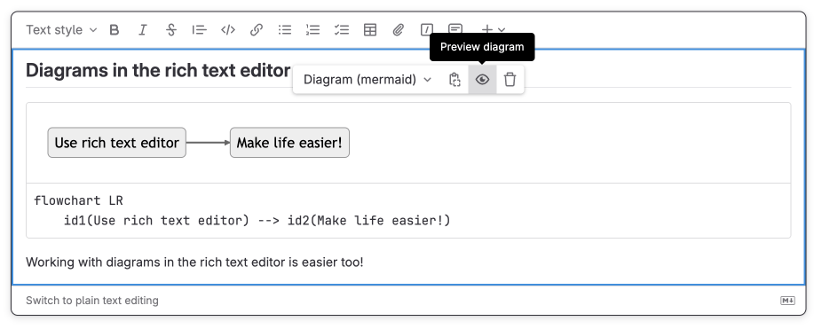

DETAILS:
**Tier:** Free, Premium, Ultimate
**Offering:** GitLab.com, GitLab Self-Managed, GitLab Dedicated

> - [Introduced](https://gitlab.com/gitlab-org/gitlab/-/issues/371931) for editing issue descriptions in GitLab 15.5 [with a flag](../administration/feature_flags.md) named `content_editor_on_issues`. Disabled by default.
> - [Introduced](https://gitlab.com/gitlab-org/gitlab/-/issues/382636) for [discussions](discussions/_index.md), and creating and editing issues and merge requests in GitLab 15.11 with the same flag.
> - [Introduced](https://gitlab.com/gitlab-org/gitlab/-/issues/407507) for epics in GitLab 16.1 with the same flag.
> - Feature flag `content_editor_on_issues` enabled by default in GitLab 16.2.
> - Feature flag `content_editor_on_issues` removed in GitLab 16.5.

Rich text editor is available in:

- [Wikis](project/wiki/_index.md)
- Issues
- Epics
- Merge requests
- [Designs](project/issues/design_management.md)

Features of the editor include:

- Format text, including as bold, italics, block quotes, headings, and inline code.
- Format ordered lists, unordered lists, and checklists.
- Insert links, attachments, images, video, and audio.
- Create and edit a table structure.
- Insert and format code blocks with syntax highlighting.
- Preview Mermaid, PlantUML, and Kroki diagrams in real time.

To track work on adding the rich text editor to more places across GitLab, see
[epic 7098](https://gitlab.com/groups/gitlab-org/-/epics/7098).

## Switch to the rich text editor

Use the rich text editor to edit descriptions, wiki pages, add comments.

To switch to the rich text editor: In a text box, in the lower-left corner, select
**Switch to rich text editing**.

## Switch to the plain text editor

If you want to enter Markdown source in the text box, return to using the plain text editor.

To switch to the plain text editor: In a text box, in the lower-left corner, select
**Switch to plain text editing**.

## Compatibility with GitLab Flavored Markdown

The rich text editor is fully compatible with [GitLab Flavored Markdown](markdown.md).
It means that you can switch between plain text and rich text modes without losing any data.

### Input rules

Rich text editor also supports input rules that let you work with rich content as if you were
typing Markdown.

Supported input rules:

| Input rule syntax                                         | Content inserted     |
| --------------------------------------------------------- | -------------------- |
| `# Heading 1`  ...   `###### Heading 6`             | Headings 1 through 6 |
| `**bold**` or `__bold__`                                  | Bold text            |
| `_italics_` or `*italics*`                                | Italicized text      |
| `~~strike~~`                                              | Strikethrough        |
| `[link](https://example.com)`                             | Hyperlink            |
| `code`                                                    | Inline code          |
| <code>&#96;&#96;&#96;rb</code> + <kbd>Enter</kbd>   <code>&#96;&#96;&#96;js</code> + <kbd>Enter</kbd> | Code block           |
| `* List item`, or  `- List item`, or  `+ List item` | Unordered list       |
| `1. List item`                                            | Numbered list        |
| `
`                                               | Collapsible section  |

## Tables

Unlike in raw Markdown, you can use the rich text editor to insert block content paragraphs,
list items, diagrams (or even another table!) in table cells.

### Insert a table

To insert a table:

1. Select **Insert table** **{table}**.
1. From the dropdown list, select the dimensions of the new table.

### Edit a table

Inside a table cell, you can use a menu to insert or delete rows or columns.

To open the menu: In the upper-right corner of a cell, select the chevron **{chevron-down}**.

### Operations on multiple cells

Select multiple cells and merge or split them.

To merge selected cells into one:

1. Select multiple cells - select one and drag your cursor.
1. In the upper-right corner of a cell, select the chevron **{chevron-down}** **> Merge N cells**.

To split merged cells: In the upper-right corner of a cell, select the chevron **{chevron-down}** **> Split cell**.

## Insert diagrams

Insert [Mermaid](https://mermaidjs.github.io/) and [PlantUML](https://plantuml.com/) diagrams and
preview them live as you type the diagram code.

To insert a diagram:

1. On the top bar of a text box, select **{plus}** **More options** and then **Mermaid diagram** or **PlantUML diagram**.
1. Enter the code for your diagram. The diagram preview appears in the text box.

## Related topics

- [Set the default text editor](profile/preferences.md#set-the-default-text-editor)
- [Keyboard shortcuts](shortcuts.md#rich-text-editor) for rich text editor
- [GitLab Flavored Markdown](markdown.md)
